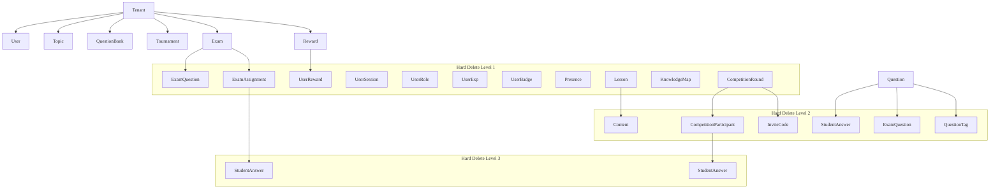

# Data Model

ERD và quy định dữ liệu.

---

## ER Diagram

The schema is designed following a multi-tenant model with data isolation
between schools. All business tables have `tenant_id` and `created_at`,
`updated_at` timestamps (except system tables).

```d2
direction: right

# ========== SYSTEM TABLES ==========
Permission: {
  shape: sql_table
  id: string {constraint: primary_key}
  name: string
  description: string
}

Role: {
  shape: sql_table
  id: string {constraint: primary_key}
  name: string
  color: string
  created_at: timestamp
  updated_at: timestamp
}

RolePermission: {
  shape: sql_table
  role_id: string {constraint: foreign_key}
  permission_id: string {constraint: foreign_key}
  created_at: timestamp
}

# ========== TENANT MANAGEMENT ==========
Tenant: {
  shape: sql_table
  id: string {constraint: primary_key}
  name: string
  code: string
  domain: string
  email: string
  phone: string
  address: string
  settings: jsonb
  status: enum
  deactivated_at: timestamp
  deleted_at: timestamp
  created_at: timestamp
  updated_at: timestamp
}

---

# ========== AUTHENTICATION ==========
User: {
  shape: sql_table
  id: string {constraint: primary_key}
  tenant_id: string {constraint: foreign_key}
  email: string
  password: string
  first_name: string
  last_name: string
  avatar_url: string
  is_active: boolean
  email_verified: boolean
  email_verified_at: timestamp
  last_login_at: timestamp
  metadata: jsonb
  deleted_at: timestamp
  created_at: timestamp
  updated_at: timestamp
}

UserRole: {
  shape: sql_table
  user_id: string {constraint: foreign_key}
  role_id: string {constraint: foreign_key}
  tenant_id: string {constraint: foreign_key}
  created_at: timestamp
}

UserSession: {
  shape: sql_table
  id: string {constraint: primary_key}
  user_id: string {constraint: foreign_key}
  device_id: string
  device_name: string
  refresh_token_hash: string
  user_agent: string
  ip_address: string
  location: string
  is_active: boolean
  expires_at: timestamp
  last_used_at: timestamp
  revoked_at: timestamp
  created_at: timestamp
  updated_at: timestamp
}

ParentStudentLink: {
  shape: sql_table
  id: string {constraint: primary_key}
  parent_id: string {constraint: foreign_key}
  student_id: string {constraint: foreign_key}
  created_at: timestamp
}

---

# ========== CONTENT STRUCTURE ==========
Subject: {
  shape: sql_table
  id: string {constraint: primary_key}
  name: string
  code: string
  icon: string
  order: integer
  created_at: timestamp
  updated_at: timestamp
}

Grade: {
  shape: sql_table
  id: string {constraint: primary_key}
  name: string
  level: integer
  created_at: timestamp
  updated_at: timestamp
}

Topic: {
  shape: sql_table
  id: string {constraint: primary_key}
  tenant_id: string {constraint: foreign_key}
  subject_id: string {constraint: foreign_key}
  grade_id: string {constraint: foreign_key}
  name: string
  description: string
  icon: string
  order: integer
  is_active: boolean
  deleted_at: timestamp
  created_at: timestamp
  updated_at: timestamp
}

Lesson: {
  shape: sql_table
  id: string {constraint: primary_key}
  topic_id: string {constraint: foreign_key}
  title: string
  description: string
  semester: enum
  order: integer
  created_at: timestamp
  updated_at: timestamp
}

Content: {
  shape: sql_table
  id: string {constraint: primary_key}
  lesson_id: string {constraint: foreign_key}
  type: enum
  title: string
  content_url: string
  duration: integer
  order: integer
  metadata: jsonb
  created_at: timestamp
  updated_at: timestamp
}

---

# ========== QUESTION BANK ==========
QuestionBank: {
  shape: sql_table
  id: string {constraint: primary_key}
  tenant_id: string {constraint: foreign_key}
  creator_id: string {constraint: foreign_key}
  name: string
  description: string
  type: enum
  is_public: boolean
  deleted_at: timestamp
  created_at: timestamp
  updated_at: timestamp
}

Question: {
  shape: sql_table
  id: string {constraint: primary_key}
  question_bank_id: string {constraint: foreign_key}
  topic_id: string {constraint: foreign_key}
  lesson_id: string {constraint: foreign_key}
  type: enum
  content: string
  options: jsonb
  correct_answer: string
  explanation: jsonb
  difficulty: enum
  points: integer
  deleted_at: timestamp
  created_at: timestamp
  updated_at: timestamp
}

QuestionTag: {
  shape: sql_table
  question_id: string {constraint: foreign_key}
  tag_name: string
  created_at: timestamp
}

---

# ========== LEARNING & PROGRESS ==========
StudentProgress: {
  shape: sql_table
  id: string {constraint: primary_key}
  student_id: string {constraint: foreign_key}
  lesson_id: string {constraint: foreign_key}
  completion_percentage: integer
  started_at: timestamp
  completed_at: timestamp
  last_accessed_at: timestamp
  created_at: timestamp
  updated_at: timestamp
}

StudentAnswer: {
  shape: sql_table
  id: string {constraint: primary_key}
  student_id: string {constraint: foreign_key}
  question_id: string {constraint: foreign_key}
  content_id: string {constraint: foreign_key}
  exam_id: string {constraint: foreign_key}
  competition_id: string {constraint: foreign_key}
  answer: string
  is_correct: boolean
  time_taken: integer
  answered_at: timestamp
  created_at: timestamp
}

---

# ========== TOURNAMENT SYSTEM ==========
Tournament: {
  shape: sql_table
  id: string {constraint: primary_key}
  tenant_id: string {constraint: foreign_key}
  name: string
  description: string
  level: enum
  subject_id: string {constraint: foreign_key}
  grade_id: string {constraint: foreign_key}
  settings: jsonb
  deleted_at: timestamp
  starts_at: timestamp
  ends_at: timestamp
  created_at: timestamp
  updated_at: timestamp
}

CompetitionRound: {
  shape: sql_table
  id: string {constraint: primary_key}
  tournament_id: string {constraint: foreign_key}
  name: string
  description: string
  order: integer
  required_score: integer
  participant_limit: integer
  requires_invite: boolean
  rules: jsonb
  starts_at: timestamp
  ends_at: timestamp
  created_at: timestamp
  updated_at: timestamp
}

CompetitionParticipant: {
  shape: sql_table
  id: string {constraint: primary_key}
  round_id: string {constraint: foreign_key}
  student_id: string {constraint: foreign_key}
  invite_code_id: string {constraint: foreign_key}
  score: integer
  rank: integer
  registered_at: timestamp
  started_at: timestamp
  completed_at: timestamp
  created_at: timestamp
  updated_at: timestamp
}

InviteCode: {
  shape: sql_table
  id: string {constraint: primary_key}
  round_id: string {constraint: foreign_key}
  creator_id: string {constraint: foreign_key}
  code: string
  max_uses: integer
  used_count: integer
  expires_at: timestamp
  created_at: timestamp
  updated_at: timestamp
}

---

# ========== GAMIFICATION ==========
UserExp: {
  shape: sql_table
  id: string {constraint: primary_key}
  user_id: string {constraint: foreign_key}
  exp_points: integer
  level: integer
  created_at: timestamp
  updated_at: timestamp
}

Badge: {
  shape: sql_table
  id: string {constraint: primary_key}
  name: string
  description: string
  icon_url: string
  category: enum
  created_at: timestamp
  updated_at: timestamp
}

UserBadge: {
  shape: sql_table
  user_id: string {constraint: foreign_key}
  badge_id: string {constraint: foreign_key}
  earned_at: timestamp
}

Reward: {
  shape: sql_table
  id: string {constraint: primary_key}
  tenant_id: string {constraint: foreign_key}
  name: string
  description: string
  image_url: string
  type: enum
  cost: integer
  stock: integer
  is_active: boolean
  deleted_at: timestamp
  created_at: timestamp
  updated_at: timestamp
}

UserReward: {
  shape: sql_table
  id: string {constraint: primary_key}
  user_id: string {constraint: foreign_key}
  reward_id: string {constraint: foreign_key}
  quantity: integer
  status: string
  redeemed_at: timestamp
  updated_at: timestamp
}

---

# ========== EXAM & ASSESSMENT ==========
Exam: {
  shape: sql_table
  id: string {constraint: primary_key}
  tenant_id: string {constraint: foreign_key}
  creator_id: string {constraint: foreign_key}
  title: string
  description: string
  subject_id: string {constraint: foreign_key}
  grade_id: string {constraint: foreign_key}
  settings: jsonb
  duration: integer
  deleted_at: timestamp
  starts_at: timestamp
  ends_at: timestamp
  created_at: timestamp
  updated_at: timestamp
}

ExamQuestion: {
  shape: sql_table
  exam_id: string {constraint: foreign_key}
  question_id: string {constraint: foreign_key}
  order: integer
  points: integer
  created_at: timestamp
}

ExamAssignment: {
  shape: sql_table
  id: string {constraint: primary_key}
  exam_id: string {constraint: foreign_key}
  student_id: string {constraint: foreign_key}
  score: integer
  started_at: timestamp
  completed_at: timestamp
  created_at: timestamp
  updated_at: timestamp
}

---

# ========== ANALYTICS ==========
KnowledgeMap: {
  shape: sql_table
  id: string {constraint: primary_key}
  student_id: string {constraint: foreign_key}
  topic_id: string {constraint: foreign_key}
  mastery_level: float
  questions_attempted: integer
  questions_correct: integer
  last_practiced: timestamp
  created_at: timestamp
  updated_at: timestamp
}

LearningAnalytics: {
  shape: sql_table
  id: string {constraint: primary_key}
  student_id: string {constraint: foreign_key}
  date: date
  learning_time: integer
  questions_attempted: integer
  lessons_completed: integer
  created_at: timestamp
  updated_at: timestamp
}

---

# ========== NOTIFICATIONS ==========
Notification: {
  shape: sql_table
  id: string {constraint: primary_key}
  user_id: string {constraint: foreign_key}
  title: string
  message: string
  type: enum
  is_read: boolean
  metadata: jsonb
  created_at: timestamp
}

---

# ========== RELATIONSHIPS ==========
Role -> UserRole: has
Permission -> RolePermission: assigned_to
Role -> RolePermission: has

Tenant -> User: has
Tenant -> Topic: has
Tenant -> QuestionBank: has
Tenant -> Tournament: has
Tenant -> Exam: has
Tenant -> Reward: has

User -> UserRole: assigned
User -> UserSession: has
User -> ParentStudentLink: as_parent
User -> QuestionBank: created
User -> Exam: created
User -> InviteCode: created
User -> UserExp: has
User -> UserBadge: earned
User -> UserReward: redeemed
User -> CompetitionParticipant: participates
User -> StudentProgress: has
User -> StudentAnswer: submits
User -> ExamAssignment: assigned
User -> KnowledgeMap: has
User -> LearningAnalytics: has
User -> Notification: receives

Subject -> Topic: has
Subject -> Tournament: for
Subject -> Exam: for

Grade -> Topic: has
Grade -> Tournament: for
Grade -> Exam: for

Topic -> Lesson: has
Topic -> Question: tagged_with
Topic -> KnowledgeMap: in

Lesson -> Content: has
Lesson -> StudentProgress: tracked_by
Lesson -> Question: tagged_with

QuestionBank -> Question: contains

Question -> StudentAnswer: answered_in
Question -> ExamQuestion: included_in
Question -> QuestionTag: tagged_with

Tournament -> CompetitionRound: has

CompetitionRound -> CompetitionParticipant: has
CompetitionRound -> InviteCode: has
CompetitionRound -> StudentAnswer: in

CompetitionParticipant -> StudentAnswer: submits_in

Badge -> UserBadge: awarded_to

Reward -> UserReward: redeemed_by

Exam -> ExamQuestion: contains
Exam -> ExamAssignment: assigned_to
Exam -> StudentAnswer: in

Content -> StudentAnswer: in
```

---

## Entity Descriptions

### System

| Table              | Description                             |
| ------------------ | --------------------------------------- |
| **Permission**     | Quyền hệ thống, không có timestamp      |
| **Role**           | Vai trò người dùng với màu và timestamp |
| **RolePermission** | Liên kết quyền với vai trò              |

### Quản lý Tenant

| Bảng       | Mô tả                                                                                          |
| ---------- | ---------------------------------------------------------------------------------------------- |
| **Tenant** | Trường học/khách hàng sử dụng hệ thống với trạng thái: ACTIVE, SUSPENDED, PENDING_DEACTIVATION |

### Authentication & Users

| Bảng                  | Mô tả                                                                     |
| --------------------- | ------------------------------------------------------------------------- |
| **User**              | Tài khoản người dùng, loại người dùng xác định qua Role (RBAC)            |
| **UserRole**          | Vai trò của người dùng trong từng tenant                                  |
| **UserSession**       | Phiên đăng nhập theo thiết bị với tracking thiết bị và hash refresh token |
| **ParentStudentLink** | Liên kết phụ huynh với học sinh (quan hệ nhiều-nhiều)                     |

### Content Structure

| Bảng        | Mô tả                                              |
| ----------- | -------------------------------------------------- |
| **Subject** | Môn học (Toán, Tiếng Việt, Toán Tiếng Anh)         |
| **Grade**   | Khối lớp (1-12)                                    |
| **Topic**   | Chủ đề học tập, có trạng thái hiển thị (is_active) |
| **Lesson**  | Bài học, có học kỳ (SEMESTER1, SEMESTER2)          |
| **Content** | Nội dung bài học: VIDEO, EXERCISE, TEXT, QUIZ      |

### Ngân hàng câu hỏi

| Bảng             | Mô tả                                                                                     |
| ---------------- | ----------------------------------------------------------------------------------------- |
| **QuestionBank** | Bộ sưu tập câu hỏi, loại: SYSTEM hoặc TEACHER                                             |
| **Question**     | Câu hỏi với loại: MULTIPLE_CHOICE, TRUE_FALSE, SHORT_ANSWER và độ khó: EASY, MEDIUM, HARD |
| **QuestionTag**  | Gắn thẻ cho câu hỏi                                                                       |

### Học tập & Tiến độ

| Bảng                | Mô tả                                   |
| ------------------- | --------------------------------------- |
| **StudentProgress** | Theo dõi tiến độ học tập của học sinh   |
| **StudentAnswer**   | Lưu trữ tất cả câu trả lời của học sinh |

### Hệ thống giải đấu

| Bảng                       | Mô tả                                                                  |
| -------------------------- | ---------------------------------------------------------------------- |
| **Tournament**             | Đấu trường với các cấp: SCHOOL, DISTRICT, PROVINCE, REGIONAL, NATIONAL |
| **CompetitionRound**       | Các vòng thi trong đấu trường                                          |
| **CompetitionParticipant** | Thí sinh tham gia các vòng thi                                         |
| **InviteCode**             | Mã mời tham gia các vòng thi cấp trường trở lên                        |

### Gamification

| Bảng           | Mô tả                                                   |
| -------------- | ------------------------------------------------------- |
| **UserExp**    | Điểm kinh nghiệm và cấp độ của người dùng               |
| **Badge**      | Huy hiệu với loại: ACHIEVEMENT, COMPETITION, LEARNING   |
| **UserBadge**  | Huy hiệu người dùng đạt được                            |
| **Reward**     | Phần thưởng trong cửa hàng, loại: VIRTUAL hoặc PHYSICAL |
| **UserReward** | Phần thưởng người dùng đã đổi                           |

### Kiểm tra & Đánh giá

| Bảng               | Mô tả                               |
| ------------------ | ----------------------------------- |
| **Exam**           | Các bài kiểm tra/thi                |
| **ExamQuestion**   | Các câu hỏi trong bài kiểm tra      |
| **ExamAssignment** | Bài kiểm tra được giao cho học sinh |

### Phân tích

| Bảng                  | Mô tả                               |
| --------------------- | ----------------------------------- |
| **KnowledgeMap**      | Bản đồ kiến thức cá nhân hóa        |
| **LearningAnalytics** | Dữ liệu phân tích học tập hàng ngày |

### Thông báo

| Bảng             | Mô tả                                                          |
| ---------------- | -------------------------------------------------------------- |
| **Notification** | Thông báo với loại: SYSTEM, ACHIEVEMENT, COMPETITION, LEARNING |

---

## Key Relationships

### Quan hệ Multi-tenant

- **Tenant** is the center, linked to all business data
- Each **User** belongs to one **Tenant**
- **Topic**, **QuestionBank**, **Tournament**, **Exam**, **Reward** all have
  `tenant_id`

### Quan hệ User RBAC

- **User** can have multiple **Roles** via **UserRole** table (e.g., user can be
  both teacher and parent)
- **Parent** links to **Student** via **ParentStudentLink** (many-to-many
  relationship)
- **User** can be the creator of: **QuestionBank**, **Exam**, **InviteCode**

### Content Structure

- **Subject** → **Grade** → **Topic** → **Lesson** → **Content**
- **Question** can link to **Topic** and/or **Lesson**
- **Lesson** has `semester` attribute (SEMESTER1, SEMESTER2)

### Tournament System

- **Tournament** → **CompetitionRound** → **CompetitionParticipant**
- **InviteCode** allows joining competition rounds when `requires_invite=true`
- **StudentAnswer** can belong to **CompetitionRound**

### Gamification & Phân tích

- **UserExp** tracks experience points
- **Badge** is awarded to **User** via **UserBadge**
- **KnowledgeMap** is built from **StudentAnswer** and **Topic**
- **LearningAnalytics** aggregates daily from learning activities

---

## Database Specifications

### Quy tắc đặt tên

- **Primary Key**: `id` (UUID v4)
- **Foreign Key**: `{table_name}_id` (e.g., `user_id`, `tenant_id`)
- **Timestamps**: `created_at`, `updated_at` (UTC timezone)
- **Soft Delete**: Only apply `deleted_at` for tables: User, Topic,
  QuestionBank, Question, Exam, Tournament, Reward

### Quy tắc dữ liệu

1. **Multi-tenancy**: All queries must include `tenant_id` except for system
   tables
2. **Data Isolation**: Data between tenants is completely independent
3. **Audit Trail**: All important changes are logged via `AuditLog` (not shown
   in diagram)
4. **Enum Values**: Use UPPERCASE with underscores for enum values
5. **Soft Delete Strategy**: Only apply `deleted_at` for specified tables, other
   tables use hard delete or retention policy
6. **Token Security**: Refresh token stores hash only in database, not plain
   text
7. **Cascade Delete**: Supports both hard delete cascade (database level) and
   soft delete cascade (application level)
8. **RBAC Implementation**: User type is determined through Role, not stored
   directly in User
9. **Semester applies to lessons only**: The `semester` field only exists in
   `Lesson` table, not applied to `Topic`

### Dữ liệu mẫu RBAC

The system will pre-seed the following RBAC data:

**Roles:**

- `root-admin` - System administrator (all tenants)
- `tenant-admin` - School administrator (one tenant)
- `teacher` - Teacher
- `parent` - Parent
- `student` - Student

**Permission Groups:**

- `user:*` - Manage users within tenant
- `content:*` - Manage learning content
- `exam:*` - Manage tests, exams
- `tournament:*` - Manage competitions, arenas
- `analytics:*` - View reports, analytics
- `notification:*` - Manage notifications
- `reward:*` - Manage rewards, gamification
- `system:*` - System administration (root-admin only)
- `session:*` - Manage multi-device sessions

### Bảng hỗ trợ ẩn

**AuditLog** (System activity logging):

- `id`, `tenant_id`, `user_id`, `action`, `entity_type`, `entity_id`
- `old_values` (JSONB), `new_values` (JSONB), `ip_address`, `user_agent`
- `created_at`

**SystemConfig** (System configuration):

- `id`, `key`, `value` (JSONB), `description`, `created_at`, `updated_at`

**FileStorage** (File management):

- `id`, `tenant_id`, `user_id`, `filename`, `path`, `mime_type`, `size`
- `bucket`, `is_public`, `metadata` (JSONB), `created_at`

**Presence** (Real-time status tracking):

- `id`, `user_id`, `tenant_id`, `status`, `last_seen_at`, `room_id`, `device_id`
- `metadata` (JSONB), `created_at`, `updated_at`

### Migration & Versioning

- **Migration Tool**: Prisma Migrate
- **Version Control**: Git với semantic versioning
- **Rollback Strategy**: Mỗi migration có rollback script
- **Data Seed**: Seed data cho các bảng: Permission, Role, Subject, Grade, Badge
- **Cascade Delete Strategy**: Tất cả foreign keys sẽ có `ON DELETE CASCADE`
  ngoại trừ các bảng yêu cầu soft delete

### Chiến lược đánh index

| Table                  | Main Index                                    | Purpose                       |
| ---------------------- | --------------------------------------------- | ----------------------------- |
| User                   | (tenant_id, email, deleted_at)                | Login và truy vấn theo tenant |
| Topic                  | (tenant_id, subject_id, grade_id, deleted_at) | Filter nội dung               |
| StudentAnswer          | (student_id, answered_at)                     | Phân tích học tập             |
| CompetitionParticipant | (round_id, score DESC)                        | Bảng xếp hạng real-time       |
| KnowledgeMap           | (student_id, mastery_level)                   | Đề xuất lộ trình AI           |
| Tenant                 | (status, deleted_at)                          | Quản lý tenant lifecycle      |
| UserSession            | (user_id, device_id, is_active)               | Quản lý thiết bị đăng nhập    |
| Presence               | (user_id, tenant_id, room_id)                 | Theo dõi real-time presence   |

### Chính sách lưu trữ dữ liệu

| Data Type           | Retention | Notes                         |
| ------------------- | --------- | ----------------------------- |
| User Sessions       | 30 ngày   | Tự động xóa sau khi hết hạn   |
| Audit Logs          | 1 năm     | Archive sau 1 năm             |
| Student Answers     | Vĩnh viễn | Cho phân tích dài hạn         |
| Competition Results | Vĩnh viễn | Lịch sử thi đấu               |
| Notification        | 90 ngày   | Tự động xóa sau khi đọc       |
| Soft Deleted Data   | 1 năm     | Tự động hard delete sau 1 năm |
| Presence Data       | 7 ngày    | Tự động xóa sau khi offline   |

### Chiến lược xóa Cascade

**Hard Cascade Delete (ON DELETE CASCADE)** Applied to tables without
`deleted_at`:

- **UserSession** → deleted when User is hard deleted
- **UserRole** → deleted when User or Role is hard deleted
- **ParentStudentLink** → deleted when User (parent/student) is hard deleted
- **StudentProgress** → deleted when User or Lesson is hard deleted
- **StudentAnswer** → deleted when User or Question is hard deleted
- **CompetitionParticipant** → deleted when CompetitionRound or User is hard
  deleted
- **ExamAssignment** → deleted when Exam or User is hard deleted
- **Presence** → deleted when User is hard deleted

**Soft Cascade Delete (Application Level)** Applied to tables with `deleted_at`:

1. **When deleting Tenant**:
   - Set `status = 'PENDING_DEACTIVATION'` → `status = 'SUSPENDED'`
   - Set `deleted_at` for all Users belonging to tenant
   - Set `deleted_at` for all Topic, QuestionBank, Tournament, Exam, Reward
     belonging to tenant

2. **When deleting User**:
   - Set `deleted_at` for User
   - Hard delete all UserSessions of user
   - Set `deleted_at` for QuestionBank, Exam, InviteCode (creator_id)

3. **When deleting Topic**:
   - Set `deleted_at` for Topic
   - Hard delete all Lessons, Content belonging to topic
   - Set `topic_id = NULL` for Question (soft unlink)

**Color Legend:**

- **Dark Red**: Root entity initiating cascade delete
- **Yellow**: Soft delete tables (only mark `deleted_at`)
- **Green**: Hard delete level 1 tables (direct hard delete)
- **Blue**: Hard delete level 2+ tables (indirect hard delete via cascade)

**Cascade Delete Flow Summary:**



**Cascade Delete Rules Summary**

| Parent Entity        | Action      | Child Entity           | Delete Type | Notes                   |
| -------------------- | ----------- | ---------------------- | ----------- | ----------------------- |
| **Tenant**           | Soft Delete | User                   | Soft Delete | Set `deleted_at`        |
| **Tenant**           | Soft Delete | Topic                  | Soft Delete | Set `deleted_at`        |
| **Tenant**           | Soft Delete | QuestionBank           | Soft Delete | Set `deleted_at`        |
| **Tenant**           | Soft Delete | Tournament             | Soft Delete | Set `deleted_at`        |
| **Tenant**           | Soft Delete | Exam                   | Soft Delete | Set `deleted_at`        |
| **Tenant**           | Soft Delete | Reward                 | Soft Delete | Set `deleted_at`        |
| **User**             | Soft Delete | UserSession            | Hard Delete | ON DELETE CASCADE       |
| **User**             | Soft Delete | QuestionBank (creator) | Soft Delete | Chỉ khi user là creator |
| **User**             | Soft Delete | Exam (creator)         | Soft Delete | Chỉ khi user là creator |
| **Topic**            | Soft Delete | Lesson                 | Hard Delete | ON DELETE CASCADE       |
| **QuestionBank**     | Soft Delete | Question               | Soft Delete | Set `deleted_at`        |
| **Tournament**       | Soft Delete | CompetitionRound       | Hard Delete | ON DELETE CASCADE       |
| **Exam**             | Soft Delete | ExamQuestion           | Hard Delete | ON DELETE CASCADE       |
| **Reward**           | Soft Delete | UserReward             | Hard Delete | ON DELETE CASCADE       |
| **Lesson**           | Hard Delete | Content                | Hard Delete | ON DELETE CASCADE       |
| **CompetitionRound** | Hard Delete | CompetitionParticipant | Hard Delete | ON DELETE CASCADE       |
| **Question**         | Hard Delete | StudentAnswer          | Hard Delete | ON DELETE CASCADE       |
| **Question**         | Hard Delete | ExamQuestion           | Hard Delete | ON DELETE CASCADE       |
| **User**             | Hard Delete | Presence               | Hard Delete | ON DELETE CASCADE       |

**Important Notes:**

1. **Hard Delete Cascade**: Configured at database level via `ON DELETE CASCADE`
2. **Soft Delete Cascade**: Handled at application level within transaction
3. **Grace Period**: Tenant has 30-day grace period before being SUSPENDED
4. **Data Retention**: Soft deleted data is kept for 1 year before hard delete
5. **Audit Log**: All cascade delete operations are logged in `AuditLog`
6. **Real-time Cleanup**: Delete presence data when user is deleted to avoid
   stale connections

### 4.9. Business Requirements Mapping

| BR ID | Related Tables                                                      | Description                                     |
| ----- | ------------------------------------------------------------------- | ----------------------------------------------- |
| BR-01 | KnowledgeMap, StudentAnswer, UserExp                                | AI phân tích điểm mạnh/yếu                      |
| BR-02 | Tournament, CompetitionRound, CompetitionParticipant                | Đấu trường đa cấp                               |
| BR-03 | LearningAnalytics, KnowledgeMap, StudentProgress                    | Báo cáo 4 cấp độ                                |
| BR-04 | Exam, QuestionBank, ExamAssignment                                  | Bộ công cụ cho giáo viên                        |
| BR-05 | UserExp, Badge, Reward, UserBadge, UserReward                       | Hệ thống Gamification                           |
| BR-06 | Subject, Grade, Topic, Lesson, Content                              | Kho nội dung học tập                            |
| BR-07 | Tenant, User, UserSession, và tất cả bảng đa thực thể               | Khả năng mở rộng đa thực thể và quản lý session |
| BR-08 | UserSession, Quản lý thiết bị                                       | Quản lý session đa thiết bị                     |
| BR-09 | Tournament, CompetitionRound, StudentAnswer với tính năng real-time | Hỗ trợ thời gian thực cho thi đấu               |
| BR-10 | Tất cả các bảng có chức năng xóa cascade                            | Chiến lược xóa cascade cho tenant               |

### 4.10. Functional Requirements Mapping

| Module         | Related Tables                                                   | Main Function              |
| -------------- | ---------------------------------------------------------------- | -------------------------- |
| Learning       | Topic, Lesson, Content, StudentProgress                          | FR-HS-01 to FR-HS-05       |
| Competition    | Tournament, CompetitionRound, CompetitionParticipant, InviteCode | FR-COMP-01 to FR-COMP-09   |
| Assessment     | KnowledgeMap, LearningAnalytics, StudentAnswer                   | FR-ANAL-01 to FR-ANAL-05   |
| Parent         | ParentStudentLink, StudentProgress, LearningAnalytics            | FR-PAR-01 to FR-PAR-04     |
| Teacher        | Exam, QuestionBank, ExamAssignment, InviteCode                   | FR-TEACH-01 to FR-TEACH-07 |
| Admin          | Tenant, User, Role, Permission, Topic                            | FR-ADMIN-01 to FR-ADMIN-09 |
| Authentication | User, UserRole, UserSession, ParentStudentLink                   | FR-AUTH-01 to FR-AUTH-09   |
| Real-time      | Tournament, CompetitionRound, StudentAnswer, Presence            | FR-RT-01 to FR-RT-06       |

---

## References
