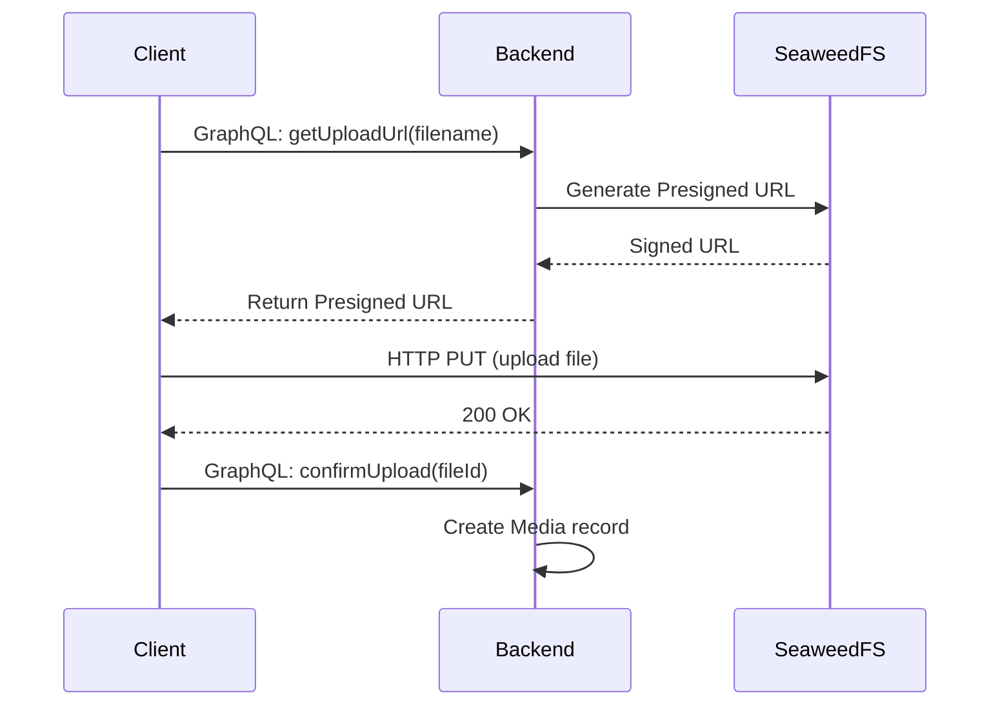

# 33: SeaweedFS

Giải pháp lưu trữ file phân tán, hỗ trợ presigned url để client upload trực tiếp

---

## Decision

**seaweedfs** với presigned url pattern

---

## Rationale

- **Presigned URL**: Client upload trực tiếp, không qua Backend → giảm tải
  server
- **Distributed Storage**: Mở rộng dễ dàng khi dung lượng tăng
- **S3-Compatible API**: Tương thích với các tool/SDK có sẵn
- **Self-hosted**: Kiểm soát hoàn toàn dữ liệu, không phụ thuộc cloud vendor
- **Lightweight**: Đơn giản hơn MinIO, phù hợp với team nhỏ

---

## Consequences

**Ưu điểm**: Giảm tải Backend, horizontal scaling, self-hosted

**Nhược điểm**: Cần quản lý thêm service, cấu hình clustering phức tạp hơn

---

## Upload Flow

---

## Alternatives Considered

| Giải pháp     | Lý do không chọn                          |
| ------------- | ----------------------------------------- |
| Local + Nginx | Không scale được, single point of failure |
| MinIO         | Nặng hơn, tốn tài nguyên hơn SeaweedFS    |
| AWS S3        | Vendor lock-in, chi phí recurring         |
| Cloudinary    | Chi phí cao, phụ thuộc bên thứ ba         |
