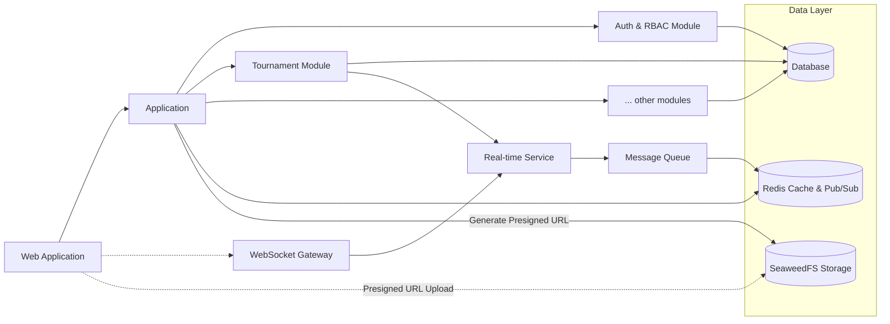

# System Design

Thiết kế kiến trúc hệ thống và các thành phần chính

---

## Architecture

---

## Concepts

### Communication

- **GraphQL**: API chính cho queries/mutations
- **Redis Pub/Sub**: Event broadcasting
- **WebSocket**: Socket.IO với cơ chế rooms
- **Presigned URL**: Upload file trực tiếp lên Storage

### Principles

- **Single Responsibility**: Mỗi module một phạm vi
- **Dependency Injection**: Dễ dàng testing
- **Data Isolation**: Dữ liệu độc lập
- **Room-based**: Tổ chức theo phòng ảo
- **Soft Delete**: Chỉ áp dụng cho entity chính

---

## Tech Stack

### BE

| Item      | Tech                      | ADR                                                                                                                                                        |
| --------- | ------------------------- | ---------------------------------------------------------------------------------------------------------------------------------------------------------- |
| Runtime   | Node.js 20+ LTS           | [0003: Node.js](decisions/0003-nodejs.md)                                                                                                                  |
| Framework | NestJS 10+                | [0001: Modular Monolith](decisions/0001-modular-monolith.md)                                                                                               |
| ORM       | Prisma 7                  | [0005: Prisma](decisions/0005-prisma.md), [0006: Cascade Delete](decisions/0006-cascade-delete.md)                                                         |
| Database  | PostgreSQL 15+            | [0004: PostgreSQL](decisions/0004-postgresql.md)                                                                                                           |
| Cache     | Redis 7+                  | [0007: Redis](decisions/0007-redis.md)                                                                                                                     |
| Realtime  | Socket.IO + Redis adapter | [0010: Socket.IO](decisions/0010-socketio.md)                                                                                                              |
| Auth      | Passport.js + JWT         | [0008: JWT Refresh Token](decisions/0008-jwt-refresh-token.md), [0002: Multi Tenant](decisions/0002-multi-tenant.md), [0009: RBAC](decisions/0009-rbac.md) |

### FE

| Item       | Tech                       | ADR                                           |
| ---------- | -------------------------- | --------------------------------------------- |
| UI Library | React 18+ với TypeScript   | [0020: React](decisions/0020-react.md)        |
| Framework  | Next.js 14+ với App Router | [0021: Next.js](decisions/0021-nextjs.md)     |
| State      | Zustand + React Context    | [0022: Zustand](decisions/0022-zustand.md)    |
| Styling    | TailwindCSS 3.x            | [0023: Tailwind](decisions/0023-tailwind.md)  |
| Components | RetroUI                    | [0024: RetroUI](decisions/0024-retroui.md)    |
| Realtime   | Socket.IO Client 4.x       | [0010: Socket.IO](decisions/0010-socketio.md) |

### Infra

| Item          | Tech                     | ADR                                                      |
| ------------- | ------------------------ | -------------------------------------------------------- |
| Container     | Docker 24+               | [0030: Docker](decisions/0030-docker.md)                 |
| Orchestration | Docker Compose           | [0030: Docker](decisions/0030-docker.md)                 |
| Load Balancer | Nginx                    | [0032: Nginx](decisions/0032-nginx.md)                   |
| CI/CD         | GitHub Actions           | [0031: Github Actions](decisions/0031-github-actions.md) |
| File Storage  | SeaweedFS                | [0033: SeaweedFS](decisions/0033-seaweedfs.md)           |
| Monitoring    | Winston + custom metrics | [0011: Winston](decisions/0011-winston.md)               |
