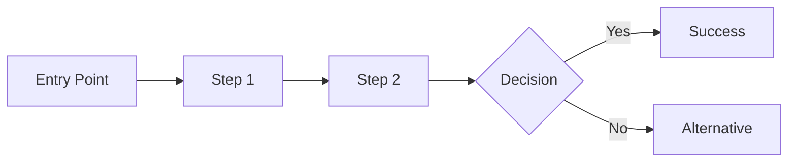

# User Journeys

User journey maps cho các luồng chính.

---

## Journey Map Template

### [Tên Journey]

**Persona**: [Tên Persona]
**Mục tiêu**: [Người dùng muốn đạt được gì]
**Scenario**: [Ngữ cảnh của journey]

#### Các giai đoạn Journey

| Giai đoạn | Hành động | Suy nghĩ | Cảm xúc | Cơ hội |
|-----------|----------|---------|---------|--------|
| Awareness | [Hành động] | [Suy nghĩ] | 😐 | [Cơ hội] |
| Consideration | [Hành động] | [Suy nghĩ] | 🤔 | [Cơ hội] |
| Decision | [Hành động] | [Suy nghĩ] | 😊 | [Cơ hội] |
| Action | [Hành động] | [Suy nghĩ] | 😄 | [Cơ hội] |
| Retention | [Hành động] | [Suy nghĩ] | 😊 | [Cơ hội] |

#### Journey Flow

---

## Core Journeys

### Journey 1: [Onboarding]

**Persona**: [Persona Name]
**Goal**: [Goal]

| Stage | Actions | Touchpoint | Pain Points | Solutions |
|-------|---------|------------|-------------|-----------|
| Sign Up | [Action] | [Touchpoint] | [Pain] | [Solution] |
| Setup | [Action] | [Touchpoint] | [Pain] | [Solution] |
| First Use | [Action] | [Touchpoint] | [Pain] | [Solution] |

**Key Metrics**:
- Completion rate: [Target]%
- Time to complete: [Target] min
- Drop-off points: [Identify]

---

### Journey 2: [Core Task]

**Persona**: [Persona Name]
**Goal**: [Goal]

| Stage | Actions | Touchpoint | Pain Points | Solutions |
|-------|---------|------------|-------------|-----------|
| Start | [Action] | [Touchpoint] | [Pain] | [Solution] |
| Execute | [Action] | [Touchpoint] | [Pain] | [Solution] |
| Complete | [Action] | [Touchpoint] | [Pain] | [Solution] |

---

## Journey Insights

### Pain Point Summary

| Journey | Major Pain Points | Priority |
|---------|-------------------|----------|
| [Journey 1] | [Pain points] | High |
| [Journey 2] | [Pain points] | Medium |

### Opportunity Areas

| Opportunity | Impact | Effort | Priority |
|-------------|--------|--------|----------|
| [Opportunity 1] | High | Medium | P1 |
| [Opportunity 2] | Medium | Low | P2 |

---

## References

- [Personas](./personas.md)
- [Usability](./usability.md)
