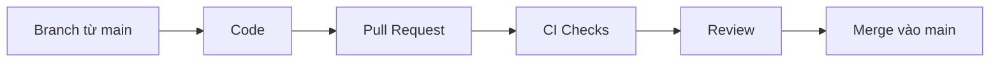
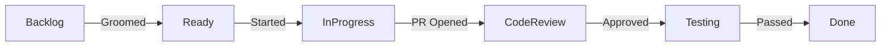

# Hướng dẫn đóng góp

Quy tắc và quy trình làm việc cho đội phát triển LMS Platform.

---

## Vai trò và trách nhiệm

### Các vai trò chính

| Vai trò | Trách nhiệm chính |
|---------|-------------------|
| **Product Owner** | Định hướng sản phẩm, ưu tiên features, approve business logic |
| **Tech Lead** | Quyết định kiến trúc, review specs, đảm bảo chất lượng code |
| **Developer** | Implement từ specifications, viết tests, tham gia code review |
| **QA Engineer** | Tạo test plans, thực hiện testing, báo cáo lỗi |

### Ma trận phối hợp

| Hoạt động | PO | Lead | Dev | QA |
|-----------|----|------|-----|----| 
| Spec | Dẫn dắt | Approve | Soạn thảo | Review |
| Code | - | Review | Tạo | - |
| Test | UAT | - | Unit | Dẫn dắt |

---

## Quy trình làm việc (Trunk Based Development)

### Branching Model

| Branch | Mục đích | Bảo vệ | Thời gian tồn tại |
|--------|----------|--------|-------------------|
| `main` | Source of truth, luôn deployable | Protected | Vĩnh viễn |
| `feature/*` | Feature branches ngắn hạn | Không | < 1 ngày |

> **Quan trọng**: 
> - Tất cả developers commit vào `main` thường xuyên
> - Feature branches phải ngắn hạn (< 1 ngày, tối đa 2-3 ngày)
> - Không có long-lived branches (`develop`, `release/*`, `hotfix/*`)

### Nguyên tắc TBD

1. **Commit nhỏ, thường xuyên** - Nhiều lần trong ngày
2. **Feature flags** - Ẩn features chưa hoàn thành trên production
3. **CI toàn diện** - Tất cả commits phải pass tests trước khi merge
4. **Không code freeze** - Luôn sẵn sàng deploy

### Quy trình Code Review

### Commit Convention

Format: `<type>(<scope>): <subject>`

| Type | Mô tả |
|------|-------|
| `feat` | Feature mới |
| `fix` | Sửa lỗi |
| `docs` | Cập nhật documentation |
| `style` | Formatting |
| `refactor` | Tái cấu trúc |
| `test` | Thêm tests |
| `chore` | Bảo trì |

---

## Sprint Process

### Thông tin Sprint

- **Thời lượng**: 2 tuần
- **Planning**: Thứ 2, 9:00 AM
- **Review**: Thứ 6, 2:00 PM (tuần 2)
- **Retrospective**: Thứ 6, 3:00 PM (tuần 2)

### Sprint Ceremonies

| Ceremony | Thời gian | Thời lượng | Mục đích |
|----------|-----------|------------|----------|
| **Planning** | Tuần 1, Thứ 2 | 2 giờ | Chọn stories, chia tasks |
| **Daily Standup** | Hàng ngày | 15 phút | Sync tiến độ |
| **Sprint Review** | Tuần 2, Thứ 6 | 1 giờ | Demo và nhận feedback |
| **Retrospective** | Tuần 2, Thứ 6 | 45 phút | Cải tiến quy trình |

---

## Task Workflow

### Trạng thái Task

### Definition of Ready

- [ ] Requirements rõ ràng
- [ ] Spec đã được approve
- [ ] Effort đã estimate

### Definition of Done

- [ ] Implementation hoàn thành
- [ ] Tests passed
- [ ] Code reviewed
- [ ] Docs cập nhật

---

## Quality Gates

### Trước Implementation

- [ ] Specifications approved bởi stakeholders
- [ ] Test cases định nghĩa trong specs
- [ ] Technical feasibility xác nhận

### Trong Implementation

- [ ] Code reviews đối chiếu specs
- [ ] Test coverage đạt yêu cầu
- [ ] Performance benchmarks validated

### Trước Release

- [ ] Tất cả spec requirements implemented
- [ ] Tất cả tests passing
- [ ] Documentation cập nhật

---

## Tài liệu liên quan

- [Setup Guide](./setup.md)
- [Development Guide](./development.md)
- [Deployment Guide](./deployment.md)
