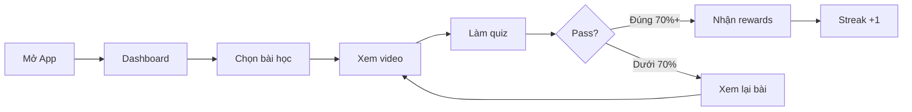
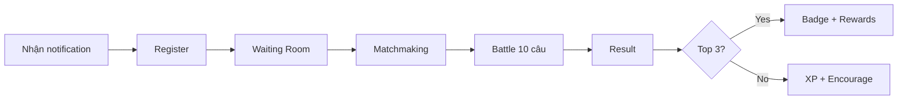

# User Journeys

Bản đồ hành trình người dùng cho các luồng chính.

## Core Journeys

### Journey 1: Student Learning Session

**Persona**: Minh (Học sinh Tiểu học)
**Goal**: Hoàn thành bài học hàng ngày và nhận phần thưởng
**Scenario**: Minh mở app sau giờ cơm tối, học 30 phút theo lộ trình AI gợi ý

#### Journey Phases

| Phase | Action | Thought | Emotion | Opportunity |
|-------|--------|---------|---------|-------------|
| Login | Mở app, thấy streak 5 ngày | "Mình đang giữ streak tốt!" | 😊 | Gamification ngay từ màn hình đầu |
| Explore | Xem bài học được gợi ý | "Hôm nay học Toán nhé" | 😐 | AI gợi ý dựa trên gap knowledge |
| Learn | Xem video 5 phút | "Video ngắn, dễ hiểu" | 😄 | Bite-size content, progress bar |
| Practice | Làm quiz 10 câu | "Sao mình sai câu này?" | 🤔 | Giải thích ngay khi sai |
| Reward | Nhận 50 XP + 1 sao | "Yeah! Gần đủ mở badge mới!" | 🎉 | Animation celebrate, progress |

#### Journey Flow

**Key Metrics**:
- Completion rate: 85%
- Time per session: 25-35 phút
- Drop-off points: Quiz fail → xem lại video

### Journey 2: Parent Monitoring

**Persona**: Hoa (Phụ huynh)
**Goal**: Xem báo cáo tuần của con mà không cần hỏi trực tiếp
**Scenario**: Tối Chủ nhật, Hoa mở app để review tiến độ học tập của con trong tuần

| Stage | Actions | Touchpoint | Pain Points | Solutions |
|-------|---------|------------|-------------|-----------|
| Access | Mở app từ notification | Push notification hàng tuần | Quên check báo cáo | Auto reminder Chủ nhật 8pm |
| Overview | Xem dashboard tổng quan | Parent Dashboard | Quá nhiều số liệu | Highlight 3 metrics chính |
| Deep dive | Xem chi tiết môn yếu | Subject Analytics | Không hiểu % nghĩa gì | So sánh với tuần trước |
| Action | Đặt goal cho tuần tới | Goal Setting | Không biết goal phù hợp | Gợi ý goal dựa trên data |
| Share | Khen con qua app | In-app message | Ngại khen trực tiếp | Template messages |

**Key Metrics**:
- Weekly active parents: 60%
- Avg time on report: 3 phút
- Goal setting rate: 40%

### Journey 3: Tournament Battle

**Persona**: Lan (Học sinh THCS)
**Goal**: Thi đấu Toán với bạn cùng trường vào cuối tuần
**Scenario**: Thứ 7 chiều, Lan join tournament do trường tổ chức

| Stage | Actions | Touchpoint | Pain Points | Solutions |
|-------|---------|------------|-------------|-----------|
| Discover | Nhận thông báo tournament | Push + In-app banner | Không biết có event | Remind 24h + 1h trước |
| Register | Đăng ký tham gia | Tournament Lobby | Sợ thua xấu mặt | Hiển thị ranking ẩn danh option |
| Wait | Chờ matchmaking | Waiting Room | Chờ lâu, buồn | Mini game trong lúc chờ |
| Battle | Trả lời 10 câu realtime | Battle Screen | Lag, mất kết nối | Graceful reconnect, pause timer |
| Result | Xem kết quả, ranking | Leaderboard | Thua, buồn | "Improvement" highlight vs previous |

#### Journey Flow

**Key Metrics**:
- Registration rate: 70% từ notification
- Completion rate: 90% (ít bỏ giữa chừng)
- Replay rate: 65% tham gia tournament tiếp theo

### Journey 4: Teacher Assessment Creation

**Persona**: Thầy Hùng (Giáo viên)
**Goal**: Tạo đề thi 15 phút cho lớp 8A từ ngân hàng câu hỏi
**Scenario**: Thứ 5 tối, Thầy Hùng cần tạo đề kiểm tra cho tiết sau

| Stage | Actions | Touchpoint | Pain Points | Solutions |
|-------|---------|------------|-------------|-----------|
| Access | Đăng nhập Teacher Portal | Web Portal | Quên password | SSO với Google Workspace |
| Select | Chọn lớp và môn | Class Selector | Nhiều lớp, khó tìm | Recent classes on top |
| Build | Chọn câu hỏi từ bank | Question Bank | Mất thời gian chọn từng câu | AI suggest based on topic |
| Review | Xem preview đề | Preview Mode | Không thấy như học sinh | Student view preview |
| Assign | Giao đề cho lớp | Assignment | Quên set deadline | Auto deadline suggestions |

**Key Metrics**:
- Avg time to create: < 10 phút
- Questions from bank: 80%
- Custom questions: 20%

## Journey Insights

### Pain Point Summary

| Journey | Major Pain Points | Priority |
|---------|-------------------|----------|
| Student Learning | Quiz fail → demotivation | High |
| Parent Monitoring | Quá nhiều data, không actionable | High |
| Tournament | Lag/disconnect khi battle | High |
| Teacher Assessment | Mất thời gian chọn câu hỏi | Medium |

### Opportunity Areas

| Opportunity | Impact | Effort | Priority |
|-------------|--------|--------|----------|
| AI gợi ý bài học gap knowledge | High | High | P0 |
| Parent weekly digest notification | High | Low | P0 |
| Reconnect graceful cho tournament | High | Medium | P1 |
| Template đề thi theo topic | Medium | Low | P1 |
| Gamification cho Parent engagement | Medium | Medium | P2 |

## References

- [Personas](./personas.md)
- [Usability](./usability.md)
