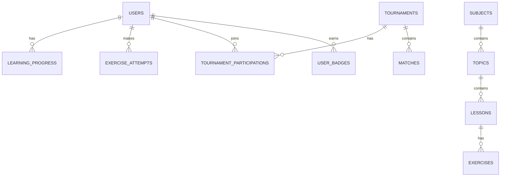

# Backend Architecture

API design, database schema, and external tool references.


## Overview

This document consolidates backend architecture including API design patterns, database schema, and references to external API documentation tools.


## External References

| Tool | Purpose | Link |
|------|---------|------|
| OpenAPI | API Specification | `[OpenAPI/Swagger URL]` |
| Postman | API Testing | `[Postman Collection URL]` |
| Apidog | API Documentation | `[Apidog URL]` |
| GraphQL Playground | GraphQL Explorer | `/graphql` |


## Tech Stack

| Layer | Technology | Version |
|-------|------------|---------|
| Runtime | Node.js | 20.x |
| Framework | NestJS | latest |
| API | GraphQL (Apollo Server) | 4.x |
| Database | PostgreSQL | 15.x |
| Cache | Redis | latest |
| Message Queue | RabbitMQ | latest |
| Search | Elasticsearch | latest |
| ORM | Prisma | latest |


## API Design

### API Style

| Aspect | Choice |
|--------|--------|
| Primary | GraphQL |
| Secondary | REST (webhooks, uploads) |
| Format | JSON |
| Versioning | Schema versioning |
| Auth | Bearer token (JWT) |

### Endpoint Summary

| Endpoint | Method | Description | Auth |
|----------|--------|-------------|------|
| `/graphql` | POST | GraphQL API | Optional |
| `/api/upload` | POST | File upload | Required |
| `/api/webhooks/*` | POST | External webhooks | API Key |
| `/health` | GET | Health check | No |


## GraphQL Schema Conventions

### Naming

| Element | Convention | Example |
|---------|------------|---------|
| Query | camelCase | `learningPath`, `tournaments` |
| Mutation | camelCase, verb prefix | `createUser`, `updateLesson` |
| Type | PascalCase | `User`, `LearningPath` |
| Input | PascalCase + Input suffix | `CreateUserInput` |
| Enum | UPPER_SNAKE_CASE | `USER_ROLE`, `TOURNAMENT_STATUS` |

### Query Pattern

```graphql
type Query {
  # Single entity
  user(id: ID!): User
  
  # List with pagination
  users(
    first: Int
    after: String
    filter: UserFilter
  ): UserConnection!
  
  # Current user
  me: User
}
```

### Mutation Pattern

```graphql
type Mutation {
  createUser(input: CreateUserInput!): CreateUserPayload!
  updateUser(id: ID!, input: UpdateUserInput!): UpdateUserPayload!
  deleteUser(id: ID!): DeleteUserPayload!
}

type CreateUserPayload {
  user: User
  errors: [Error!]
}
```


## Pagination

### Cursor-based (Recommended)

```graphql
type UserConnection {
  edges: [UserEdge!]!
  pageInfo: PageInfo!
  totalCount: Int!
}

type UserEdge {
  node: User!
  cursor: String!
}

type PageInfo {
  hasNextPage: Boolean!
  hasPreviousPage: Boolean!
  startCursor: String
  endCursor: String
}
```


## Error Handling

### Error Type

```graphql
type Error {
  code: ErrorCode!
  message: String!
  field: String
}

enum ErrorCode {
  VALIDATION_ERROR
  NOT_FOUND
  UNAUTHORIZED
  FORBIDDEN
  CONFLICT
  INTERNAL_ERROR
}
```

> For complete error codes and response format, see [API Contracts](../../api/contracts.md).


## Database Design

### Database Info

| Aspect | Value |
|--------|-------|
| DBMS | PostgreSQL 15 |
| Charset | UTF-8 |
| Collation | en_US.UTF-8 |
| Extensions | uuid-ossp, pgcrypto |

### Naming Conventions

| Element | Convention | Example |
|---------|------------|---------|
| Table | snake_case, plural | `users`, `learning_paths` |
| Column | snake_case | `created_at`, `user_id` |
| Primary Key | `id` | `id UUID` |
| Foreign Key | `{table_singular}_id` | `user_id` |
| Index | `idx_{table}_{columns}` | `idx_users_email` |
| Unique | `uq_{table}_{columns}` | `uq_users_email` |

### Common Columns

All tables include:

| Column | Type | Description |
|--------|------|-------------|
| `id` | UUID | Primary key |
| `created_at` | TIMESTAMPTZ | Creation time |
| `updated_at` | TIMESTAMPTZ | Last update time |
| `deleted_at` | TIMESTAMPTZ | Soft delete (optional) |

### Core Tables

| Table | Description | Key Columns |
|-------|-------------|-------------|
| `users` | User accounts | id, email, role, tenant_id |
| `subjects` | Subjects | id, name, slug, icon |
| `topics` | Topics within subjects | id, subject_id, grade_id, name |
| `lessons` | Lessons within topics | id, topic_id, title, content |
| `exercises` | Exercises within lessons | id, lesson_id, type, difficulty |
| `tournaments` | Tournament definitions | id, name, status, start_time |

### Entity Relationship




## References

- [System Design](./system-design.md)
- [Tech Stack](./tech-stack.md)
- [Data Model](./data-model.md)
- [API Contracts](../../api/contracts.md)
