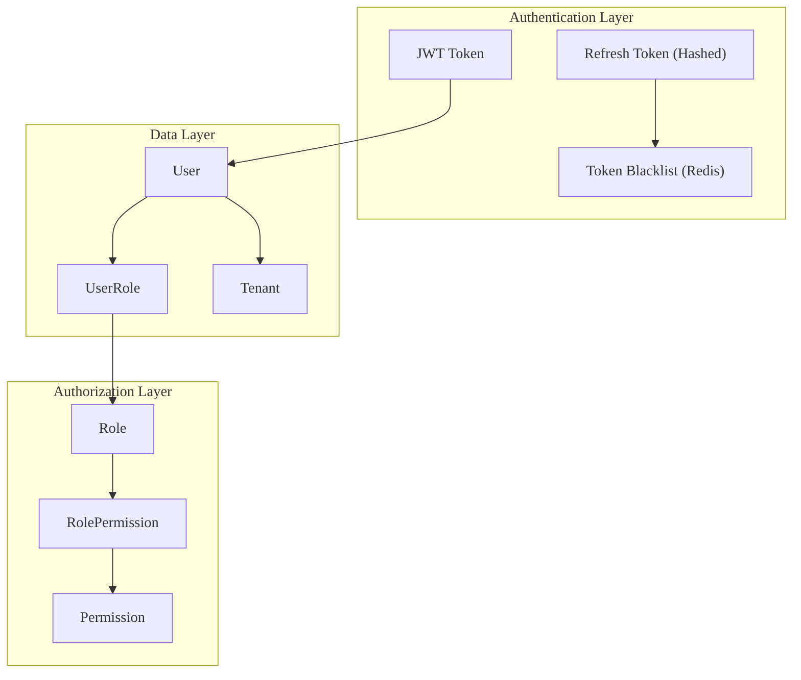
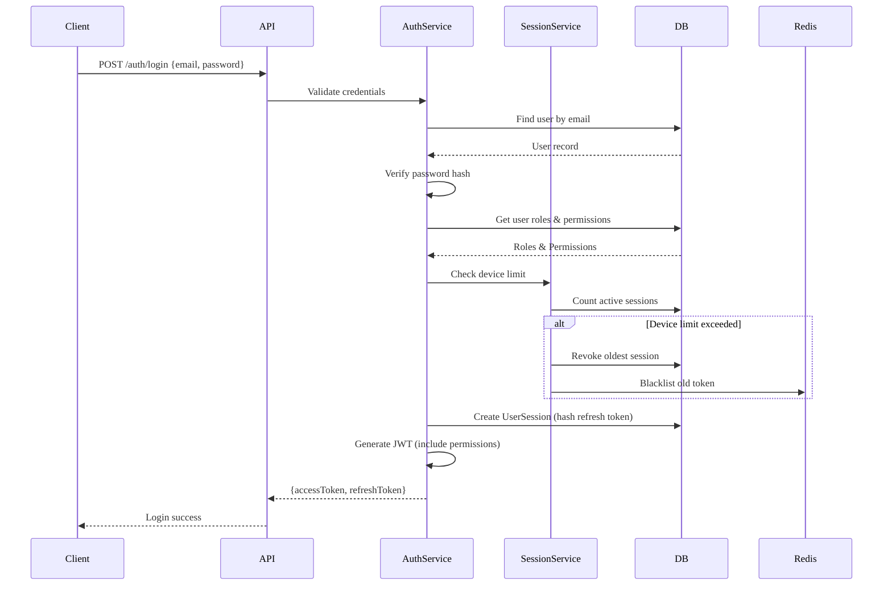
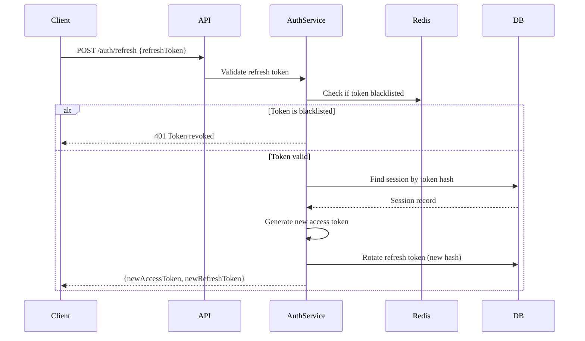
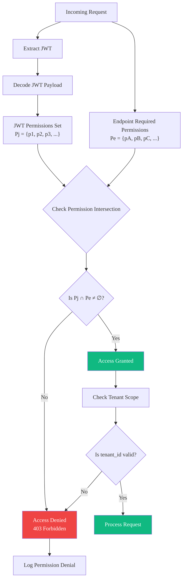
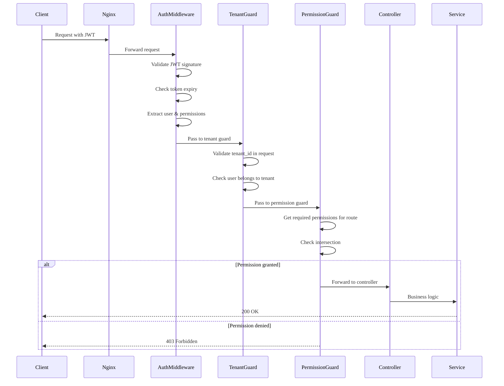
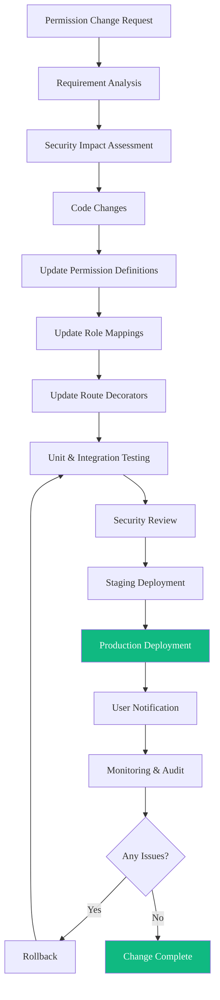
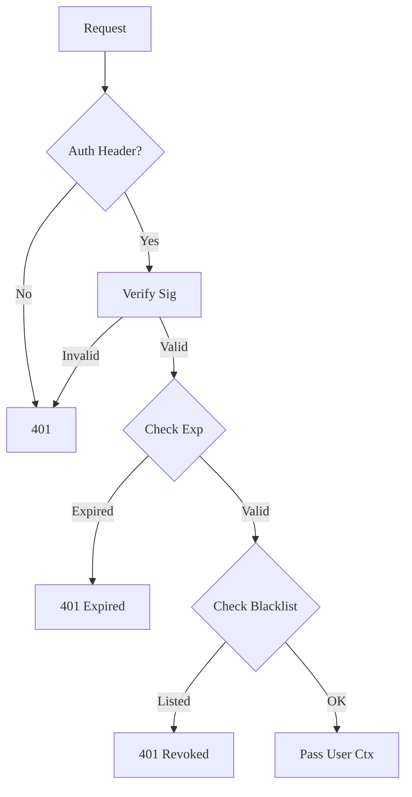

# Security Policy

Tiêu chuẩn bảo mật, kiểm soát truy cập và xác thực.

---

## RBAC Model

### 2.1. Tổng quan kiến trúc



### 2.2. Các thành phần chính

| Component            | Description                                         | Storage Location       |
| -------------------- | --------------------------------------------------- | ---------------------- |
| **User**             | Tài khoản người dùng, không lưu trực tiếp loại user | PostgreSQL             |
| **Role**             | Vai trò với name, color, description                | PostgreSQL (Seed data) |
| **Permission**       | Permission cụ thể theo module và action             | PostgreSQL (Seed data) |
| **UserRole**         | Gán role cho user trong tenant                      | PostgreSQL             |
| **RolePermission**   | Gán permission cho role                             | PostgreSQL             |
| **JWT Access Token** | Token ngắn hạn (15-30 phút)                         | Client-side            |
| **Refresh Token**    | Token dài hạn, chỉ lưu hash                         | PostgreSQL (hashed)    |
| **Token Blacklist**  | Danh sách token đã thu hồi                          | Redis                  |

---

## Authentication Flow

### 3.1. Luồng đăng nhập



### 3.2. Luồng Refresh Token



---

## Authorization Flow

### 4.1. Luồng xác thực quyền



### 4.2. Các cấp độ chi tiết quyền

Hệ thống hỗ trợ 3 mức độ chi tiết của permission:

| Level            | Pattern         | Example     | Use Case                        |
| ---------------- | --------------- | ----------- | ------------------------------- |
| **Module-level** | `module:*`      | `exam:*`    | Admin có full access cho module |
| **Action-level** | `module:action` | `exam:read` | Specific action trên module     |
| **Special**      | `admin:*`       | `admin:all` | Root admin bypass               |

### 4.3. Pipeline xử lý yêu cầu



---

## Security Policies

### 5.1. Bảo mật Token

| Policy                    | Value                | Description                  |
| ------------------------- | -------------------- | ---------------------------- |
| **Access Token Expiry**   | 15-30 phút           | Giảm window of attack        |
| **Refresh Token Expiry**  | 7 ngày               | Cân bằng giữa UX và security |
| **Token Algorithm**       | HS256/RS256          | Signing algorithm            |
| **Refresh Token Storage** | Chỉ hash             | Không lưu plain text         |
| **Blacklist TTL**         | Token expiry + 1 giờ | Cleanup sau khi hết hạn      |

### 5.2. Bảo mật phiên

| Policy                    | Value                     | Description                  |
| ------------------------- | ------------------------- | ---------------------------- |
| **Max Devices**           | 3 (cấu hình được)         | Giới hạn thiết bị concurrent |
| **Session Tracking**      | Device ID, IP, User Agent | Audit trail                  |
| **Remote Logout**         | Có hỗ trợ                 | Logout các thiết bị khác     |
| **Oldest Session Revoke** | Tự động                   | Khi vượt limit               |

### 5.3. Bảo mật mật khẩu

| Policy             | Value    | Description                   |
| ------------------ | -------- | ----------------------------- |
| **Hash Algorithm** | bcrypt   | Industry standard             |
| **Salt Rounds**    | 12       | Cân bằng performance/security |
| **Min Length**     | 8 ký tự  | Yêu cầu tối thiểu             |
| **Complexity**     | Optional | Uppercase, number, special    |

### 5.4. Xác thực 2 yếu tố (2FA)

| Áp dụng cho    | Method                      | Required |
| -------------- | --------------------------- | -------- |
| `root-admin`   | TOTP (Google Authenticator) | Có       |
| `tenant-admin` | TOTP (Google Authenticator) | Có       |
| Các roles khác | Optional                    | Không    |

---

## Multi-Tenant Security

### 6.1. Quy tắc cô lập dữ liệu

1. **Query Filter**: Tất cả queries PHẢI include `tenant_id` (trừ system tables)
2. **Cross-Tenant Block**: Không cho phép access dữ liệu tenant khác
3. **API Validation**: Validate `tenant_id` trong request body/params
4. **Audit Log**: Log tất cả cross-tenant access bởi root-admin

### 6.2. Ma trận phạm vi Tenant

| Role           | Tenant của mình  | Tenant khác        | System Data     |
| -------------- | ---------------- | ------------------ | --------------- |
| `root-admin`   | ✅ Full          | ✅ Via impersonate | ✅ Full         |
| `tenant-admin` | ✅ Full          | ❌ Blocked         | ❌ Không access |
| `teacher`      | ✅ Limited       | ❌ Blocked         | ❌ Không access |
| `parent`       | ✅ Limited       | ❌ Blocked         | ❌ Không access |
| `student`      | ✅ Dữ liệu riêng | ❌ Blocked         | ❌ Không access |

---

## Permission Change Process



---

## Rate Limiting & Protection

### 8.1. Cấu hình giới hạn tốc độ

| Endpoint                | Limit          | Window | Block Duration |
| ----------------------- | -------------- | ------ | -------------- |
| `/auth/login`           | 5 requests     | 1 phút | 5 phút         |
| `/auth/register`        | 3 requests     | 1 giờ  | 1 giờ          |
| `/auth/forgot-password` | 3 requests     | 1 giờ  | 1 giờ          |
| General API             | 100 requests   | 1 phút | 1 phút         |
| WebSocket connect       | 10 connections | 1 phút | 5 phút         |

### 8.2. Các bảo vệ bổ sung

| Protection             | Implementation    | Purpose                       |
| ---------------------- | ----------------- | ----------------------------- |
| **CORS**               | Whitelist origins | Chống cross-site attacks      |
| **Helmet**             | Security headers  | XSS, clickjacking protection  |
| **Input Validation**   | Class-validator   | SQL injection, XSS prevention |
| **Request Size Limit** | 10MB              | DoS prevention                |

---

## Audit Logging

### 9.1. Các sự kiện được log

| Event Category     | Events                                     | Retention |
| ------------------ | ------------------------------------------ | --------- |
| **Authentication** | Login, logout, failed login, token refresh | 1 năm     |
| **Authorization**  | Permission denied, impersonation           | 1 năm     |
| **Data Access**    | CRUD operations trên sensitive data        | 6 tháng   |
| **Admin Actions**  | Tenant management, user management         | 2 năm     |

### 9.2. Định dạng Log

```json
{
  "timestamp": "2024-01-15T10:30:00Z",
  "level": "info",
  "event": "auth.login.success",
  "userId": "uuid",
  "tenantId": "uuid",
  "ip": "192.168.1.1",
  "userAgent": "Mozilla/5.0...",
  "metadata": {
    "deviceId": "uuid",
    "loginMethod": "password"
  }
}
```

---

## References

- [Business Overview](/specs)
- [System Design](../system-design.md)
- [Data Model](../data-model.md)
- [Auth Module](../../02-modules/auth/logic.md)

---

## JWT Token Specification

### 10.1. Tổng quan

- **Standard**: RFC 7519 (JSON Web Token).
- **Role**: Authentication (Stateless) & Authorization.
- **Đặc điểm**: Compact, Secure (Signed), Scalable.

### 10.2. Cấu trúc Token

Format: `Header.Payload.Signature`

#### Header

Algorithm: `HS256` (HMAC SHA-256).

#### Payload (Claims)

**Standard Claims**:

- `sub`: User UUID.
- `iss`: Issuer (e.g., `lms-auth`).
- `iat`, `exp`: Timestamp.

**Custom Claims (Context)**:

- `tenant_id`: School Context hiện tại.
- `role`: RBAC Role (e.g., `teacher`).
- `permissions`: String array (e.g., `["content:create"]`).
- `session_id`: Cho revocation/blacklist.

#### Signature

`HMACSHA256(base64(header) + "." + base64(payload), secret)`

### 10.3. Chiến lược (Dual Token)

| Token       | TTL | Storage (Client) | Mục đích            |
| ----------- | --- | ---------------- | ------------------- |
| **Access**  | 15m | Memory           | API Auth            |
| **Refresh** | 7d  | HttpOnly Cookie  | Rotate Access Token |

**Rotation Policy**: New Access Token = New Refresh Token. Old Refresh Token
invalidated ngay (Reuse Detection).

### 10.4. Quy trình xác thực



### 10.5. Các thực hành bảo mật tốt nhất

1.  **Storage**: Access Token trong Memory (No XSS). Refresh Token trong
    HttpOnly Cookie.
2.  **Revocation**: Redis Blacklist (key: `session_id`, ttl: `exp`).
3.  **Algorithm**: Enforce `HS256`, reject `none`.

### 10.6. Mã lỗi

| Code                  | Status | Description     |
| --------------------- | ------ | --------------- |
| `AUTH_HEADER_MISSING` | 401    | Yêu cầu token   |
| `TOKEN_EXPIRED`       | 401    | Cần refresh     |
| `TOKEN_INVALID`       | 401    | Bad signature   |
| `SESSION_REVOKED`     | 401    | Session revoked |

### 10.7. Tài liệu tham khảo

- [RFC 7519](https://tools.ietf.org/html/rfc7519)
- [Auth Business Logic](../../02-modules/auth/logic.md)
- [Auth Workflows](../../02-modules/auth/logic.md)
- [Auth Data Model](../../02-modules/auth/data.md)
