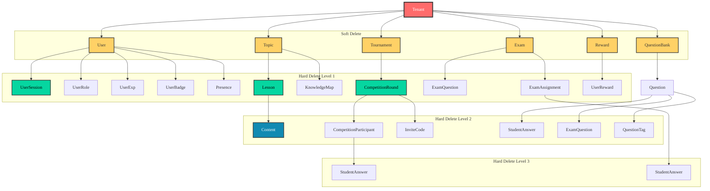

# Data Model

## ER Diagram

The schema is designed following a multi-tenant model with data isolation between schools. All business tables have `tenant_id` and `created_at`, `updated_at` timestamps (except system tables).

```d2
# ========== SYSTEM TABLES ==========
Permission: {
  shape: sql_table
  id: string {constraint: primary_key}
  name: string
  description: string
}

Role: {
  shape: sql_table
  id: string {constraint: primary_key}
  name: string
  color: string
  created_at: timestamp
  updated_at: timestamp
}

RolePermission: {
  shape: sql_table
  role_id: string {constraint: foreign_key}
  permission_id: string {constraint: foreign_key}
  created_at: timestamp
}

# ========== TENANT MANAGEMENT ==========
Tenant: {
  shape: sql_table
  id: string {constraint: primary_key}
  name: string
  code: string
  domain: string
  email: string
  phone: string
  address: string
  settings: jsonb
  status: enum
  deactivated_at: timestamp
  deleted_at: timestamp
  created_at: timestamp
  updated_at: timestamp
}

# ========== AUTHENTICATION ==========
User: {
  shape: sql_table
  id: string {constraint: primary_key}
  tenant_id: string {constraint: foreign_key}
  email: string
  password: string
  first_name: string
  last_name: string
  avatar_url: string
  is_active: boolean
  email_verified: boolean
  email_verified_at: timestamp
  last_login_at: timestamp
  metadata: jsonb
  deleted_at: timestamp
  created_at: timestamp
  updated_at: timestamp
}

UserRole: {
  shape: sql_table
  user_id: string {constraint: foreign_key}
  role_id: string {constraint: foreign_key}
  tenant_id: string {constraint: foreign_key}
  created_at: timestamp
}

UserSession: {
  shape: sql_table
  id: string {constraint: primary_key}
  user_id: string {constraint: foreign_key}
  device_id: string
  device_name: string
  refresh_token_hash: string
  user_agent: string
  ip_address: string
  location: string
  is_active: boolean
  expires_at: timestamp
  last_used_at: timestamp
  revoked_at: timestamp
  created_at: timestamp
  updated_at: timestamp
}

ParentStudentLink: {
  shape: sql_table
  id: string {constraint: primary_key}
  parent_id: string {constraint: foreign_key}
  student_id: string {constraint: foreign_key}
  created_at: timestamp
}

# ========== CONTENT STRUCTURE ==========
Subject: {
  shape: sql_table
  id: string {constraint: primary_key}
  name: string
  code: string
  icon: string
  order: integer
  created_at: timestamp
  updated_at: timestamp
}

Grade: {
  shape: sql_table
  id: string {constraint: primary_key}
  name: string
  level: integer
  created_at: timestamp
  updated_at: timestamp
}

Topic: {
  shape: sql_table
  id: string {constraint: primary_key}
  tenant_id: string {constraint: foreign_key}
  subject_id: string {constraint: foreign_key}
  grade_id: string {constraint: foreign_key}
  name: string
  description: string
  icon: string
  order: integer
  is_active: boolean
  deleted_at: timestamp
  created_at: timestamp
  updated_at: timestamp
}

Lesson: {
  shape: sql_table
  id: string {constraint: primary_key}
  topic_id: string {constraint: foreign_key}
  title: string
  description: string
  semester: enum
  order: integer
  created_at: timestamp
  updated_at: timestamp
}

Content: {
  shape: sql_table
  id: string {constraint: primary_key}
  lesson_id: string {constraint: foreign_key}
  type: enum
  title: string
  content_url: string
  duration: integer
  order: integer
  metadata: jsonb
  created_at: timestamp
  updated_at: timestamp
}

# ========== QUESTION BANK ==========
QuestionBank: {
  shape: sql_table
  id: string {constraint: primary_key}
  tenant_id: string {constraint: foreign_key}
  creator_id: string {constraint: foreign_key}
  name: string
  description: string
  type: enum
  is_public: boolean
  deleted_at: timestamp
  created_at: timestamp
  updated_at: timestamp
}

Question: {
  shape: sql_table
  id: string {constraint: primary_key}
  question_bank_id: string {constraint: foreign_key}
  topic_id: string {constraint: foreign_key}
  lesson_id: string {constraint: foreign_key}
  type: enum
  content: string
  options: jsonb
  correct_answer: string
  explanation: jsonb
  difficulty: enum
  points: integer
  deleted_at: timestamp
  created_at: timestamp
  updated_at: timestamp
}

QuestionTag: {
  shape: sql_table
  question_id: string {constraint: foreign_key}
  tag_name: string
  created_at: timestamp
}

# ========== LEARNING & PROGRESS ==========
StudentProgress: {
  shape: sql_table
  id: string {constraint: primary_key}
  student_id: string {constraint: foreign_key}
  lesson_id: string {constraint: foreign_key}
  completion_percentage: integer
  started_at: timestamp
  completed_at: timestamp
  last_accessed_at: timestamp
  created_at: timestamp
  updated_at: timestamp
}

StudentAnswer: {
  shape: sql_table
  id: string {constraint: primary_key}
  student_id: string {constraint: foreign_key}
  question_id: string {constraint: foreign_key}
  content_id: string {constraint: foreign_key}
  exam_id: string {constraint: foreign_key}
  competition_id: string {constraint: foreign_key}
  answer: string
  is_correct: boolean
  time_taken: integer
  answered_at: timestamp
  created_at: timestamp
}

# ========== TOURNAMENT SYSTEM ==========
Tournament: {
  shape: sql_table
  id: string {constraint: primary_key}
  tenant_id: string {constraint: foreign_key}
  name: string
  description: string
  level: enum
  subject_id: string {constraint: foreign_key}
  grade_id: string {constraint: foreign_key}
  settings: jsonb
  deleted_at: timestamp
  starts_at: timestamp
  ends_at: timestamp
  created_at: timestamp
  updated_at: timestamp
}

CompetitionRound: {
  shape: sql_table
  id: string {constraint: primary_key}
  tournament_id: string {constraint: foreign_key}
  name: string
  description: string
  order: integer
  required_score: integer
  participant_limit: integer
  requires_invite: boolean
  rules: jsonb
  starts_at: timestamp
  ends_at: timestamp
  created_at: timestamp
  updated_at: timestamp
}

CompetitionParticipant: {
  shape: sql_table
  id: string {constraint: primary_key}
  round_id: string {constraint: foreign_key}
  student_id: string {constraint: foreign_key}
  invite_code_id: string {constraint: foreign_key}
  score: integer
  rank: integer
  registered_at: timestamp
  started_at: timestamp
  completed_at: timestamp
  created_at: timestamp
  updated_at: timestamp
}

InviteCode: {
  shape: sql_table
  id: string {constraint: primary_key}
  round_id: string {constraint: foreign_key}
  creator_id: string {constraint: foreign_key}
  code: string
  max_uses: integer
  used_count: integer
  expires_at: timestamp
  created_at: timestamp
  updated_at: timestamp
}

# ========== GAMIFICATION ==========
UserExp: {
  shape: sql_table
  id: string {constraint: primary_key}
  user_id: string {constraint: foreign_key}
  exp_points: integer
  level: integer
  created_at: timestamp
  updated_at: timestamp
}

Badge: {
  shape: sql_table
  id: string {constraint: primary_key}
  name: string
  description: string
  icon_url: string
  category: enum
  created_at: timestamp
  updated_at: timestamp
}

UserBadge: {
  shape: sql_table
  user_id: string {constraint: foreign_key}
  badge_id: string {constraint: foreign_key}
  earned_at: timestamp
}

Reward: {
  shape: sql_table
  id: string {constraint: primary_key}
  tenant_id: string {constraint: foreign_key}
  name: string
  description: string
  image_url: string
  type: enum
  cost: integer
  stock: integer
  is_active: boolean
  deleted_at: timestamp
  created_at: timestamp
  updated_at: timestamp
}

UserReward: {
  shape: sql_table
  id: string {constraint: primary_key}
  user_id: string {constraint: foreign_key}
  reward_id: string {constraint: foreign_key}
  quantity: integer
  status: string
  redeemed_at: timestamp
  updated_at: timestamp
}

# ========== EXAM & ASSESSMENT ==========
Exam: {
  shape: sql_table
  id: string {constraint: primary_key}
  tenant_id: string {constraint: foreign_key}
  creator_id: string {constraint: foreign_key}
  title: string
  description: string
  subject_id: string {constraint: foreign_key}
  grade_id: string {constraint: foreign_key}
  settings: jsonb
  duration: integer
  deleted_at: timestamp
  starts_at: timestamp
  ends_at: timestamp
  created_at: timestamp
  updated_at: timestamp
}

ExamQuestion: {
  shape: sql_table
  exam_id: string {constraint: foreign_key}
  question_id: string {constraint: foreign_key}
  order: integer
  points: integer
  created_at: timestamp
}

ExamAssignment: {
  shape: sql_table
  id: string {constraint: primary_key}
  exam_id: string {constraint: foreign_key}
  student_id: string {constraint: foreign_key}
  score: integer
  started_at: timestamp
  completed_at: timestamp
  created_at: timestamp
  updated_at: timestamp
}

# ========== ANALYTICS ==========
KnowledgeMap: {
  shape: sql_table
  id: string {constraint: primary_key}
  student_id: string {constraint: foreign_key}
  topic_id: string {constraint: foreign_key}
  mastery_level: float
  questions_attempted: integer
  questions_correct: integer
  last_practiced: timestamp
  created_at: timestamp
  updated_at: timestamp
}

LearningAnalytics: {
  shape: sql_table
  id: string {constraint: primary_key}
  student_id: string {constraint: foreign_key}
  date: date
  learning_time: integer
  questions_attempted: integer
  lessons_completed: integer
  created_at: timestamp
  updated_at: timestamp
}

# ========== NOTIFICATIONS ==========
Notification: {
  shape: sql_table
  id: string {constraint: primary_key}
  user_id: string {constraint: foreign_key}
  title: string
  message: string
  type: enum
  is_read: boolean
  metadata: jsonb
  created_at: timestamp
}

# ========== RELATIONSHIPS ==========
Role -> UserRole: has
Permission -> RolePermission: assigned_to
Role -> RolePermission: has

Tenant -> User: has
Tenant -> Topic: has
Tenant -> QuestionBank: has
Tenant -> Tournament: has
Tenant -> Exam: has
Tenant -> Reward: has

User -> UserRole: assigned
User -> UserSession: has
User -> ParentStudentLink: as_parent
User -> QuestionBank: created
User -> Exam: created
User -> InviteCode: created
User -> UserExp: has
User -> UserBadge: earned
User -> UserReward: redeemed
User -> CompetitionParticipant: participates
User -> StudentProgress: has
User -> StudentAnswer: submits
User -> ExamAssignment: assigned
User -> KnowledgeMap: has
User -> LearningAnalytics: has
User -> Notification: receives

Subject -> Topic: has
Subject -> Tournament: for
Subject -> Exam: for

Grade -> Topic: has
Grade -> Tournament: for
Grade -> Exam: for

Topic -> Lesson: has
Topic -> Question: tagged_with
Topic -> KnowledgeMap: in

Lesson -> Content: has
Lesson -> StudentProgress: tracked_by
Lesson -> Question: tagged_with

QuestionBank -> Question: contains

Question -> StudentAnswer: answered_in
Question -> ExamQuestion: included_in
Question -> QuestionTag: tagged_with

Tournament -> CompetitionRound: has

CompetitionRound -> CompetitionParticipant: has
CompetitionRound -> InviteCode: has
CompetitionRound -> StudentAnswer: in

CompetitionParticipant -> StudentAnswer: submits_in

Badge -> UserBadge: awarded_to

Reward -> UserReward: redeemed_by

Exam -> ExamQuestion: contains
Exam -> ExamAssignment: assigned_to
Exam -> StudentAnswer: in

Content -> StudentAnswer: in
```

## Entity Descriptions

### 2.1. System

| Table | Description |
|------|-------|
| **Permission** | System permissions, without timestamps |
| **Role** | User roles with colors and timestamps |
| **RolePermission** | Links permissions with roles |

### 2.2. Tenant Management

| Table | Description |
|------|-------|
| **Tenant** | School/customer using the system with status: ACTIVE, SUSPENDED, PENDING_DEACTIVATION |

### 2.3. Authentication & Users

| Table | Description |
|------|-------|
| **User** | User account, user type determined through Role (RBAC) |
| **UserRole** | User's role in each tenant |
| **UserSession** | Device-based login session with device tracking and refresh token hashing |
| **ParentStudentLink** | Links parent with student (many-to-many relationship) |

### 2.4. Content Structure

| Table | Description |
|------|-------|
| **Subject** | Subjects (Math, Vietnamese, Math in English) |
| **Grade** | Grade levels (1-12) |
| **Topic** | Learning topics, with visibility status (is_active) |
| **Lesson** | Lessons, with semester (SEMESTER1, SEMESTER2) |
| **Content** | Lesson content: VIDEO, EXERCISE, TEXT, QUIZ |

### 2.5. Question Bank

| Table | Description |
|------|-------|
| **QuestionBank** | Question collection, type: SYSTEM or TEACHER |
| **Question** | Questions with type: MULTIPLE_CHOICE, TRUE_FALSE, SHORT_ANSWER and difficulty: EASY, MEDIUM, HARD |
| **QuestionTag** | Tags for questions |

### 2.6. Learning & Progress

| Table | Description |
|------|-------|
| **StudentProgress** | Tracks student learning progress |
| **StudentAnswer** | Stores all student answers |

### 2.7. Tournament System

| Table | Description |
|------|-------|
| **Tournament** | Arena with levels: SCHOOL, DISTRICT, PROVINCE, REGIONAL, NATIONAL |
| **CompetitionRound** | Competition rounds within the arena |
| **CompetitionParticipant** | Participants joining competition rounds |
| **InviteCode** | Invitation codes for joining school-level and above competition rounds |

### 2.8. Gamification

| Table | Description |
|------|-------|
| **UserExp** | User experience points and level |
| **Badge** | Badges with type: ACHIEVEMENT, COMPETITION, LEARNING |
| **UserBadge** | Badges earned by users |
| **Reward** | Rewards in the store, type: VIRTUAL or PHYSICAL |
| **UserReward** | Rewards redeemed by users |

### 2.9. Exams & Assessment

| Table | Description |
|------|-------|
| **Exam** | Tests/exams |
| **ExamQuestion** | Questions in exams |
| **ExamAssignment** | Exams assigned to students |

### 2.10. Analytics

| Table | Description |
|------|-------|
| **KnowledgeMap** | Personalized knowledge map |
| **LearningAnalytics** | Daily learning analytics data |

### 2.11. Notifications

| Table | Description |
|------|-------|
| **Notification** | Notifications with type: SYSTEM, ACHIEVEMENT, COMPETITION, LEARNING |

## Key Relationships

### 3.1. Multi-tenant Relationships
- **Tenant** is the center, linked to all business data
- Each **User** belongs to one **Tenant**
- **Topic**, **QuestionBank**, **Tournament**, **Exam**, **Reward** all have `tenant_id`

### 3.2. User RBAC Relationships
- **User** can have multiple **Roles** via **UserRole** table (e.g., user can be both teacher and parent)
- **Parent** links to **Student** via **ParentStudentLink** (many-to-many relationship)
- **User** can be the creator of: **QuestionBank**, **Exam**, **InviteCode**

### 3.3. Content Structure
- **Subject** → **Grade** → **Topic** → **Lesson** → **Content**
- **Question** can link to **Topic** and/or **Lesson**
- **Lesson** has `semester` attribute (SEMESTER1, SEMESTER2)

### 3.4. Tournament System
- **Tournament** → **CompetitionRound** → **CompetitionParticipant**
- **InviteCode** allows joining competition rounds when `requires_invite=true`
- **StudentAnswer** can belong to **CompetitionRound**

### 3.5. Gamification & Analytics
- **UserExp** tracks experience points
- **Badge** is awarded to **User** via **UserBadge**
- **KnowledgeMap** is built from **StudentAnswer** and **Topic**
- **LearningAnalytics** aggregates daily from learning activities

## Database Specifications

### 4.1. Naming Conventions
- **Primary Key**: `id` (UUID v4)
- **Foreign Key**: `{table_name}_id` (e.g., `user_id`, `tenant_id`)
- **Timestamps**: `created_at`, `updated_at` (UTC timezone)
- **Soft Delete**: Only apply `deleted_at` for tables: User, Topic, QuestionBank, Question, Exam, Tournament, Reward

### 4.2. Data Rules
1. **Multi-tenancy**: All queries must include `tenant_id` except for system tables
2. **Data Isolation**: Data between tenants is completely independent
3. **Audit Trail**: All important changes are logged via `AuditLog` (not shown in diagram)
4. **Enum Values**: Use UPPERCASE with underscores for enum values
5. **Soft Delete Strategy**: Only apply `deleted_at` for specified tables, other tables use hard delete or retention policy
6. **Token Security**: Refresh token stores hash only in database, not plain text
7. **Cascade Delete**: Supports both hard delete cascade (database level) and soft delete cascade (application level)
8. **RBAC Implementation**: User type is determined through Role, not stored directly in User
9. **Semester applies to lessons only**: The `semester` field only exists in `Lesson` table, not applied to `Topic`

### 4.3. RBAC Seed Data
The system will pre-seed the following RBAC data:

**Roles:**
- `root-admin` - System administrator (all tenants)
- `tenant-admin` - School administrator (one tenant)
- `teacher` - Teacher
- `parent` - Parent
- `student` - Student

**Permission Groups:**
- `user:*` - Manage users within tenant
- `content:*` - Manage learning content
- `exam:*` - Manage tests, exams
- `tournament:*` - Manage competitions, arenas
- `analytics:*` - View reports, analytics
- `notification:*` - Manage notifications
- `reward:*` - Manage rewards, gamification
- `system:*` - System administration (root-admin only)
- `session:*` - Manage multi-device sessions

### 4.4. Hidden Support Tables

**AuditLog** (System activity logging):
- `id`, `tenant_id`, `user_id`, `action`, `entity_type`, `entity_id`
- `old_values` (JSONB), `new_values` (JSONB), `ip_address`, `user_agent`
- `created_at`

**SystemConfig** (System configuration):
- `id`, `key`, `value` (JSONB), `description`, `created_at`, `updated_at`

**FileStorage** (File management):
- `id`, `tenant_id`, `user_id`, `filename`, `path`, `mime_type`, `size`
- `bucket`, `is_public`, `metadata` (JSONB), `created_at`

**Presence** (Real-time status tracking):
- `id`, `user_id`, `tenant_id`, `status`, `last_seen_at`, `room_id`, `device_id`
- `metadata` (JSONB), `created_at`, `updated_at`

### 4.5. Migration & Versioning
- **Migration Tool**: Prisma Migrate
- **Version Control**: Git với semantic versioning
- **Rollback Strategy**: Mỗi migration có rollback script
- **Data Seed**: Seed data cho các bảng: Permission, Role, Subject, Grade, Badge
- **Cascade Delete Strategy**: Tất cả foreign keys sẽ có `ON DELETE CASCADE` ngoại trừ các bảng yêu cầu soft delete

### 4.6. Indexing Strategy

| Bảng | Index Chính | Purpose |
|------|------------|----------|
| User | (tenant_id, email, deleted_at) | Login và truy vấn theo tenant |
| Topic | (tenant_id, subject_id, grade_id, deleted_at) | Filter nội dung |
| StudentAnswer | (student_id, answered_at) | Phân tích học tập |
| CompetitionParticipant | (round_id, score DESC) | Bảng xếp hạng real-time |
| KnowledgeMap | (student_id, mastery_level) | Đề xuất lộ trình AI |
| Tenant | (status, deleted_at) | Quản lý tenant lifecycle |
| UserSession | (user_id, device_id, is_active) | Quản lý thiết bị đăng nhập |
| Presence | (user_id, tenant_id, room_id) | Theo dõi real-time presence |

### 4.7. Data Retention Policy

| Loại Dữ Liệu | Thời Gian Lưu Trữ | Ghi Chú |
|-------------|-------------------|---------|
| User Sessions | 30 ngày | Tự động xóa sau khi hết hạn |
| Audit Logs | 1 năm | Archive sau 1 năm |
| Student Answers | Vĩnh viễn | Cho phân tích dài hạn |
| Competition Results | Vĩnh viễn | Lịch sử thi đấu |
| Notification | 90 ngày | Tự động xóa sau khi đọc |
| Soft Deleted Data | 1 năm | Tự động hard delete sau 1 năm |
| Presence Data | 7 ngày | Tự động xóa sau khi offline |

### 4.8. Cascade Delete Strategy

**Hard Cascade Delete (ON DELETE CASCADE)**
Applied to tables without `deleted_at`:
- **UserSession** → deleted when User is hard deleted
- **UserRole** → deleted when User or Role is hard deleted
- **ParentStudentLink** → deleted when User (parent/student) is hard deleted
- **StudentProgress** → deleted when User or Lesson is hard deleted
- **StudentAnswer** → deleted when User or Question is hard deleted
- **CompetitionParticipant** → deleted when CompetitionRound or User is hard deleted
- **ExamAssignment** → deleted when Exam or User is hard deleted
- **Presence** → deleted when User is hard deleted

**Soft Cascade Delete (Application Level)**
Applied to tables with `deleted_at`:
1. **When deleting Tenant**:
   - Set `status = 'PENDING_DEACTIVATION'` → `status = 'SUSPENDED'`
   - Set `deleted_at` for all Users belonging to tenant
   - Set `deleted_at` for all Topic, QuestionBank, Tournament, Exam, Reward belonging to tenant

2. **When deleting User**:
   - Set `deleted_at` for User
   - Hard delete all UserSessions of user
   - Set `deleted_at` for QuestionBank, Exam, InviteCode (creator_id)

3. **When deleting Topic**:
   - Set `deleted_at` for Topic
   - Hard delete all Lessons, Content belonging to topic
   - Set `topic_id = NULL` for Question (soft unlink)

**Color Legend:**
- 🔴 **Dark Red**: Root entity initiating cascade delete
- 🟡 **Yellow**: Soft delete tables (only mark `deleted_at`)
- 🟢 **Green**: Hard delete level 1 tables (direct hard delete)
- 🔵 **Blue**: Hard delete level 2+ tables (indirect hard delete via cascade)

**Cascade Delete Flow Summary:**



**Cascade Delete Rules Summary**

| Parent Entity | Action | Child Entity | Delete Type | Notes |
|--------------|--------|-------------|-------------|-------|
| **Tenant** | Soft Delete | User | Soft Delete | Set `deleted_at` |
| **Tenant** | Soft Delete | Topic | Soft Delete | Set `deleted_at` |
| **Tenant** | Soft Delete | QuestionBank | Soft Delete | Set `deleted_at` |
| **Tenant** | Soft Delete | Tournament | Soft Delete | Set `deleted_at` |
| **Tenant** | Soft Delete | Exam | Soft Delete | Set `deleted_at` |
| **Tenant** | Soft Delete | Reward | Soft Delete | Set `deleted_at` |
| **User** | Soft Delete | UserSession | Hard Delete | ON DELETE CASCADE |
| **User** | Soft Delete | QuestionBank (creator) | Soft Delete | Only if user is creator |
| **User** | Soft Delete | Exam (creator) | Soft Delete | Only if user is creator |
| **Topic** | Soft Delete | Lesson | Hard Delete | ON DELETE CASCADE |
| **QuestionBank** | Soft Delete | Question | Soft Delete | Set `deleted_at` |
| **Tournament** | Soft Delete | CompetitionRound | Hard Delete | ON DELETE CASCADE |
| **Exam** | Soft Delete | ExamQuestion | Hard Delete | ON DELETE CASCADE |
| **Reward** | Soft Delete | UserReward | Hard Delete | ON DELETE CASCADE |
| **Lesson** | Hard Delete | Content | Hard Delete | ON DELETE CASCADE |
| **CompetitionRound** | Hard Delete | CompetitionParticipant | Hard Delete | ON DELETE CASCADE |
| **Question** | Hard Delete | StudentAnswer | Hard Delete | ON DELETE CASCADE |
| **Question** | Hard Delete | ExamQuestion | Hard Delete | ON DELETE CASCADE |
| **User** | Hard Delete | Presence | Hard Delete | ON DELETE CASCADE |

**Important Notes:**
1. **Hard Delete Cascade**: Configured at database level via `ON DELETE CASCADE`
2. **Soft Delete Cascade**: Handled at application level within transaction
3. **Grace Period**: Tenant has 30-day grace period before being SUSPENDED
4. **Data Retention**: Soft deleted data is kept for 1 year before hard delete
5. **Audit Log**: All cascade delete operations are logged in `AuditLog`
6. **Real-time Cleanup**: Delete presence data when user is deleted to avoid stale connections

### 4.9. Business Requirements Mapping

| BR ID | Related Tables | Description |
|-------|-------------------|-------|
| BR-01 | KnowledgeMap, StudentAnswer, UserExp | AI analyzes strengths/weaknesses |
| BR-02 | Tournament, CompetitionRound, CompetitionParticipant | Multi-level arena |
| BR-03 | LearningAnalytics, KnowledgeMap, StudentProgress | 4-level reporting |
| BR-04 | Exam, QuestionBank, ExamAssignment | Teacher management tools |
| BR-05 | UserExp, Badge, Reward, UserBadge, UserReward | Gamification system |
| BR-06 | Subject, Grade, Topic, Lesson, Content | Learning content repository |
| BR-07 | Tenant, User, UserSession, and all multi-tenant tables | Multi-tenant scalability and session management |
| BR-08 | UserSession, Device management | Multi-device session management |
| BR-09 | Tournament, CompetitionRound, StudentAnswer with real-time features | Real-time support for competitions |
| BR-10 | All tables with cascade delete | Cascade delete strategy for tenant |

### 4.10. Functional Requirements Mapping

| Module | Related Tables | Main Functions |
|--------|-------------------|------------------|
| Learning | Topic, Lesson, Content, StudentProgress | FR-HS-01 to FR-HS-05 |
| Competition | Tournament, CompetitionRound, CompetitionParticipant, InviteCode | FR-COMP-01 to FR-COMP-09 |
| Assessment | KnowledgeMap, LearningAnalytics, StudentAnswer | FR-ANAL-01 to FR-ANAL-05 |
| Parent | ParentStudentLink, StudentProgress, LearningAnalytics | FR-PAR-01 to FR-PAR-04 |
| Teacher | Exam, QuestionBank, ExamAssignment, InviteCode | FR-TEACH-01 to FR-TEACH-07 |
| Admin | Tenant, User, Role, Permission, Topic | FR-ADMIN-01 to FR-ADMIN-09 |
| Authentication | User, UserRole, UserSession, ParentStudentLink | FR-AUTH-01 to FR-AUTH-09 |
| Real-time | Tournament, CompetitionRound, StudentAnswer, Presence | FR-RT-01 to FR-RT-06 |

## References

- [Business Overview](../00-business/overview.md)
- [System Design](./system-design.md)
- [Cross-Cutting](./cross-cutting/README.md)