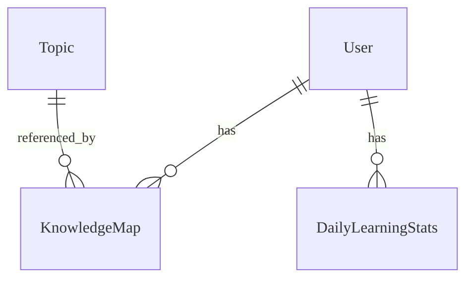

# Analytics - Data Model
 
Cấu trúc dữ liệu cho phân tích và theo dõi tiến độ.

---

## Entities

### Thực thể: KnowledgeMap

**Description**: Lưu trữ mức độ thành thạo kiến thức của học sinh theo chủ đề.
**Storage**: Database (PostgreSQL) **Retention**: Vĩnh viễn

#### Các trường

| Field Name          | Type      | Required | Default  | Validation  | Description              |
| ------------------- | --------- | -------- | -------- | ----------- | ------------------------ |
| id                  | UUID      | ✅       | auto-gen | unique      | Khóa chính               |
| student_id          | UUID      | ✅       | -        | valid user  | FK Học sinh              |
| topic_id            | UUID      | ✅       | -        | valid topic | FK Chủ đề                |
| mastery_level       | Float     | ✅       | 0.0      | 0.0 - 1.0   | Điểm thành thạo          |
| questions_attempted | Integer   | ✅       | 0        | >= 0        | Số câu hỏi đã làm        |
| questions_correct   | Integer   | ✅       | 0        | >= 0        | Số câu trả lời đúng      |
| last_practiced_at   | Timestamp | ❌       | null     | -           | Thời gian luyện tập cuối |

### Thực thể: DailyLearningStats

**Description**: Bảng tổng hợp hoạt động học tập hàng ngày. **Storage**:
Database (PostgreSQL)

#### Các trường

| Field Name          | Type    | Required | Default  | Validation | Description               |
| ------------------- | ------- | -------- | -------- | ---------- | ------------------------- |
| id                  | UUID    | ✅       | auto-gen | unique     | Khóa chính                |
| student_id          | UUID    | ✅       | -        | -          | FK Học sinh               |
| date                | Date    | ✅       | -        | -          | Ngày thống kê             |
| total_learning_time | Integer | ✅       | 0        | seconds    | Tổng thời gian học (giây) |
| lessons_completed   | Integer | ✅       | 0        | >= 0       | Số bài học hoàn thành     |
| exercises_done      | Integer | ✅       | 0        | >= 0       | Số bài tập đã làm         |

#### Mối quan hệ

---

## References

- [API Endpoints](./api.md)
- [Business Logic](./logic.md)
- [Test Cases](./tests.md)
