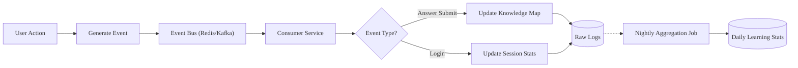
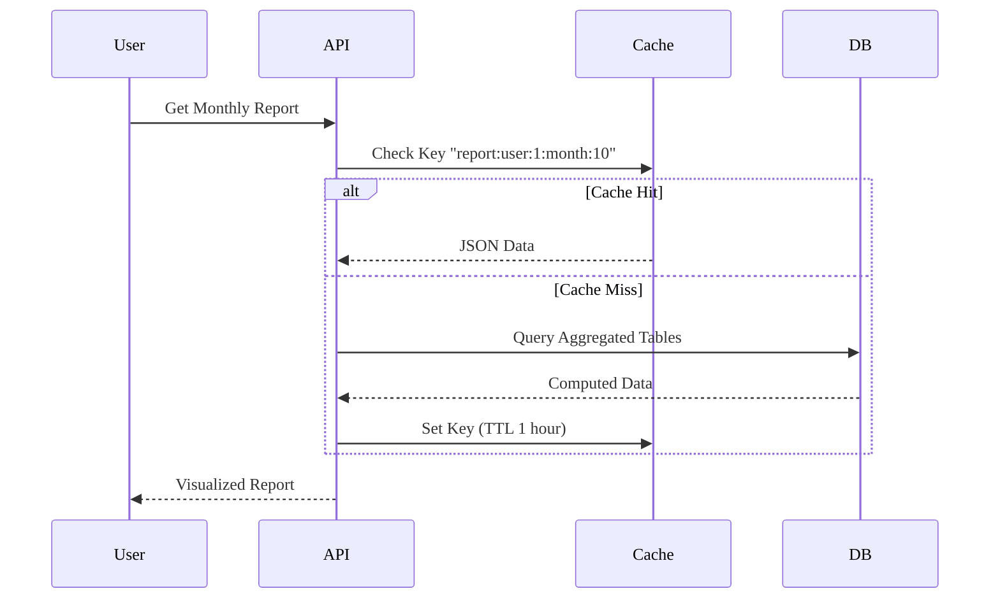

# Analytics & Reporting - Business Logic

Chi tiết quy tắc nghiệp vụ, workflows và xử lý lỗi cho module Analytics.

---

## Business Rules

| Rule ID          | Rule Name           | Description                      | Condition                                | Action                                | Exception            |
| ---------------- | ------------------- | -------------------------------- | ---------------------------------------- | ------------------------------------- | -------------------- |
| BR-ANALYTICS-001 | Mastery Calculation | Công thức tính mức độ thành thạo | Dựa trên điểm Quiz và thời gian gần đây  | Score \* DecayFactor                  | -                    |
| BR-ANALYTICS-002 | Data Aggregation    | Lịch trình tổng hợp dữ liệu      | Cron job hàng đêm                        | Nén raw logs thành thống kê hàng ngày | Thử lại khi thất bại |
| BR-ANALYTICS-003 | Report Retention    | Thời gian lưu trữ báo cáo        | Raw logs: 3 tháng, Aggregated: Vĩnh viễn | Xóa raw logs cũ                       | -                    |
| BR-ANALYTICS-004 | Access Control      | Quyền xem báo cáo                | Giáo viên chỉ xem lớp được phân công     | Lọc truy vấn theo phân công           | -                    |

---

## Dependencies

### Phụ thuộc nội bộ

- ✅ Learning Module - Nguồn dữ liệu bài tập/tiến độ.
- ✅ Auth Module - Thông tin người dùng/vai trò.

### Phụ thuộc bên ngoài

- ✅ PostgreSQL - Lưu trữ time-series (thông qua partitioning).
- ✅ Redis - Caching báo cáo.

---

## KPIs & Metrics

| Metric           | Target                           | Measurement     | Frequency      |
| ---------------- | -------------------------------- | --------------- | -------------- |
| Report Load Time | < 500ms                          | APM             | Thời gian thực |
| Data Freshness   | < 1 giờ (cho thống kê hàng ngày) | ETL Job Monitor | Hàng ngày      |

---

## Validation Criteria

- [ ] Dữ liệu báo cáo khớp với dữ liệu gốc (Tính chính xác dữ liệu).
- [ ] Tính năng phân quyền hoạt động đúng (Giáo viên lớp A không thể xem lớp B).
- [ ] Hiệu suất ổn định với dữ liệu lớn.

---

## Review & Approval

| Role              | Name | Date | Status |
| ----------------- | ---- | ---- | ------ |
| **Product Owner** |      |      |        |
| **Tech Lead**     |      |      |        |
| **QA Lead**       |      |      |        |

---

# Workflows

---

---

## Workflow Summary

| Workflow ID | Workflow Name   | Trigger           | Actors       | Status         |
| ----------- | --------------- | ----------------- | ------------ | -------------- |
| WF-ANA-001  | ETL Pipeline    | User Action Event | System       | Đang hoạt động |
| WF-ANA-002  | Generate Report | UI Request        | User, System | Đang hoạt động |

---

## Workflow Details

### WF-ANA-001: ETL Pipeline

**Description**: Quy trình thu thập và tổng hợp dữ liệu từ các sự kiện gốc.

#### Flow Diagram

#### Steps

| Step | Description | Actor        | System Action                      | Exit Condition     |
| ---- | ----------- | ------------ | ---------------------------------- | ------------------ |
| 1    | Nhận Event  | System       | Tiêu thụ dữ liệu                   | Event đã phân tích |
| 2    | Xử lý Event | System       | Cập nhật bộ đếm thời gian thực     | -                  |
| 3    | Tổng hợp    | System (Job) | Tóm tắt Logs -> Thống kê hàng ngày | Job hoàn thành     |

### WF-ANA-002: Generate Learning Report

**Description**: Tạo báo cáo học tập cho người dùng.

#### Flow Diagram

---

## Events

### Sự kiện hệ thống

| Event Name                   | Description                    | Payload            | Emitted By    |
| ---------------------------- | ------------------------------ | ------------------ | ------------- |
| `analytics.report.generated` | Báo cáo lớn hoàn thành (async) | `{report_id, url}` | Analytics Svc |

---

## Error Handling

| Error Scenario           | Detection           | Recovery Action | Escalation    |
| ------------------------ | ------------------- | --------------- | ------------- |
| Aggregation Job thất bại | Job Status = Failed | Thử lại x3      | Thông báo Dev |

---

## Performance Requirements

- **ETL Latency**: Cập nhật thời gian thực (Knowledge Map) < 5s độ trễ từ event.

---

## Validation Checklist

- [ ] Đã kiểm tra độ tin cậy ETL (không mất dữ liệu)

---

## References

- [Overview](/specs)
