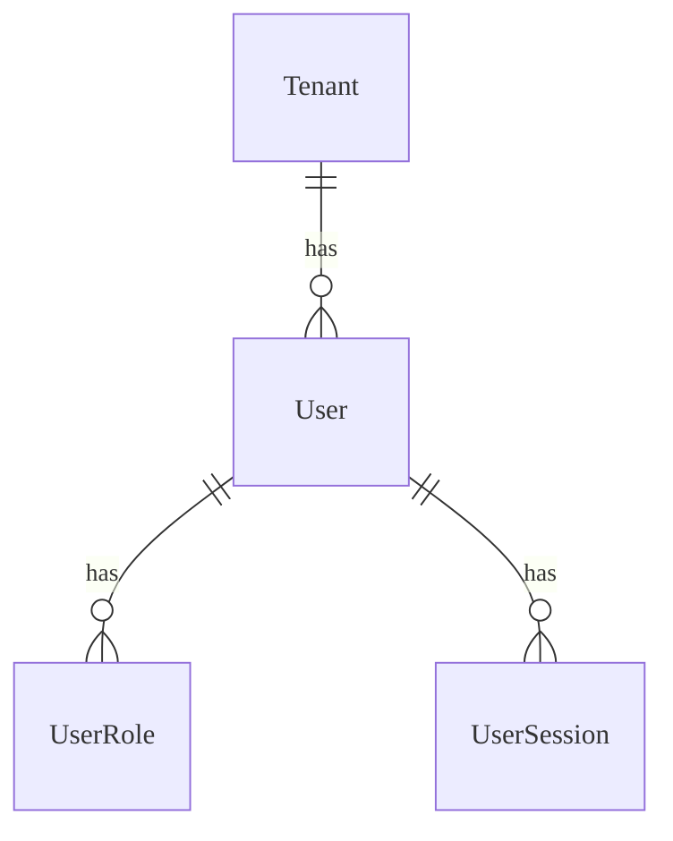
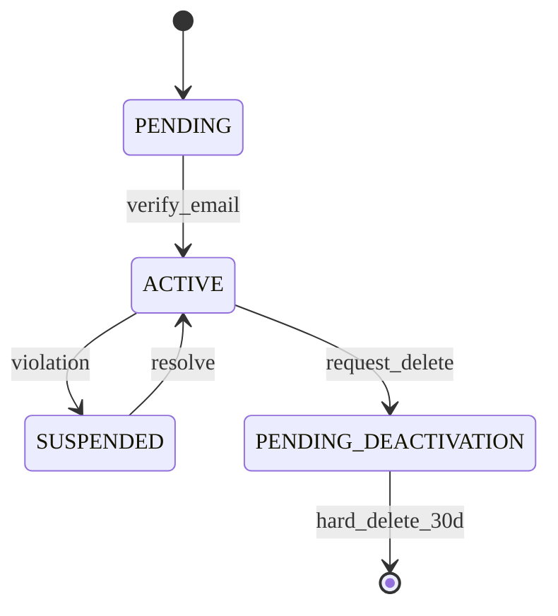

# Auth - Data Model
 
Cấu trúc dữ liệu cho hệ thống xác thực và quản lý người dùng.

---

## Entities

### Thực thể: User

**Description**: Người dùng hệ thống (Admin, Teacher, Student, Parent)
**Storage**: Database (PostgreSQL) **Retention**: Vĩnh viễn (Soft delete)

#### Các trường

| Field Name    | Type      | Required | Default  | Validation   | Description        |
| ------------- | --------- | -------- | -------- | ------------ | ------------------ |
| id            | UUID      | ✅       | auto-gen | unique       | Primary key        |
| tenant_id     | UUID      | ✅       | -        | valid tenant | Tham chiếu Tenant  |
| email         | String    | ✅       | -        | email format | Unique theo tenant |
| password_hash | String    | ✅       | -        | bcrypt       | Mã hóa             |
| is_active     | Boolean   | ❌       | true     | -            | Status             |
| deleted_at    | Timestamp | ❌       | null     | -            | Soft delete        |

#### Mối quan hệ

### Thực thể: UserSession

**Description**: Session đăng nhập của người dùng **Storage**: Database + Redis
**Retention**: 7 ngày (TTL)

#### Các trường

| Field Name         | Type      | Required | Default  | Validation | Description        |
| ------------------ | --------- | -------- | -------- | ---------- | ------------------ |
| id                 | UUID      | ✅       | auto-gen | unique     | Primary key        |
| user_id            | UUID      | ✅       | -        | valid user | Tham chiếu User    |
| device_id          | String    | ✅       | -        | -          | Device fingerprint |
| refresh_token_hash | String    | ✅       | -        | sha256     | Token an toàn      |
| revoked_at         | Timestamp | ❌       | null     | -          | Trạng thái thu hồi |

### Thực thể: Role

**Description**: Vai trò người dùng (RBAC) **Storage**: Database **Retention**:
Vĩnh viễn

#### Các trường

| Field Name | Type   | Required | Default  | Validation | Description            |
| ---------- | ------ | -------- | -------- | ---------- | ---------------------- |
| id         | UUID   | ✅       | auto-gen | unique     | Primary key            |
| name       | String | ✅       | -        | enum       | root-admin, teacher... |
| color      | String | ❌       | -        | hex        | Hiển thị UI            |

---

## Lifecycle States

### Tenant State Machine

---

## Storage Specifications

### Cơ sở dữ liệu

- **Table Name**: `users`, `roles`, `user_sessions`
- **Engine**: PostgreSQL
- **Charset**: utf8mb4
- **Partitioning**: Không

### Chiến lược Caching

- **Cache Type**: Redis
- **TTL**: 15 phút (User Profile), 7 ngày (Refresh Token)
- **Invalidation**: Event-based (Update Profile -> Clear Cache)

---

## Performance Requirements

- **Query Performance**: < 50ms cho Login by Email
- **Write Throughput**: 1000 register/sec
- **Storage Growth**: 1GB/tháng

---

## Data Security

- **Encryption**: At-rest (DB Volume), In-transit (TLS 1.3)
- **Masking**: Password hash, Token hash
- **Access Control**: Row Level Security (RLS) theo Tenant

---

## Validation Checklist

- [x] Tất cả entities định nghĩa đầy đủ fields
- [x] Relationships được document rõ ràng
- [x] Indexes tối ưu cho query patterns
- [x] Performance requirements khả thi

---

## References

- [Overview](/specs)
