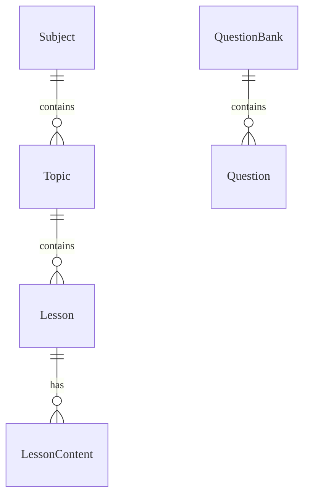

# Content & Question Bank - Data Model

Data model cho module Content: Topic, Lesson, Question, QuestionBank.

---

## Entities

### Thực thể: Topic

**Description**: Chủ đề học tập (Chương/Bài). **Storage**: Database (PostgreSQL)
**Retention**: Vĩnh viễn

#### Các trường

| Field Name | Type    | Required | Default  | Validation    | Description         |
| ---------- | ------- | -------- | -------- | ------------- | ------------------- |
| id         | UUID    | ✅       | auto-gen | unique        | Khóa chính          |
| subject_id | UUID    | ✅       | -        | valid subject | FK Subject          |
| grade_id   | UUID    | ✅       | -        | valid grade   | FK Grade            |
| name       | String  | ✅       | -        | len > 3       | Tên chủ đề          |
| slug       | String  | ✅       | -        | unique        | Tên URL thân thiện  |
| order      | Integer | ✅       | 0        | -             | Thứ tự hiển thị     |
| is_active  | Boolean | ✅       | false    | -             | Trạng thái hiển thị |

### Thực thể: Lesson

**Description**: Bài học cụ thể trong một Topic. **Storage**: Database
(PostgreSQL) **Retention**: Vĩnh viễn

#### Các trường

| Field Name | Type    | Required | Default   | Validation  | Description        |
| ---------- | ------- | -------- | --------- | ----------- | ------------------ |
| id         | UUID    | ✅       | auto-gen  | unique      | Khóa chính         |
| topic_id   | UUID    | ✅       | -         | valid topic | FK Topic           |
| title      | String  | ✅       | -         | len > 3     | Tiêu đề bài học    |
| semester   | String  | ✅       | SEMESTER1 | enum        | Học kỳ áp dụng     |
| order      | Integer | ✅       | 0         | -           | Thứ tự trong Topic |

### Thực thể: Question

**Description**: Câu hỏi trắc nghiệm hoặc tự luận. **Storage**: Database
(PostgreSQL) - JSONB cho nội dung linh hoạt.

#### Các trường

| Field Name     | Type   | Required | Default  | Validation   | Description                     |
| -------------- | ------ | -------- | -------- | ------------ | ------------------------------- |
| id             | UUID   | ✅       | auto-gen | unique       | Khóa chính                      |
| bank_id        | UUID   | ✅       | -        | valid bank   | FK QuestionBank                 |
| type           | String | ✅       | MCQ      | enum         | Loại câu hỏi                    |
| content        | Text   | ✅       | -        | HTML/LaTeX   | Nội dung câu hỏi                |
| options        | JSONB  |          | []       | schema valid | Các đáp án (nếu trắc nghiệm)    |
| correct_answer | String |          | -        | -            | Đáp án đúng (Đơn giản)          |
| explanation    | JSONB  |          | {}       | -            | Giải thích chi tiết             |
| difficulty     | String | ✅       | MEDIUM   | enum         | Mức độ khó (EASY, MEDIUM, HARD) |

#### Mối quan hệ

---

## References

- [API Endpoints](./api.md)
- [Business Logic](./logic.md)
- [Test Cases](./tests.md)
