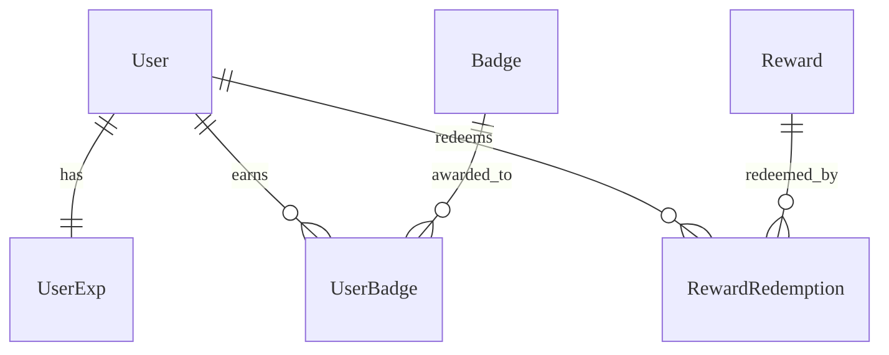

# Gamification - Data Model
 
Cấu trúc dữ liệu cho điểm kinh nghiệm, danh hiệu và phần thưởng.

---

## Entities

### Thực thể: UserExp

**Description**: Lưu trữ điểm kinh nghiệm và cấp độ của người dùng. **Storage**:
Database (PostgreSQL) + Redis (Cache Level/EXP)

#### Các trường

| Field Name | Type      | Required | Default  | Validation | Description                |
| ---------- | --------- | -------- | -------- | ---------- | -------------------------- |
| id         | UUID      | ✅       | auto-gen | unique     | Khóa chính                 |
| user_id    | UUID      | ✅       | -        | unique     | FK User                    |
| exp_points | BigInt    | ✅       | 0        | >= 0       | Tổng điểm EXP              |
| coins      | Integer   | ✅       | 0        | >= 0       | Số dư xu có thể đổi thưởng |
| level      | Integer   | ✅       | 1        | >= 1       | Cấp độ hiện tại            |
| updated_at | Timestamp | ✅       | now()    | -          | Thời điểm cập nhật cuối    |

### Thực thể: Badge

**Description**: Định nghĩa các danh hiệu/huy hiệu. **Storage**: Database
(PostgreSQL)

#### Các trường

| Field Name  | Type    | Required | Default  | Validation | Description           |
| ----------- | ------- | -------- | -------- | ---------- | --------------------- |
| id          | UUID    | ✅       | auto-gen | unique     | Khóa chính            |
| name        | String  | ✅       | -        | -          | Tên badge             |
| description | String  | ❌       | -        | -          | Mô tả cách nhận       |
| icon_url    | String  | ✅       | -        | url        | Hình ảnh badge        |
| condition   | JSONB   | ❌       | {}       | -          | Điều kiện tự động cấp |
| is_active   | Boolean | ✅       | true     | -          | Status                |

### Thực thể: Reward

**Description**: Các phần thưởng trong cửa hàng. **Storage**: Database
(PostgreSQL)

#### Các trường

| Field Name  | Type    | Required | Default  | Validation | Description        |
| ----------- | ------- | -------- | -------- | ---------- | ------------------ |
| id          | UUID    | ✅       | auto-gen | unique     | Khóa chính         |
| name        | String  | ✅       | -        | -          | Tên phần thưởng    |
| price_coins | Integer | ✅       | 0        | >= 0       | Giá bằng xu        |
| stock       | Integer | ✅       | 0        | >= 0       | Tồn kho            |
| type        | String  | ✅       | VIRTUAL  | enum       | VIRTUAL / PHYSICAL |

#### Mối quan hệ

---

## References

- [API Endpoints](./api.md)
- [Business Logic](./logic.md)
- [Test Cases](./tests.md)
