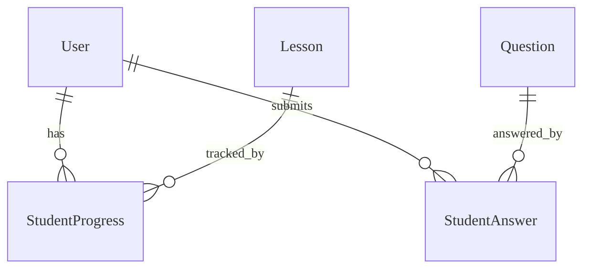

# Learning - Data Model
 
Cấu trúc dữ liệu theo dõi tiến độ và kết quả học tập.

---

## Entities

### Thực thể: StudentProgress

**Description**: Lưu trữ trạng thái và tiến độ của student cho một bài học cụ
thể. **Storage**: Database (PostgreSQL) **Retention**: Vĩnh viễn

#### Các trường

| Field Name            | Type      | Required | Default     | Validation   | Description                                            |
| --------------------- | --------- | -------- | ----------- | ------------ | ------------------------------------------------------ |
| id                    | UUID      | ✅       | auto-gen    | unique       | Khóa chính                                             |
| student_id            | UUID      | ✅       | -           | valid user   | FK đến User                                            |
| lesson_id             | UUID      | ✅       | -           | valid lesson | FK đến Lesson (Content Module)                         |
| completion_percentage | Integer   | ✅       | 0           | 0-100        | Phần trăm hoàn thành                                   |
| status                | String    | ✅       | NOT_STARTED | enum         | Trạng thái (LOCKED, AVAILABLE, IN_PROGRESS, COMPLETED) |
| started_at            | Timestamp | ❌       | null        | -            | Thời gian bắt đầu học                                  |
| completed_at          | Timestamp | ❌       | null        | -            | Thời gian hoàn thành                                   |
| last_accessed_at      | Timestamp | ✅       | now()       | -            | Thời gian truy cập lần cuối                            |

#### Indexes

| Index Name                  | Fields                  | Type   | Mục đích                       |
| --------------------------- | ----------------------- | ------ | ------------------------------ |
| idx_progress_student        | [student_id]            | B-tree | Lọc theo student               |
| idx_progress_student_lesson | [student_id, lesson_id] | B-tree | Tra cứu tiến độ bài học cụ thể |

### Thực thể: StudentAnswer

**Description**: Lưu trữ lịch sử trả lời chi tiết cho mỗi câu hỏi trong bài
tập/quiz. **Storage**: Database (PostgreSQL) -> Có thể chuyển sang TimeSeries DB
hoặc Partitioning nếu dữ liệu lớn. **Retention**: Vĩnh viễn (hoặc archive sau 2
năm)

#### Các trường

| Field Name  | Type      | Required | Default  | Validation     | Description                      |
| ----------- | --------- | -------- | -------- | -------------- | -------------------------------- |
| id          | UUID      | ✅       | auto-gen | unique         | Khóa chính                       |
| question_id | UUID      | ✅       | -        | valid question | FK đến Question                  |
| content_id  | UUID      | ❌       | -        | -              | FK đến Content (Context)         |
| session_id  | UUID      | ❌       | -        | -              | FK đến Practice Session (nếu có) |
| answer      | JSONB     | ✅       | -        | schema valid   | Nội dung câu trả lời của student |
| is_correct  | Boolean   | ✅       | false    | -              | Kết quả đúng/sai                 |
| time_taken  | Integer   | ✅       | 0        | >= 0           | Thời gian trả lời (ms)           |
| answered_at | Timestamp | ✅       | now()    | -              | Thời gian nộp bài                |

#### Mối quan hệ

---

## References

- [API Endpoints](./api.md)
- [Business Logic](./logic.md)
- [Test Cases](./tests.md)
