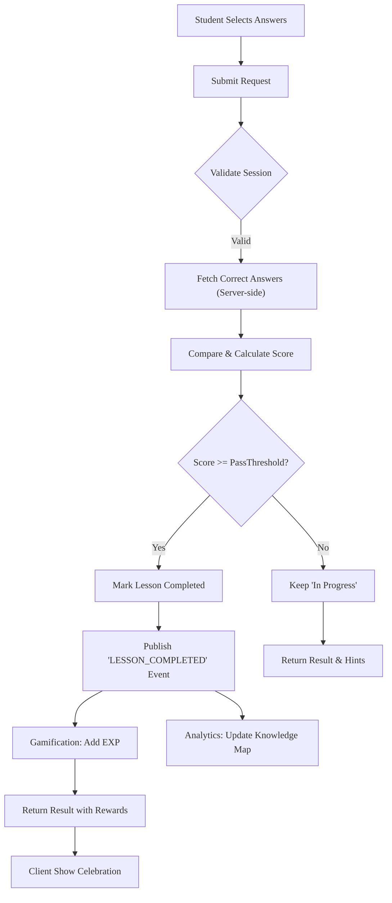
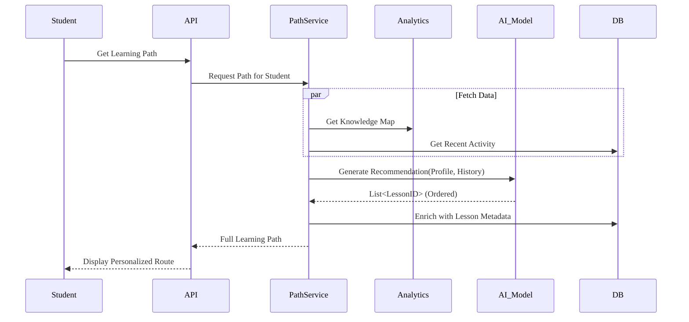
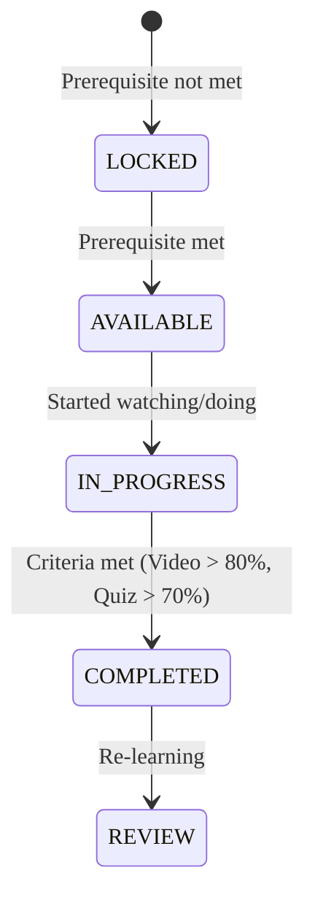

# Learning & Personalization - Business Logic

Chi tiết quy tắc nghiệp vụ, workflows và xử lý lỗi cho module Learning.

---

## Business Rules

| Rule ID      | Rule Name          | Description                      | Condition                                  | Action                                     | Exception                   |
| ------------ | ------------------ | -------------------------------- | ------------------------------------------ | ------------------------------------------ | --------------------------- |
| BR-LEARN-001 | Video Completion   | Điều kiện hoàn thành video       | Thời gian xem > 80% tổng thời lượng        | Đánh dấu Video Completed                   | Lỗi mạng -> Retry logic     |
| BR-LEARN-002 | Lesson Completion  | Điều kiện hoàn thành bài học     | Video Completed VÀ Quiz Score > 70%        | Đánh dấu Lesson Completed, Trigger Reward  | -                           |
| BR-LEARN-003 | Prerequisite Check | Kiểm tra điều kiện tiên quyết    | Bài học trước chưa hoàn thành              | Trạng thái Locked, Trả về `CONTENT_LOCKED` | -                           |
| BR-LEARN-004 | Anti-Cheat         | Ngăn chặn gian lận trong bài tập | Client request đáp án trước khi submit     | Chặn request, Ghi log vi phạm              | -                           |
| BR-LEARN-005 | Reward Trigger     | Trao thưởng khi hoàn thành       | Lesson Completed thay đổi từ False -> True | Gọi Gamification Service thêm EXP          | Service down -> Queue event |

---

## Dependencies

### Phụ thuộc nội bộ

- ✅ Content Module - Cung cấp nội dung bài học, video, câu hỏi.
- ✅ Analytics Module - Cung cấp Knowledge Map và phân tích dữ liệu.
- ✅ Gamification Module - Xử lý điểm thưởng, huy hiệu.

### Phụ thuộc bên ngoài

- ✅ AI Service (Python) - Mô hình đề xuất lộ trình học tập.

---

## KPIs & Metrics

| Metric                 | Target  | Measurement                        | Frequency |
| ---------------------- | ------- | ---------------------------------- | --------- |
| Adaptive Path Accuracy | > 85%   | User feedback & click-through rate | Hàng tuần |
| Lesson Completion Rate | > 60%   | DB query (completed / started)     | Hàng ngày |
| P95 Latency (Submit)   | < 200ms | APM Monitoring                     | Real-time |

---

## Validation Criteria

- [ ] Tất cả use cases đã được định nghĩa và review.
- [ ] Logic hoàn thành bài học (BR-LEARN-001, BR-LEARN-002) được test kỹ lưỡng.
- [ ] Luồng tương tác với AI Service được định nghĩa rõ ràng (fallback khi lỗi).
- [ ] Cơ chế anti-cheat được thiết kế.

---

## Review & Approval

| Role              | Name | Date | Status |
| ----------------- | ---- | ---- | ------ |
| **Product Owner** |      |      |        |
| **Tech Lead**     |      |      |        |
| **QA Lead**       |      |      |        |

---

# Workflows

---

## Workflow Summary

| Workflow ID  | Workflow Name            | Trigger                         | Actors              | Status |
| ------------ | ------------------------ | ------------------------------- | ------------------- | ------ |
| WF-LEARN-001 | Submit Exercise          | Student nộp câu trả lời         | Student, System     | Active |
| WF-LEARN-002 | Generate Learning Path   | Student truy cập dashboard      | Student, AI Service | Active |
| WF-LEARN-003 | Lesson Progress Tracking | Student xem video/vượt qua quiz | Student, System     | Active |

---

## Workflow Details

### WF-LEARN-001: Submit Exercise

**Description**: Quy trình xử lý khi student nộp câu trả lời cho bài tập luyện
tập.

#### Flow Diagram

#### Steps

| Step | Description             | Actor   | System Action                   | Exit Condition |
| ---- | ----------------------- | ------- | ------------------------------- | -------------- |
| 1    | Student gửi câu trả lời | Student | Nhận request                    | -              |
| 2    | Xác thực Session        | System  | Kiểm tra session ID & expiry    | Session Valid  |
| 3    | Chấm điểm câu trả lời   | System  | So sánh với đáp án đúng         | -              |
| 4    | Cập nhật tiến độ        | System  | Lưu vào DB, cập nhật stats      | -              |
| 5    | Trigger Events          | System  | Emit completion events (nếu có) | -              |
| 6    | Trả về Response         | System  | Gửi JSON result                 | -              |

#### Business Rules

- **BR-LEARN-004**: Kiểm tra Anti-Cheat trước khi chấm điểm.
- **BR-LEARN-005**: Chỉ trigger rewards nếu đây là lần hoàn thành _đầu tiên_.

### WF-LEARN-002: Adaptive Learning Path Generation

**Description**: Tạo lộ trình học tập thích ứng dựa trên lịch sử.

#### Flow Diagram

### WF-LEARN-003: Lesson Progress State

**Description**: Trạng thái của một bài học đối với student.

#### Flow Diagram

---

## Events

### Sự kiện hệ thống

| Event Name         | Description                   | Payload                              | Emitted By   |
| ------------------ | ----------------------------- | ------------------------------------ | ------------ |
| `lesson.completed` | Bài học hoàn thành            | `{student_id, lesson_id, timestamp}` | Learning Svc |
| `path.generated`   | Lộ trình học tập mới được tạo | `{student_id, path_id}`              | Learning Svc |

---

## Error Handling

| Error Scenario   | Detection    | Recovery Action                       | Escalation  |
| ---------------- | ------------ | ------------------------------------- | ----------- |
| AI Model Timeout | Timeout > 2s | Trả về Default Path (theo Curriculum) | Log warning |
| DB Write Fail    | Exception    | Trả lỗi cho client, retry client-side | -           |

---

## Performance Requirements

- **Thời gian xử lý**: Submit answer < 200ms
- **Throughput**: 5000 requests/sec (Submit)

---

## Security Requirements

- [ ] Rate limiting theo user
- [ ] Xác thực quyền sở hữu session

---

## Validation Checklist

- [ ] Tất cả workflows đã được vẽ sơ đồ
- [ ] Xử lý lỗi được chỉ định cho AI failure

---

## References

- [Overview](/specs)
