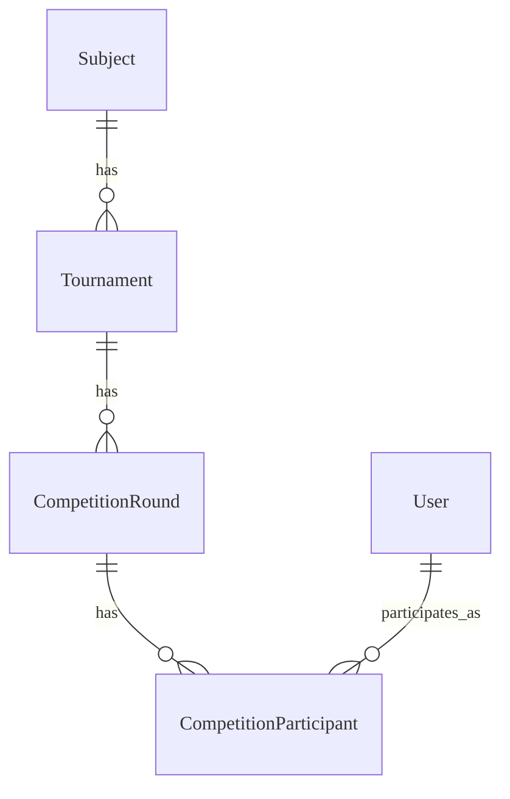

# Tournament - Data Model
 
Cấu trúc dữ liệu cho các cuộc thi và kết quả thi đấu.

---

## Entities

### Thực thể: Tournament

**Description**: Cuộc thi lớn (ví dụ: Math Arena). **Storage**: Database
(PostgreSQL)

#### Các trường

| Field Name | Type      | Required | Default  | Validation  | Description               |
| ---------- | --------- | -------- | -------- | ----------- | ------------------------- |
| id         | UUID      | ✅       | auto-gen | unique      | Khóa chính                |
| name       | String    | ✅       | -        | len > 5     | Tên cuộc thi              |
| level      | String    | ✅       | SCHOOL   | enum        | Cấp độ (SCHOOL, DISTRICT) |
| subject_id | UUID      | ✅       | -        | -           | Môn học                   |
| starts_at  | Timestamp | ✅       | -        | -           | Thời gian bắt đầu         |
| ends_at    | Timestamp | ✅       | -        | > starts_at | Thời gian kết thúc        |

### Thực thể: CompetitionRound

**Description**: Vòng thi cụ thể (ví dụ: Vòng 1, Chung kết). **Storage**:
Database (PostgreSQL)

#### Các trường

| Field Name        | Type    | Required | Default  | Validation | Description          |
| ----------------- | ------- | -------- | -------- | ---------- | -------------------- |
| id                | UUID    | ✅       | auto-gen | unique     | Khóa chính           |
| tournament_id     | UUID    | ✅       | -        | -          | FK Tournament        |
| name              | String  | ✅       | -        | -          | Tên vòng thi         |
| requires_invite   | Boolean | ✅       | false    | -          | Yêu cầu invite code? |
| participant_limit | Integer | ✅       | 100      | > 0        | Giới hạn user/room   |

### Thực thể: CompetitionParticipant

**Description**: Người tham gia vòng thi. **Storage**: Database (PostgreSQL)

#### Các trường

| Field Name | Type      | Required | Default  | Validation | Description           |
| ---------- | --------- | -------- | -------- | ---------- | --------------------- |
| id         | UUID      | ✅       | auto-gen | unique     | Khóa chính            |
| round_id   | UUID      | ✅       | -        | -          | FK Round              |
| student_id | UUID      | ✅       | -        | -          | FK Student            |
| score      | Integer   | ✅       | 0        | >= 0       | Tổng điểm             |
| rank       | Integer   | ❌       | null     | -          | Hạng cuối cùng        |
| started_at | Timestamp | ❌       | null     | -          | Thời gian bắt đầu thi |

#### Mối quan hệ

---

## References

- [API Endpoints](./api.md)
- [Business Logic](./logic.md)
- [Test Cases](./tests.md)
