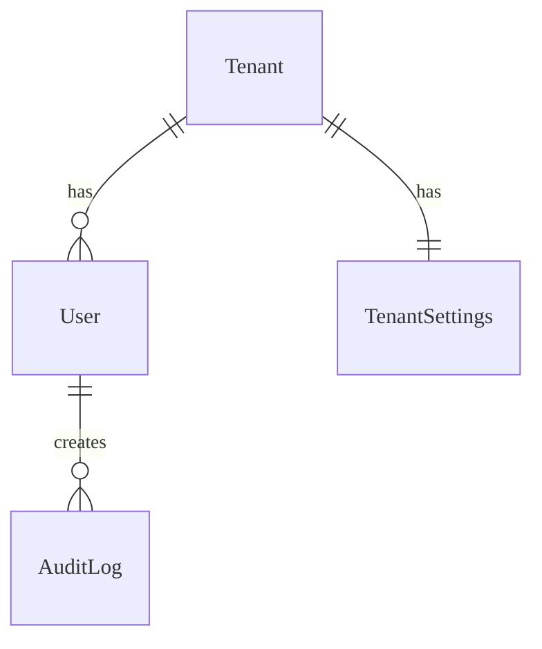

# Admin & Tenant - Data Model

Data model cho module Admin: Tenant, TenantSettings, AuditLog.

---

## Entities

### Entity: Tenant

**Description**: Đơn vị tổ chức (trường học, tổ chức giáo dục).
**Storage**: Database (PostgreSQL)
**Retention**: Vĩnh viễn (Soft delete)

#### Fields

| Field Name | Type      | Required | Default  | Validation | Description       |
| ---------- | --------- | -------- | -------- | ---------- | ----------------- |
| id         | UUID      | ✅       | auto-gen | unique     | Khóa chính        |
| code       | String    | ✅       | -        | unique     | Mã tenant duy nhất |
| name       | String    | ✅       | -        | len > 3    | Tên hiển thị      |
| status     | String    | ✅       | PENDING  | enum       | Trạng thái        |
| deleted_at | Timestamp | ❌       | null     | -          | Soft delete       |

### Entity: AuditLog

**Description**: Ghi lại các hành động quản trị quan trọng.
**Storage**: Database (PostgreSQL)
**Retention**: 2 năm

#### Fields

| Field Name | Type      | Required | Default  | Validation | Description        |
| ---------- | --------- | -------- | -------- | ---------- | ------------------ |
| id         | UUID      | ✅       | auto-gen | unique     | Khóa chính         |
| user_id    | UUID      | ✅       | -        | valid user | Người thực hiện    |
| action     | String    | ✅       | -        | -          | Loại hành động     |
| target     | JSONB     | ✅       | {}       | -          | Đối tượng bị tác động |
| created_at | Timestamp | ✅       | now()    | -          | Thời gian          |

#### Relationships

---

## References

- [API Endpoints](./api.md)
- [Business Logic](./logic.md)
- [Test Cases](./tests.md)
