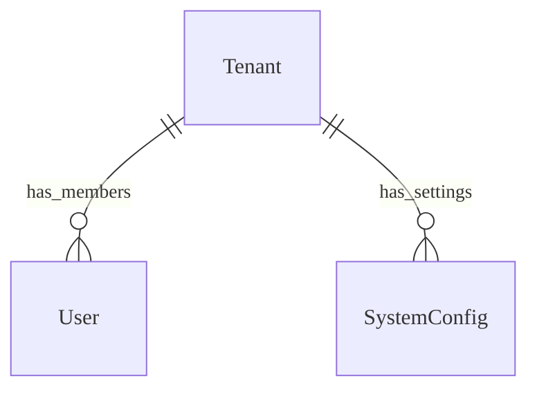
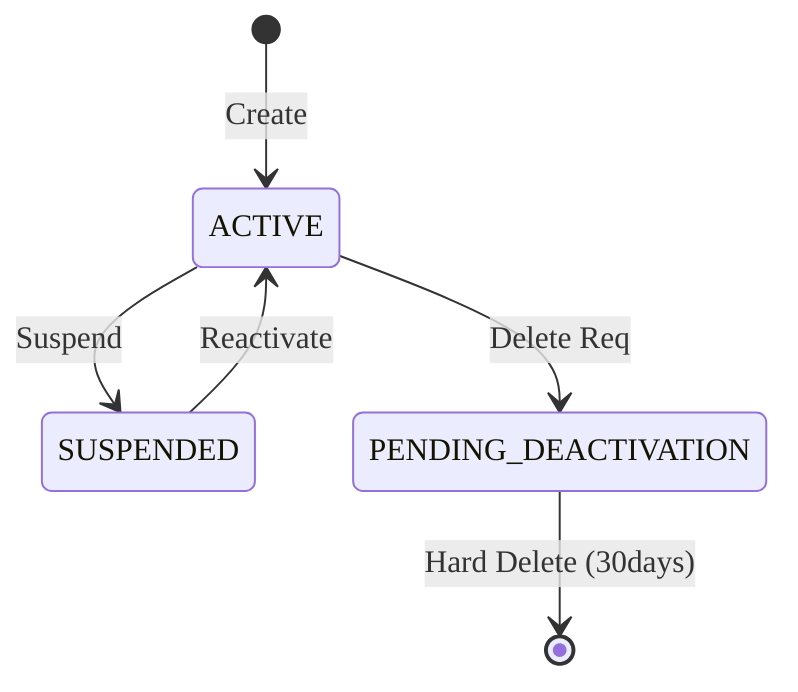

# Admin & Tenant Management - Data Model

---

## Overview

Mô hình dữ liệu để lưu trữ thông tin Tenant và cấu hình hệ thống.

---

## Entities

### Entity: Tenant

**Description**: Đại diện cho một đơn vị sử dụng (Trường học, Tổ chức).
**Storage**: Database (PostgreSQL)

#### Fields

| Field Name        | Type      | Required | Default  | Validation   | Description                             |
| ----------------- | --------- | -------- | -------- | ------------ | --------------------------------------- |
| id                | UUID      | ✅       | auto-gen | unique       | Khóa chính                              |
| name              | String    | ✅       | -        | len > 3      | Tên trường                              |
| code              | String    | ✅       | -        | unique, slug | Mã trường (subdomain)                   |
| status            | String    | ✅       | ACTIVE   | enum         | ACTIVE, SUSPENDED, PENDING_DEACTIVATION |
| subscription_plan | String    | ✅       | FREE     | enum         | Gói dịch vụ                             |
| created_at        | Timestamp | ✅       | now()    | -            | Ngày tạo                                |
| deleted_at        | Timestamp | ❌       | null     | -            | Ngày xóa (Soft delete)                  |

### Entity: SystemConfig

**Description**: Cấu hình toàn cục hoặc theo phạm vi tenant. **Storage**:
Database (PostgreSQL)

#### Fields

| Field Name | Type   | Required | Default  | Validation      | Description                 |
| ---------- | ------ | -------- | -------- | --------------- | --------------------------- |
| id         | UUID   | ✅       | auto-gen | unique          | Khóa chính                  |
| scope      | String | ✅       | SYSTEM   | enum            | SYSTEM, TENANT              |
| tenant_id  | UUID   | ❌       | null     | -               | Null nếu là cấu hình System |
| key        | String | ✅       | -        | unique in scope | Tên cấu hình                |
| value      | JSONB  | ✅       | {}       | -               | Giá trị cấu hình            |

#### Relationships

---

## Lifecycle States

### Tenant Lifecycle

---

## Storage Specifications

### Database

- **Schema**: `public` (Shared Tables).
- **Tenant Isolation**: Row-level security (RLS) dựa trên `tenant_id`.

---

## Performance Requirements

- **Tenant Resolution**: Phân giải tenant từ subdomain < 10ms (cached).

---

## Data Security

- **Isolation**: Đảm bảo các truy vấn luôn bao gồm `WHERE tenant_id = ?`.
- **Encryption**: Mã hóa các cấu hình nhạy cảm (API Keys) trong `SystemConfig`.

---

## Validation Checklist

- [ ] Các policy RLS được áp dụng cho tất cả truy vấn
- [ ] Kiểm tra xung đột Tenant Code

---

## References

- [Overview](/specs)
