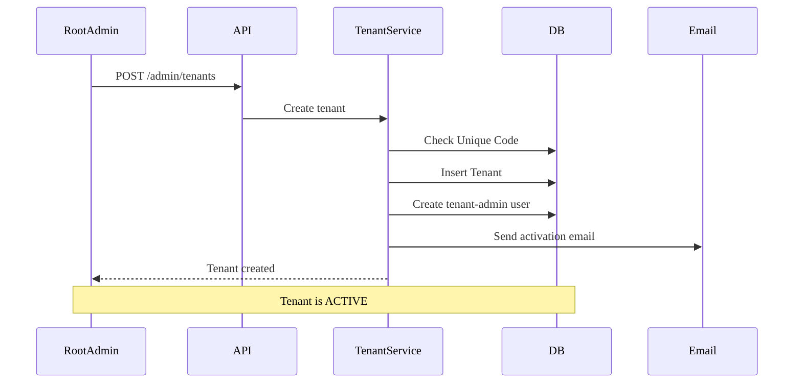
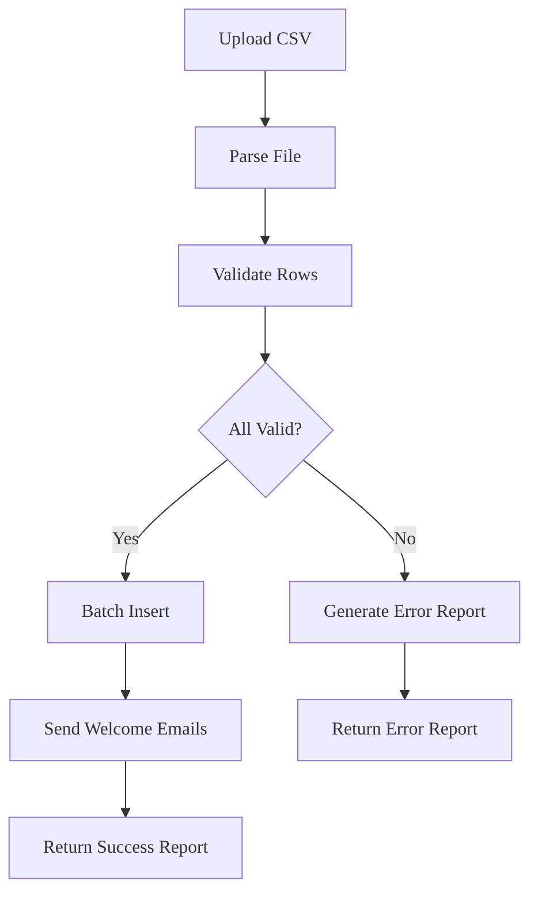

# Admin & Tenant Management - Business Logic

## Business Context
- **Module**: Admin & Tenant Management
- **Version**: 1.0
- **Status**: Approved
- **Last Updated**: 2026-01-14

## Overview
Module quản trị hệ thống cung cấp các tính năng quản lý Tenant (Trường học), quản lý User (Giáo viên, Học sinh), và cấu hình hệ thống. Phân quyền nghiêm ngặt giữa Root Admin và Tenant Admin.

## Use Cases
| Use Case ID | Use Case Name | Description | Priority | Status |
|------------|--------------|-------|----------|--------|
| UC-ADMIN-001 | Create Tenant | Tạo mới một Tenant (Trường học) | P0 | Planned |
| UC-ADMIN-002 | Suspend Tenant | Tạm ngưng hoạt động của Tenant | P1 | Planned |
| UC-ADMIN-003 | Impersonate Admin | Đăng nhập với tư cách Tenant Admin | P1 | Planned |
| UC-ADMIN-004 | Import Users | Import danh sách user từ file CSV | P0 | Planned |
| UC-ADMIN-005 | Configure System | Thay đổi cấu hình hệ thống | P2 | Planned |

### UC-ADMIN-004: Import Users
**Actor**: Tenant Admin
**Preconditions**: File CSV đúng định dạng.
**Main Flow**:
1. Admin tải lên file CSV.
2. Hệ thống xác thực định dạng và dữ liệu.
3. Hệ thống tạo các tài khoản User.
4. Hệ thống gửi email kích hoạt (tùy chọn).
5. Hệ thống trả về kết quả import.

## Business Rules
| Rule ID | Rule Name | Description | Condition | Action | Exception |
|---------|----------|-------|------------|---------|------------|
| BR-ADMIN-001 | Unique Tenant Code | Mã Tenant phải là duy nhất | Mã đã tồn tại trong DB | Từ chối tạo mới | - |
| BR-ADMIN-002 | Tenant Soft Delete | Xóa Tenant chỉ đánh dấu là đã xóa | Yêu cầu xóa | Đặt `deleted_at`, Lên lịch xóa vĩnh viễn sau 30 ngày | - |
| BR-ADMIN-003 | User Protection | Không thể tự xóa chính mình | User ID trùng với người yêu cầu | Chặn xóa | - |
| BR-ADMIN-004 | Import Limit | Giới hạn số lượng import | Số dòng > 500 | Từ chối yêu cầu | - |

## Dependencies
### Internal Dependencies
- ✅ Auth Module - Quản lý User/Đăng nhập.
- ✅ Analytics Module - Tổng hợp dữ liệu khi xóa Tenant.

### External Dependencies
- ✅ Email Service (SendGrid) - Gửi email kích hoạt.

## KPIs & Metrics
| Metric | Target | Measurement | Frequency |
|--------|--------|-------------------|-----------|
| Tenant Creation Time | < 2s | API Latency | Real-time |
| Import Speed | < 10s / 500 users | Job Duration | Real-time |

## Validation Criteria
- [ ] Kiểm tra tính duy nhất của Tenant Code hoạt động chính xác.
- [ ] Quy trình Soft Delete -> Hard Delete chạy đúng.
- [ ] Import CSV báo cáo chính xác các dòng lỗi.
- [ ] Audit log cho Impersonation đầy đủ.

## Review & Approval
| Role | Name | Date | Status |
|------|------|------|--------|
| **Product Owner** | | | |
| **Tech Lead** | | | |
| **QA Lead** | | | |

---

# Workflows

## Overview
Các workflow để quản lý vòng đời Tenant và Import User.

## Workflow Summary
| Workflow ID | Workflow Name | Trigger | Actors | Status |
|-------------|--------------|---------|--------|--------|
| WF-ADMIN-001 | Create Tenant | Admin gửi form | Root Admin, System | Active |
| WF-ADMIN-002 | Import Users | Admin tải lên CSV | Tenant Admin, System | Active |

## Workflow Details

### WF-ADMIN-001: Create Tenant
**Description**: Quy trình khởi tạo một Tenant mới.

#### Flow Diagram

### WF-ADMIN-002: Import Users
**Description**: Quy trình import user hàng loạt.

#### Flow Diagram

#### Steps
| Step | Description | Actor | System Action | Exit Condition |
|------|-------------|-------|---------------|----------------|
| 1 | Tải lên CSV | Admin | Xác thực định dạng | CSV hợp lệ |
| 2 | Xác thực dữ liệu | System | Kiểm tra Email, Trường bắt buộc | - |
| 3 | Batch Insert | System | DB Transaction Insert | Users đã tạo |
| 4 | Thông báo | System | Async Email Queue | - |

## Events
### System Events
| Event Name | Description | Payload | Emitted By |
|------------|-------------|---------|------------|
| `tenant.created` | Tenant mới được tạo | `{tenant_id, name}` | Admin Svc |
| `tenant.suspended` | Tenant bị tạm ngưng | `{tenant_id, reason}` | Admin Svc |

## Error Handling
| Error Scenario | Detection | Recovery Action | Escalation |
|----------------|-----------|-----------------|------------|
| Email trùng lặp trong Import | DB Constraint | Bỏ qua dòng, ghi log lỗi | - |
| Email Service không hoạt động | Timeout | Thử lại sau (Job) | - |

## Performance Requirements
- **Tenant Creation**: < 2s.

## Security Requirements
- [ ] Chỉ Root Admin mới có thể kích hoạt các workflow Tenant.
- [ ] Tenant Admin chỉ có thể import user vào tenant của mình.

## Validation Checklist
- [ ] CSV Parsing xử lý UTF-8 chính xác

## References

- [Overview](./overview.md)
