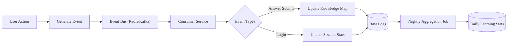
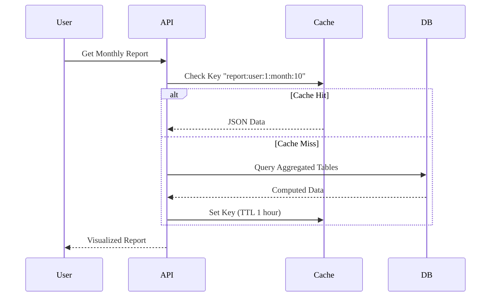

# Analytics & Reporting - Business Logic

## Business Context
- **Module**: Analytics & Reporting
- **Version**: 1.0
- **Status**: Đã phê duyệt
- **Cập nhật lần cuối**: 2026-01-14

## Overview
Module chịu trách nhiệm thu thập, xử lý và trực quan hóa dữ liệu hoạt động học tập. Cung cấp báo cáo đa cấp cho Học sinh, Phụ huynh, Giáo viên và Quản trị viên.

## Use Cases
| Use Case ID | Use Case Name | Description | Priority | Status |
|------------|--------------|-------|----------|--------|
| UC-ANALYTICS-001 | View Knowledge Map | Xem bản đồ kiến thức cá nhân | P0 | Đã lên kế hoạch |
| UC-ANALYTICS-002 | View Learning Report | Xem báo cáo học tập cá nhân (hàng ngày/hàng tuần) | P1 | Đã lên kế hoạch |
| UC-ANALYTICS-003 | View Class Performance | Giáo viên xem tiến độ học tập của lớp | P0 | Đã lên kế hoạch |
| UC-ANALYTICS-004 | View System Overview | Admin xem thống kê tổng quan hệ thống | P2 | Đã lên kế hoạch |
| UC-ANALYTICS-005 | Export Report | Xuất báo cáo sang định dạng Excel/PDF | P2 | Đã lên kế hoạch |

### UC-ANALYTICS-001: View Knowledge Map
**Actor**: Học sinh, Giáo viên
**Preconditions**: Dữ liệu học tập tồn tại.
**Luồng chính**:
1. Người dùng truy cập Dashboard.
2. Hệ thống tải dữ liệu Knowledge Map từ DB/Cache.
3. Hệ thống tính toán mức độ thành thạo cho từng Topic.
4. Hệ thống hiển thị biểu đồ cây/lưới kiến thức.

## Business Rules
| Rule ID | Rule Name | Description | Condition | Action | Exception |
|---------|----------|-------|------------|---------|------------|
| BR-ANALYTICS-001 | Mastery Calculation | Công thức tính mức độ thành thạo | Dựa trên điểm Quiz và thời gian gần đây | Score * DecayFactor | - |
| BR-ANALYTICS-002 | Data Aggregation | Lịch trình tổng hợp dữ liệu | Cron job hàng đêm | Nén raw logs thành thống kê hàng ngày | Thử lại khi thất bại |
| BR-ANALYTICS-003 | Report Retention | Thời gian lưu trữ báo cáo | Raw logs: 3 tháng, Aggregated: Vĩnh viễn | Xóa raw logs cũ | - |
| BR-ANALYTICS-004 | Access Control | Quyền xem báo cáo | Giáo viên chỉ xem lớp được phân công | Lọc truy vấn theo phân công | - |

## Dependencies
### Internal Dependencies
- ✅ Learning Module - Nguồn dữ liệu bài tập/tiến độ.
- ✅ Auth Module - Thông tin người dùng/vai trò.

### External Dependencies
- ✅ PostgreSQL - Lưu trữ time-series (thông qua partitioning).
- ✅ Redis - Caching báo cáo.

## KPIs & Metrics
| Metric | Target | Measurement | Frequency |
|--------|--------|-------------------|-----------|
| Report Load Time | < 500ms | APM | Thời gian thực |
| Data Freshness | < 1 giờ (cho thống kê hàng ngày) | ETL Job Monitor | Hàng ngày |

## Validation Criteria
- [ ] Dữ liệu báo cáo khớp với dữ liệu gốc (Tính chính xác dữ liệu).
- [ ] Tính năng phân quyền hoạt động đúng (Giáo viên lớp A không thể xem lớp B).
- [ ] Hiệu suất ổn định với dữ liệu lớn.

---

## Review & Approval
| Role | Name | Date | Status |
|------|------|------|--------|
| **Product Owner** | | | |
| **Tech Lead** | | | |
| **QA Lead** | | | |

---

# Workflows

## Overview
Các quy trình xử lý dữ liệu (ETL) và truy xuất báo cáo.

## Workflow Summary
| Workflow ID | Workflow Name | Trigger | Actors | Status |
|-------------|--------------|---------|--------|--------|
| WF-ANA-001 | ETL Pipeline | User Action Event | System | Đang hoạt động |
| WF-ANA-002 | Generate Report | UI Request | User, System | Đang hoạt động |

## Workflow Details

### WF-ANA-001: ETL Pipeline
**Description**: Quy trình thu thập và tổng hợp dữ liệu từ các sự kiện gốc.

#### Flow Diagram

#### Steps
| Step | Description | Actor | System Action | Exit Condition |
|------|-------------|-------|---------------|----------------|
| 1 | Nhận Event | System | Tiêu thụ dữ liệu | Event đã phân tích |
| 2 | Xử lý Event | System | Cập nhật bộ đếm thời gian thực | - |
| 3 | Tổng hợp | System (Job) | Tóm tắt Logs -> Thống kê hàng ngày | Job hoàn thành |

### WF-ANA-002: Generate Learning Report
**Description**: Tạo báo cáo học tập cho người dùng.

#### Flow Diagram

## Events
### System Events
| Event Name | Description | Payload | Emitted By |
|------------|-------------|---------|------------|
| `analytics.report.generated` | Báo cáo lớn hoàn thành (async) | `{report_id, url}` | Analytics Svc |

## Error Handling
| Error Scenario | Detection | Recovery Action | Escalation |
|----------------|-----------|-----------------|------------|
| Aggregation Job thất bại | Job Status = Failed | Thử lại x3 | Thông báo Dev |

## Performance Requirements
- **ETL Latency**: Cập nhật thời gian thực (Knowledge Map) < 5s độ trễ từ event.

---

## Validation Checklist
- [ ] Đã kiểm tra độ tin cậy ETL (không mất dữ liệu)
