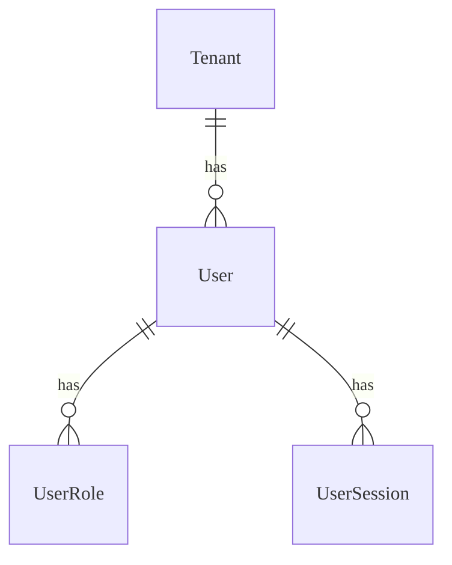
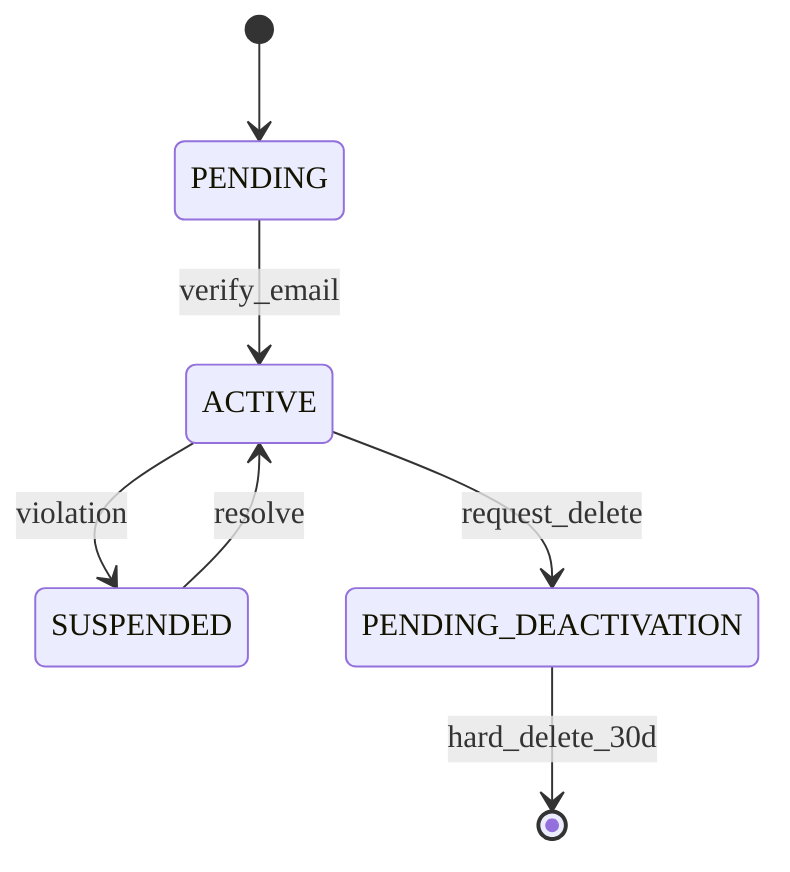

# Auth - Data Model

## Overview
Data model cho module Auth: User, Role, Permission, Session, Tenant.

## Entities

### Entity: User
**Mô tả**: Người dùng hệ thống (Admin, Teacher, Student, Parent)
**Storage**: Database (PostgreSQL)
**Retention**: Vĩnh viễn (Soft delete)

#### Fields
| Field Name | Type | Required | Default | Validation | Mô tả |
|------------|------|----------|---------|------------|-------|
| id | UUID | ✅ | auto-gen | unique | Primary key |
| tenant_id | UUID | ✅ | - | valid tenant | Tham chiếu Tenant |
| email | String | ✅ | - | email format | Unique theo tenant |
| password_hash | String | ✅ | - | bcrypt | Mã hóa |
| is_active | Boolean | ❌ | true | - | Trạng thái |
| deleted_at | Timestamp | ❌ | null | - | Soft delete |

#### Relationships

### Entity: UserSession
**Mô tả**: Session đăng nhập của người dùng
**Storage**: Database + Redis
**Retention**: 7 ngày (TTL)

#### Fields
| Field Name | Type | Required | Default | Validation | Mô tả |
|------------|------|----------|---------|------------|-------|
| id | UUID | ✅ | auto-gen | unique | Primary key |
| user_id | UUID | ✅ | - | valid user | Tham chiếu User |
| device_id | String | ✅ | - | - | Device fingerprint |
| refresh_token_hash | String | ✅ | - | sha256 | Token an toàn |
| revoked_at | Timestamp | ❌ | null | - | Trạng thái thu hồi |

### Entity: Role
**Mô tả**: Vai trò người dùng (RBAC)
**Storage**: Database
**Retention**: Vĩnh viễn

#### Fields
| Field Name | Type | Required | Default | Validation | Mô tả |
|------------|------|----------|---------|------------|-------|
| id | UUID | ✅ | auto-gen | unique | Primary key |
| name | String | ✅ | - | enum | root-admin, teacher... |
| color | String | ❌ | - | hex | Hiển thị UI |

## Lifecycle States
### Tenant State Machine

## Storage Specifications
### Database
- **Table Name**: `users`, `roles`, `user_sessions`
- **Engine**: PostgreSQL
- **Charset**: utf8mb4
- **Partitioning**: Không

### Caching Strategy
- **Cache Type**: Redis
- **TTL**: 15 phút (User Profile), 7 ngày (Refresh Token)
- **Invalidation**: Event-based (Update Profile -> Clear Cache)

## Performance Requirements
- **Query Performance**: < 50ms cho Login by Email
- **Write Throughput**: 1000 register/sec
- **Storage Growth**: 1GB/tháng

## Data Security
- **Encryption**: At-rest (DB Volume), In-transit (TLS 1.3)
- **Masking**: Password hash, Token hash
- **Access Control**: Row Level Security (RLS) theo Tenant

---

## Validation Checklist
- [x] Tất cả entities định nghĩa đầy đủ fields
- [x] Relationships được document rõ ràng
- [x] Indexes tối ưu cho query patterns
- [x] Performance requirements khả thi
