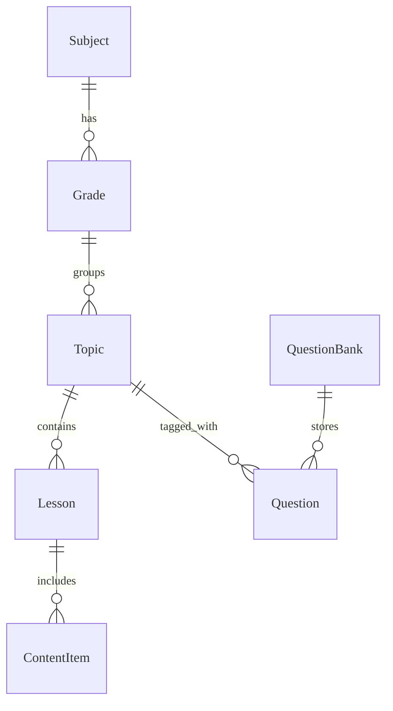
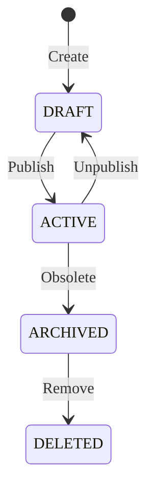

# Content & Question Bank - Data Model

---

## Overview
Data model quản lý cấu trúc nội dung học tập và ngân hàng câu hỏi.

---

## Entities

### Entity: Topic
**Description**: Chủ đề học tập (Chương/Bài).
**Storage**: Database (PostgreSQL)
**Retention**: Vĩnh viễn

#### Fields
| Field Name | Type | Required | Default | Validation | Description |
|------------|------|----------|---------|------------|-------------|
| id | UUID | ✅ | auto-gen | unique | Khóa chính |
| subject_id | UUID | ✅ | - | valid subject | FK Subject |
| grade_id | UUID | ✅ | - | valid grade | FK Grade |
| name | String | ✅ | - | len > 3 | Tên chủ đề |
| slug | String | ✅ | - | unique | Tên URL thân thiện |
| order | Integer | ✅ | 0 | - | Thứ tự hiển thị |
| is_active | Boolean | ✅ | false | - | Trạng thái hiển thị |

### Entity: Lesson
**Description**: Bài học cụ thể trong một Topic.
**Storage**: Database (PostgreSQL)
**Retention**: Vĩnh viễn

#### Fields
| Field Name | Type | Required | Default | Validation | Description |
|------------|------|----------|---------|------------|-------------|
| id | UUID | ✅ | auto-gen | unique | Khóa chính |
| topic_id | UUID | ✅ | - | valid topic | FK Topic |
| title | String | ✅ | - | len > 3 | Tiêu đề bài học |
| semester | String | ✅ | SEMESTER1 | enum | Học kỳ áp dụng |
| order | Integer | ✅ | 0 | - | Thứ tự trong Topic |

### Entity: Question
**Description**: Câu hỏi trắc nghiệm hoặc tự luận.
**Storage**: Database (PostgreSQL) - JSONB cho nội dung linh hoạt.

#### Fields
| Field Name | Type | Required | Default | Validation | Description |
|------------|------|----------|---------|------------|-------------|
| id | UUID | ✅ | auto-gen | unique | Khóa chính |
| bank_id | UUID | ✅ | - | valid bank | FK QuestionBank |
| type | String | ✅ | MCQ | enum | Loại câu hỏi |
| content | Text | ✅ | - | HTML/LaTeX | Nội dung câu hỏi |
| options | JSONB |  | [] | schema valid | Các đáp án (nếu trắc nghiệm) |
| correct_answer | String |  | - | - | Đáp án đúng (Đơn giản) |
| explanation | JSONB |  | {} | - | Giải thích chi tiết |
| difficulty | String | ✅ | MEDIUM | enum | Mức độ khó (EASY, MEDIUM, HARD) |

#### Relationships

---

## Lifecycle States
### Content Lifecycle

---

## Storage Specifications
### Database
- **Engine**: PostgreSQL
- **Full Text Search**: Sử dụng `tsvector` để tìm kiếm câu hỏi theo nội dung.

### File Storage
- **Location**: S3 Bucket `lms-content`
- **Path Structure**: `/{subject}/{grade}/{topic_id}/{content_id}/{filename}`
- **Formats**: MP4 (HLS), PDF, JPEG/PNG.

---

## Performance Requirements
- **Status**: Approved
- **Read**: Tải Catalog (Tree view) < 100ms.
- **Search**: Tìm kiếm câu hỏi < 100ms.

---

## Data Security
- **Access**: Public (Nội dung Active), Private (Nội dung Draft - chỉ Teacher).

---

## Validation Checklist
- [ ] Ràng buộc phân cấp được đảm bảo qua FK
- [ ] Index JSONB cho Question options

---

## References

- [Overview](./README.md)
