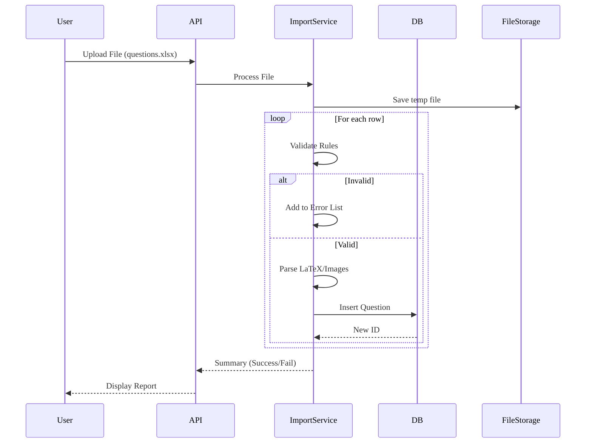
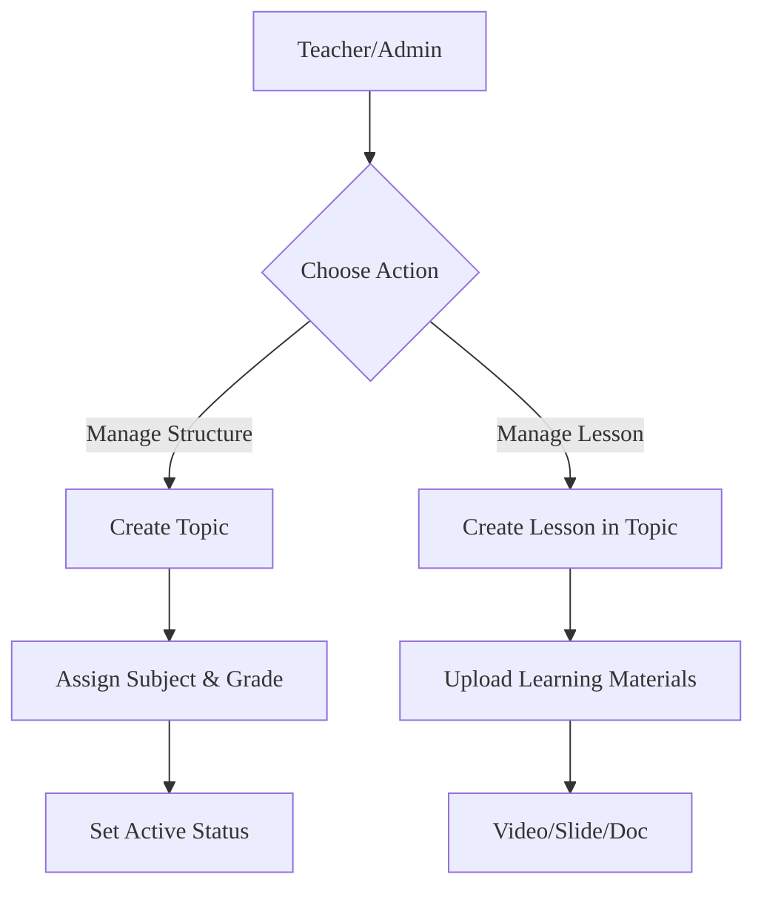

# Content & Question Bank - Business Logic

## Business Context
- **Module**: Content & Question Bank
- **Version**: 1.0
- **Status**: Approved
- **Last Updated**: 2026-01-14

## Overview
Module cốt lõi quản lý Cấu trúc Chương trình học (Subject, Grade, Topic, Lesson), Tài nguyên Giáo dục (Video, Document), và Ngân hàng Câu hỏi. Cung cấp dữ liệu cho các module Learning và Exam.

## Use Cases
| Use Case ID | Use Case Name | Description | Priority | Status |
|------------|--------------|-------|----------|--------|
| UC-CONT-001 | Manage Subjects & Grades | Quản lý danh mục môn học và khối lớp (Admin) | P1 | Planned |
| UC-CONT-002 | Create Topic Structure | Tạo và tổ chức cây Topic | P0 | Planned |
| UC-CONT-003 | Manage Lessons | Tạo bài học và gán vào topic | P0 | Planned |
| UC-CONT-004 | Upload Content | Upload video, tài liệu cho bài học | P0 | Planned |
| UC-CONT-005 | Manage Question Bank | Tạo ngân hàng câu hỏi và thêm câu hỏi | P0 | Planned |
| UC-CONT-006 | Bulk Import Questions | Import câu hỏi từ file Excel/Word | P1 | Planned |
| UC-CONT-007 | Publish Content | Publish nội dung cho học sinh sử dụng | P1 | Planned |

### UC-CONT-006: Bulk Import Questions
**Actor**: Teacher, Admin
**Preconditions**: File import khớp với định dạng template.
**Main Flow**:
1. Người dùng upload file (Excel/Word).
2. Hệ thống parse file và validate các rules.
3. Hệ thống hiển thị preview các câu hỏi hợp lệ và lỗi.
4. Người dùng xác nhận import.
5. Hệ thống lưu câu hỏi vào ngân hàng.
6. Hệ thống trả về báo cáo kết quả.

**Postconditions**: Các câu hỏi được tạo trong ngân hàng.
**Exceptions**: Lỗi định dạng file -> Báo cáo chi tiết lỗi theo từng dòng.

## Business Rules
| Rule ID | Rule Name | Description | Condition | Action | Exception |
|---------|----------|-------|------------|---------|------------|
| BR-CONT-001 | Content Hierarchy | Cấu trúc phân cấp bắt buộc | Subject -> Grade -> Topic -> Lesson -> Content | Áp dụng ràng buộc FK | - |
| BR-CONT-002 | Access Control | Quyền truy cập nội dung | Học sinh chỉ xem được `is_active=true` | Lọc theo `is_active` trong Query | - |
| BR-CONT-003 | Unique Slug | Định danh URL thân thiện SEO | Slug của Topic/Subject phải unique toàn hệ thống | Tự động tạo/Validate tính duy nhất | Thêm suffix nếu trùng |
| BR-CONT-004 | Question Points | Tính điểm câu hỏi | Tổng điểm Quiz phải được tính động hoặc cố định | Validate tổng điểm | - |
| BR-CONT-005 | Import Validation | Validation dữ liệu import | Kích thước file < 10MB, đúng MIME type | Từ chối file không hợp lệ, Parse content rules | - |

## Dependencies
### Internal Dependencies
- ❌ Không có - Content là module nền tảng (Core).

### External Dependencies
- ✅ File Storage (S3/MinIO) - Lưu trữ Videos, Images, Documents.
- ✅ Search Engine (Elasticsearch) - Tìm kiếm câu hỏi và bài học.

## KPIs & Metrics
| Metric | Target | Measurement | Frequency |
|--------|--------|-------------------|-----------|
| Content Upload Success Rate | > 99% | Giám sát Log | Hàng ngày |
| Question Import Speed | < 5s cho 100 câu hỏi | Thời gian thực hiện Job | Real-time |
| Search Latency | < 100ms | APM | Real-time |

## Validation Criteria
- [ ] Cây cấu trúc nội dung hiển thị đúng phân cấp.
- [ ] Quy trình import chạy đúng với file template và file lỗi.
- [ ] Media upload phát được trên tất cả thiết bị.
- [ ] Quyền Teacher (tạo draft) và Admin (publish) hoạt động đúng.

## Review & Approval
| Role | Name | Date | Status |
|------|------|------|--------|
| **Product Owner** | | | |
| **Tech Lead** | | | |
| **QA Lead** | | | |

---

# Workflows

## Overview
Các workflow quản lý vòng đời nội dung và quy trình nhập dữ liệu ngân hàng câu hỏi.

## Workflow Summary
| Workflow ID | Workflow Name | Trigger | Actors | Status |
|-------------|--------------|---------|--------|--------|
| WF-CONT-001 | Create Content Hierarchy | Admin/Teacher setup | Teacher, Admin | Active |
| WF-CONT-002 | Bulk Import Questions | Upload action | Teacher, Import Svc | Active |
| WF-CONT-003 | Content Publishing | Publish action | Teacher | Active |

## Workflow Details

### WF-CONT-002: Bulk Import Questions
**Description**: Quy trình import câu hỏi từ file bên ngoài vào hệ thống.

#### Flow Diagram

#### Steps
| Step | Description | Actor | System Action | Exit Condition |
|------|-------------|-------|---------------|----------------|
| 1 | Upload File | User | Nhận & Lưu Temp | File đã lưu |
| 2 | Parse & Validate | System | Đọc các dòng, kiểm tra định dạng | Parsing hoàn tất |
| 3 | Insert DB | System | Insert các câu hỏi hợp lệ | - |
| 4 | Generate Report | System | Tạo báo cáo tổng hợp | Report sẵn sàng |

### WF-CONT-001: Create Content Structure
**Description**: Tạo cây cấu trúc môn học.

#### Flow Diagram

## Events
### System Events
| Event Name | Description | Payload | Emitted By |
|------------|-------------|---------|------------|
| `content.published` | Lesson/Topic được publish | `{id, type}` | Content Svc |
| `question.imported` | Import hoàn tất | `{batch_id, count}` | Import Svc |

## Error Handling
| Error Scenario | Detection | Recovery Action | Escalation |
|----------------|-----------|-----------------|------------|
| Import File Corrupt | Parse Error | Trả về "Invalid File Format" | - |
| Partial Import Failure | Row Error | Bỏ qua dòng, ghi log vào report, tiếp tục | - |

## Performance Requirements
- **Import Throughput**: 100 câu hỏi / 5s.

## Security Requirements
- [ ] Quét file upload để phát hiện malware (tích hợp VirusTotal hoặc ClamAV)

## Validation Checklist
- [ ] Diagram khớp với logic code cho vòng lặp import
- [ ] Cơ chế báo cáo lỗi hoạt động cho các lỗi một phần

## References

- [Overview](./overview.md)
