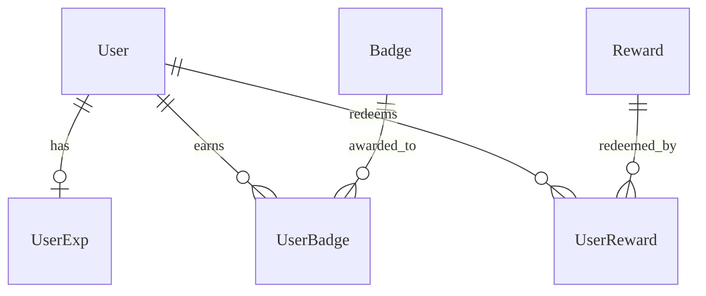
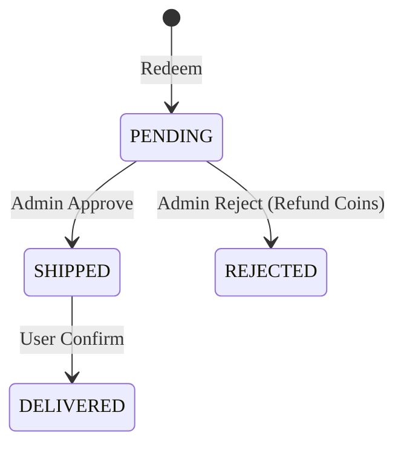

# Gamification & Rewards - Data Model

---

## Overview
Mô hình dữ liệu để lưu trữ thông tin thành tích, điểm số và phần thưởng của người dùng.

---

## Entities

### Entity: UserExp
**Description**: Lưu trữ điểm kinh nghiệm và cấp độ của người dùng.
**Storage**: Database (PostgreSQL) + Redis (Cache Level/EXP)

#### Fields
| Field Name | Type | Required | Default | Validation | Description |
|------------|------|----------|---------|------------|-------------|
| id | UUID | ✅ | auto-gen | unique | Khóa chính |
| user_id | UUID | ✅ | - | unique | FK User |
| exp_points | BigInt | ✅ | 0 | >= 0 | Tổng điểm EXP |
| coins | Integer | ✅ | 0 | >= 0 | Số dư xu có thể đổi thưởng |
| level | Integer | ✅ | 1 | >= 1 | Cấp độ hiện tại |
| updated_at | Timestamp | ✅ | now() | - | Thời điểm cập nhật cuối |

### Entity: Badge
**Description**: Định nghĩa các danh hiệu/huy hiệu.
**Storage**: Database (PostgreSQL)

#### Fields
| Field Name | Type | Required | Default | Validation | Description |
|------------|------|----------|---------|------------|-------------|
| id | UUID | ✅ | auto-gen | unique | Khóa chính |
| name | String | ✅ | - | - | Tên badge |
| description | String | ❌ | - | - | Mô tả cách nhận |
| icon_url | String | ✅ | - | url | Hình ảnh badge |
| condition | JSONB | ❌ | {} | - | Điều kiện tự động cấp |
| is_active | Boolean | ✅ | true | - | Status |

### Entity: Reward
**Description**: Các phần thưởng trong cửa hàng.
**Storage**: Database (PostgreSQL)

#### Fields
| Field Name | Type | Required | Default | Validation | Description |
|------------|------|----------|---------|------------|-------------|
| id | UUID | ✅ | auto-gen | unique | Khóa chính |
| name | String | ✅ | - | - | Tên phần thưởng |
| price_coins | Integer | ✅ | 0 | >= 0 | Giá bằng xu |
| stock | Integer | ✅ | 0 | >= 0 | Tồn kho |
| type | String | ✅ | VIRTUAL | enum | VIRTUAL / PHYSICAL |

#### Relationships

---

## Lifecycle States
### Order Lifecycle (UserReward)

---

## Storage Specifications
### Database
- **Table Name Prefix**: `game_`
- **Concurrency**: Sử dụng Row Locking hoặc Optimistic Locking (cột `version`) cho `UserExp` để tránh race conditions khi cộng điểm.

---

## Performance Requirements
- **Write**: Việc cộng điểm/xu được xử lý bất đồng bộ qua Queue để đảm bảo thời gian phản hồi thấp cho luồng Learning.
- **Read**: Đọc bảng xếp hạng từ Redis (ZSET).

---

## Data Security
- **Integrity**: Không cho phép sửa đổi trực tiếp `exp_points` từ API client (chỉ thông qua server-side events).

---

## Validation Checklist
- [ ] Xử lý cập nhật đồng thời (Chiến lược Locking)
- [ ] Logic đồng bộ Redis được định nghĩa

---

## References

- [Overview](./README.md)
