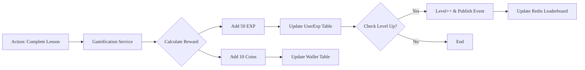
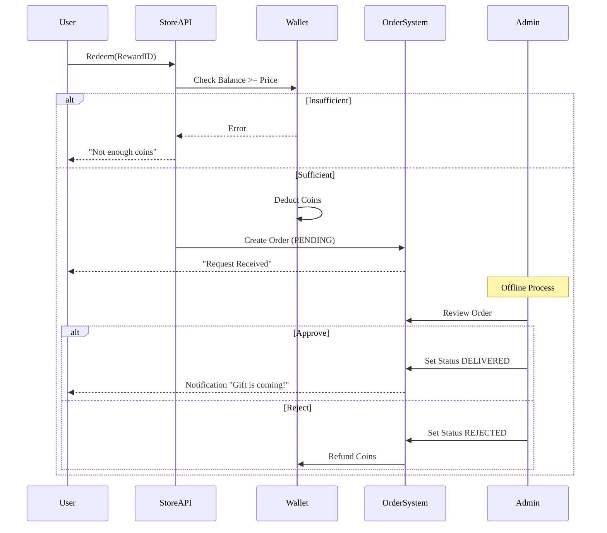

# Gamification & Rewards - Business Logic

## Business Context
- **Module**: Gamification & Rewards
- **Version**: 1.0
- **Status**: Approved
- **Last Updated**: 2026-01-14

## Overview
Module quản lý hệ thống phần thưởng, bao gồm Điểm Kinh nghiệm (EXP), Cấp độ, Badge, và Cửa hàng Phần thưởng để tăng cường sự gắn kết của người dùng.

## Use Cases
| Use Case ID | Use Case Name | Description | Priority | Status |
|------------|--------------|-------|----------|--------|
| UC-GAME-001 | Earn EXP & Coins | Nhận điểm/xu khi hoàn thành nhiệm vụ | P0 | Planned |
| UC-GAME-002 | Level Up | Tăng cấp độ khi tích lũy đủ EXP | P0 | Planned |
| UC-GAME-003 | View Leaderboard | Xem bảng xếp hạng thi đua | P1 | Planned |
| UC-GAME-004 | Browse Reward Store | Xem danh sách phần thưởng có sẵn | P1 | Planned |
| UC-GAME-005 | Redeem Reward | Đổi điểm/xu lấy phần thưởng | P0 | Planned |
| UC-GAME-006 | Receive Badge | Nhận huy hiệu khi đạt các cột mốc | P1 | Planned |

### UC-GAME-005: Redeem Reward
**Actor**: Học viên
**Preconditions**: Có đủ số dư Coins.
**Main Flow**:
1. Học viên chọn một phần thưởng trong Cửa hàng.
2. Hệ thống kiểm tra số dư.
3. Hệ thống trừ Coins.
4. Hệ thống tạo yêu cầu đổi thưởng (nếu là vật lý) hoặc cấp phần thưởng ngay (nếu là ảo).
5. Hệ thống gửi thông báo thành công.

## Business Rules
| Rule ID | Rule Name | Description | Condition | Action | Exception |
|---------|----------|-------|------------|---------|------------|
| BR-GAME-001 | Level Formula | Công thức tính Level | EXP tích lũy | Level = $100 \times N^{1.5}$ | - |
| BR-GAME-002 | Coin Balance | Số dư ví không được âm | Kết quả giao dịch < 0 | Chặn giao dịch, Trả về `INSUFFICIENT_COINS` | - |
| BR-GAME-003 | Reward Approval | Phần thưởng vật lý cần phê duyệt | Type = PHYSICAL | Trạng thái đặt thành `PENDING` | - |
| BR-GAME-004 | Daily Cap | Giới hạn EXP hàng ngày | Tổng EXP trong ngày > 1000 | Dừng cấp EXP | - |
| BR-GAME-005 | Unique Badge | Badge chỉ được nhận một lần | Người dùng đã có badge | Không làm gì | - |

## Dependencies
### Internal Dependencies
- ✅ Learning Module - Kích hoạt sự kiện khi hoàn thành bài học.
- ✅ Tournament Module - Kích hoạt sự kiện khi thắng giải đấu.

### External Dependencies
- ✅ Redis - Cache bảng xếp hạng (Sorted Sets).

## KPIs & Metrics
| Metric | Target | Measurement | Frequency |
|--------|--------|-------------------|-----------|
| User Engagement | +20% WoW | Người dùng hoạt động hàng ngày kích hoạt sự kiện gamification | Hàng tuần |
| Redemption Rate | > 5% users | Truy vấn DB trên bảng Order | Hàng tháng |

## Validation Criteria
- [ ] Công thức tính Level hoạt động chính xác.
- [ ] Giao dịch đổi xu đảm bảo Atomicity (không trừ tiền mà không có phần thưởng).
- [ ] Bảng xếp hạng cập nhật realtime.

## Review & Approval
| Role | Name | Date | Status |
|------|------|------|--------|
| **Product Owner** | | | |
| **Tech Lead** | | | |
| **QA Lead** | | | |

---

# Workflows

## Overview
Các quy trình xử lý sự kiện tích điểm và đổi thưởng.

## Workflow Summary
| Workflow ID | Workflow Name | Trigger | Actors | Status |
|-------------|--------------|---------|--------|--------|
| WF-GAME-001 | Process EXP Event | Hoàn thành học/thi | System (Async) | Active |
| WF-GAME-002 | Reward Redemption | Kết nối tới Store | Student, Admin | Active |

## Workflow Details

### WF-GAME-001: Process EXP Event
**Description**: Xử lý sự kiện cấp điểm khi người dùng hoàn thành hoạt động.

#### Flow Diagram

#### Steps
| Step | Description | Actor | System Action | Exit Condition |
|------|-------------|-------|---------------|----------------|
| 1 | Nhận Event | System | Xác thực loại event | Event hợp lệ |
| 2 | Tính EXP | System | Áp dụng công thức & quy tắc | - |
| 3 | Cập nhật DB | System | Tăng exp, coins | - |
| 4 | Kiểm tra Level | System | Nếu mới > hiện tại, cập nhật | - |
| 5 | Đồng bộ Redis | System | ZADD score tới Redis | - |

### WF-GAME-002: Reward Redemption
**Description**: Quy trình đổi thưởng và phê duyệt đơn hàng.

#### Flow Diagram

## Events
### System Events
| Event Name | Description | Payload | Emitted By |
|------------|-------------|---------|------------|
| `level.up` | Người dùng lên cấp | `{user_id, new_level, reward}` | Game Svc |
| `badge.earned` | Người dùng nhận badge | `{user_id, badge_id}` | Game Svc |

## Error Handling
| Error Scenario | Detection | Recovery Action | Escalation |
|----------------|-----------|-----------------|------------|
| Redis Down | Connection Err | Fallback sang truy vấn DB (chậm hơn) | Alert Ops |
| DB Transaction Fail | Rollback | Thử lại (Optimistic Lock) hoặc báo lỗi | - |

## Performance Requirements
- **Async Processing**: Độ trễ hàng đợi event < 1s.

## Security Requirements
- [ ] Xác thực phía server cho tất cả phần thưởng (không tin tưởng client)

## Validation Checklist
- [ ] Việc trừ phần thưởng có tính transactional

## References

- [Overview](./overview.md)
