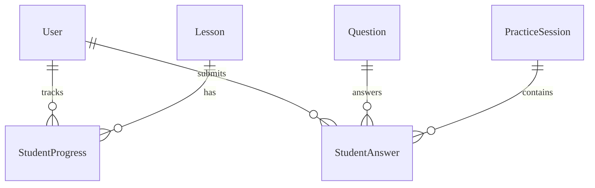
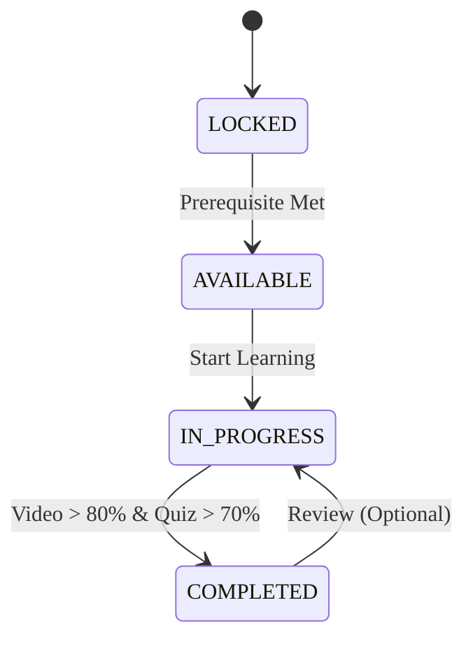

# Learning & Personalization - Data Model

## Overview
Data model cho module Learning, lưu trữ tiến độ học tập của student và lịch sử trả lời.

## Entities

### Entity: StudentProgress
**Description**: Lưu trữ trạng thái và tiến độ của student cho một bài học cụ thể.
**Storage**: Database (PostgreSQL)
**Retention**: Vĩnh viễn

#### Fields
| Field Name | Type | Required | Default | Validation | Description |
|------------|------|----------|---------|------------|-------------|
| id | UUID | ✅ | auto-gen | unique | Khóa chính |
| student_id | UUID | ✅ | - | valid user | FK đến User |
| lesson_id | UUID | ✅ | - | valid lesson | FK đến Lesson (Content Module) |
| completion_percentage | Integer | ✅ | 0 | 0-100 | Phần trăm hoàn thành |
| status | String | ✅ | NOT_STARTED | enum | Trạng thái (LOCKED, AVAILABLE, IN_PROGRESS, COMPLETED) |
| started_at | Timestamp | ❌ | null | - | Thời gian bắt đầu học |
| completed_at | Timestamp | ❌ | null | - | Thời gian hoàn thành |
| last_accessed_at | Timestamp | ✅ | now() | - | Thời gian truy cập lần cuối |

#### Indexes
| Index Name | Fields | Type | Mục đích |
|------------|--------|------|--------|
| idx_progress_student | [student_id] | B-tree | Lọc theo student |
| idx_progress_student_lesson | [student_id, lesson_id] | B-tree | Tra cứu tiến độ bài học cụ thể |

### Entity: StudentAnswer
**Description**: Lưu trữ lịch sử trả lời chi tiết cho mỗi câu hỏi trong bài tập/quiz.
**Storage**: Database (PostgreSQL) -> Có thể chuyển sang TimeSeries DB hoặc Partitioning nếu dữ liệu lớn.
**Retention**: Vĩnh viễn (hoặc archive sau 2 năm)

#### Fields
| Field Name | Type | Required | Default | Validation | Description |
|------------|------|----------|---------|------------|-------------|
| id | UUID | ✅ | auto-gen | unique | Khóa chính |
| question_id | UUID | ✅ | - | valid question | FK đến Question |
| content_id | UUID | ❌ | - | - | FK đến Content (Context) |
| session_id | UUID | ❌ | - | - | FK đến Practice Session (nếu có) |
| answer | JSONB | ✅ | - | schema valid | Nội dung câu trả lời của student |
| is_correct | Boolean | ✅ | false | - | Kết quả đúng/sai |
| time_taken | Integer | ✅ | 0 | >= 0 | Thời gian trả lời (ms) |
| answered_at | Timestamp | ✅ | now() | - | Thời gian nộp bài |

#### Relationships

## Lifecycle States
### Lesson Progress State Machine

## Storage Specifications
### Database
- **Table Name**: `student_progress`, `student_answers`
- **Engine**: PostgreSQL
- **Partitioning**: Cân nhắc partitioning `student_answers` theo tháng nếu lượng user lớn.

### Caching Strategy
- **Cache Type**: Redis
- **Key**: `learning:path:{student_id}`
- **TTL**: 1 giờ (invalidate khi có tiến độ mới hoặc cập nhật nội dung)
- **Content**: Danh sách bài học được đề xuất hiện tại.

## Performance Requirements
- **Hiệu năng Query**: Get Learning Path < 200ms
- **Write Throughput**: Hỗ trợ 5000 concurrent submissions/sec (Peak).
- **Storage Growth**: Dự kiến `StudentAnswer` tăng trưởng 50GB/tháng.

## Data Security
- **Access Control**: Students chỉ có thể xem tiến độ của chính mình. Teachers/Admins có thể xem tiến độ của students được phân công.
- **Masking**: Không áp dụng.

---

## Validation Checklist
- [ ] Tất cả entities được định nghĩa với đầy đủ fields
- [ ] Indexes được tối ưu cho tra cứu theo student_id
- [ ] Chiến lược partitioning cho bảng lớn được định nghĩa
- [ ] Caching cho personalized path được thiết kế
