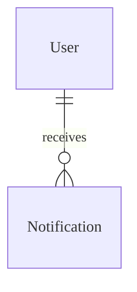

# Real-time Communication - Data Model

## Overview
Data model cho Realtime tập trung vào lưu trữ tạm thời (Redis) và logs.

## Entities

### Entity: Presence (Redis)
**Description**: Trạng thái online của người dùng.
**Storage**: Redis (Key-Value)
**Retention**: TTL (Heartbeat interval + buffer)

#### Fields
| Field Name | Type | Key | Description |
|------------|------|-----|-------------|
| status | String | `user:presence:{id}` | ONLINE / BUSY |
| server_id | String | (Hash field) | ID Node đang kết nối |
| socket_id | String | (Hash field) | ID Session Socket |
| last_seen | Timestamp | (Hash field) | Thời gian ping cuối |

### Entity: Notification
**Description**: Lưu trữ thông báo đã gửi để xem sau.
**Storage**: Database (MongDB/PostgreSQL)

#### Fields
| Field Name | Type | Required | Default | Validation | Description |
|------------|------|----------|---------|------------|-------------|
| id | UUID | ✅ | auto-gen | unique | Khóa chính |
| user_id | UUID | ✅ | - | - | Người nhận |
| type | String | ✅ | INFO | enum | INFO, WARNING, ALERT |
| title | String | ✅ | - | - | Tiêu đề |
| body | String | ❌ | - | - | Nội dung |
| data | JSONB | ❌ | {} | - | Metadata (Link, Action) |
| read_at | Timestamp | ❌ | null | - | Thời gian đọc |
| created_at | Timestamp | ✅ | now() | - | Thời gian tạo |

#### Relationships

## Storage Specifications
### Redis
- **Clustering**: Master-Replica.
- **Eviction**: Volatile-LRU (ưu tiên xóa presence cũ).

### Database
- **Optimization**: Phân vùng `Notification` theo tháng.

## Performance Requirements
- **Presence Check**: < 5ms.
- **Notification Write**: Async write < 50ms.

## Data Security
- **Encryption**: WSS (TLS) cho tất cả kết nối.

---

## Validation Checklist
- [ ] Redis keys hết hạn hoạt động đúng
- [ ] Truy vấn lịch sử thông báo được tối ưu
