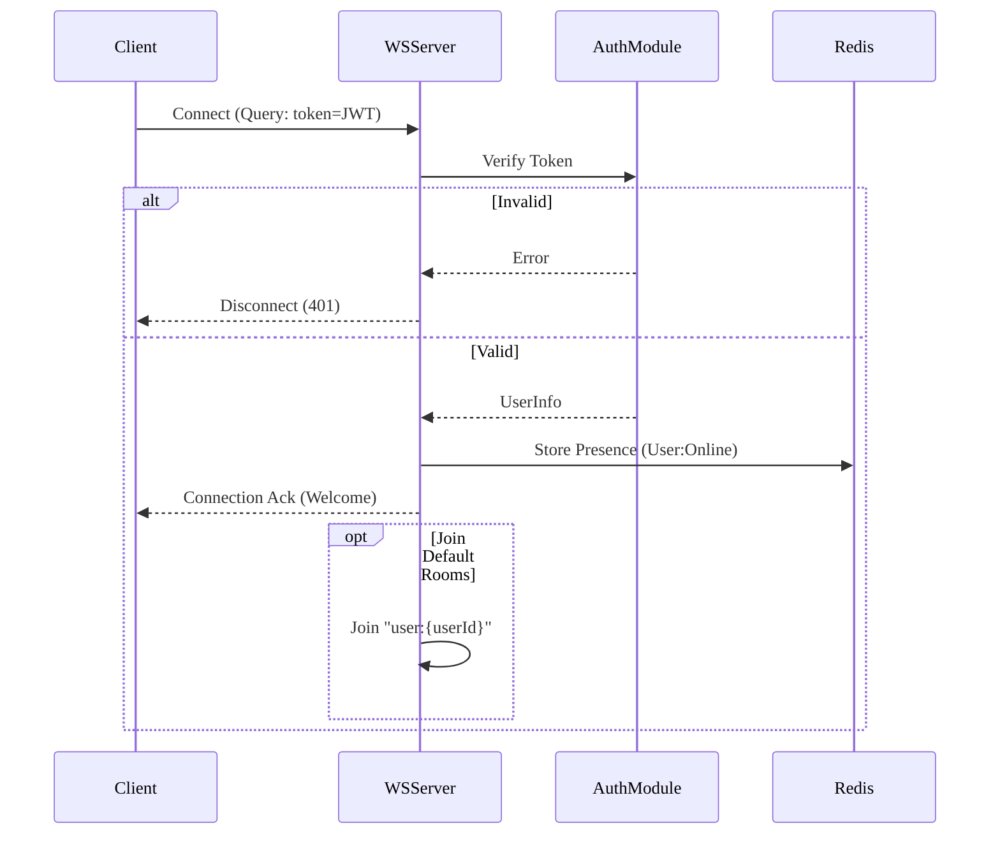
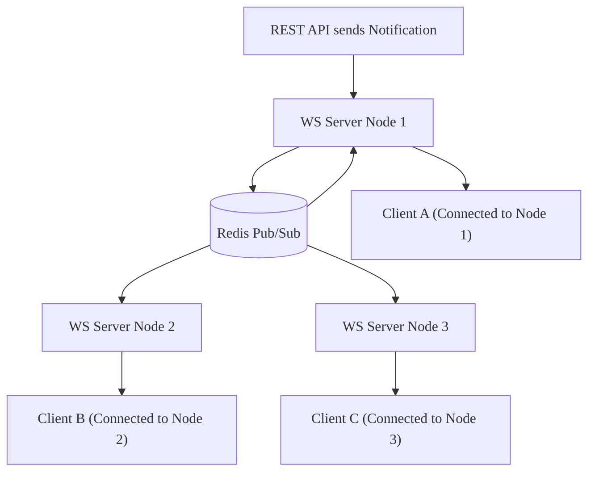

# Real-time Communication - Business Logic

Chi tiết quy tắc nghiệp vụ, workflows và xử lý lỗi cho module Real-time.

---

## Business Rules

| Rule ID   | Rule Name      | Description                     | Condition                       | Action                                         | Exception |
| --------- | -------------- | ------------------------------- | ------------------------------- | ---------------------------------------------- | --------- |
| BR-RT-001 | Auth Required  | Tất cả kết nối phải có Token    | Handshake không có token hợp lệ | Ngắt kết nối (401)                             | -         |
| BR-RT-002 | Sticky Session | Hỗ trợ HTTP polling fallback    | Client kết nối lại              | Định tuyến đến cùng node (Load Balancer level) | -         |
| BR-RT-003 | Room Limits    | Giới hạn người dùng trong phòng | Users > MaxRoomSize             | Từ chối tham gia                               | -         |
| BR-RT-004 | Rate Limiting  | Ngăn chặn spam tin nhắn         | Msgs > 10/sec                   | Hủy msg, có thể chặn                           | -         |

---

## Dependencies

### Phụ thuộc nội bộ

- ✅ Auth Module - Xác thực JWT.
- ✅ Redis - Pub/Sub Adapter & Presence Store.

### Phụ thuộc bên ngoài

- ❌ Không có - Self-hosted Socket.IO cluster.

---

## KPIs & Metrics

| Metric                 | Target  | Measurement         | Frequency |
| ---------------------- | ------- | ------------------- | --------- |
| Connection Latency     | < 100ms | Thời gian Handshake | Real-time |
| Concurrent Connections | > 10k   | Load Test           | Hàng tuần |
| Event Delivery Rate    | > 99.9% | Theo dõi Msg Ack    | Hàng ngày |

---

## Validation Criteria

- [ ] Kết nối thành công với JWT hợp lệ.
- [ ] Tính năng Broadcast hoạt động trên nhiều server nodes (Redis Adapter).
- [ ] Xử lý 10k kết nối đồng thời.

---

## Review & Approval

| Role              | Name | Date | Status |
| ----------------- | ---- | ---- | ------ |
| **Product Owner** |      |      |        |
| **Tech Lead**     |      |      |        |
| **QA Lead**       |      |      |        |

---

# Workflows

---

---

## Workflow Summary

| Workflow ID | Workflow Name       | Trigger           | Actors         | Status |
| ----------- | ------------------- | ----------------- | -------------- | ------ |
| WF-RT-001   | WebSocket Handshake | Client kết nối    | Client, Server | Active |
| WF-RT-002   | Broadcast Event     | Internal API Call | System, Redis  | Active |

---

## Workflow Details

### WF-RT-001: WebSocket Handshake

**Description**: Quy trình thiết lập kết nối bảo mật.

#### Flow Diagram

### WF-RT-002: Multi-Server Broadcast

**Description**: Phân phối tin nhắn qua nhiều server nodes.

#### Flow Diagram

---

## Events

### Sự kiện hệ thống

| Event Name          | Description           | Payload                | Emitted By |
| ------------------- | --------------------- | ---------------------- | ---------- |
| `socket.connect`    | Người dùng mới online | `{user_id, socket_id}` | WS Server  |
| `socket.disconnect` | Người dùng offline    | `{user_id, reason}`    | WS Server  |

---

## Error Handling

| Error Scenario     | Detection     | Recovery Action                               | Escalation |
| ------------------ | ------------- | --------------------------------------------- | ---------- |
| Redis Pub/Sub Down | Mất kết nối   | Server Local Broadcast Only (Degraded)        | Alert      |
| Token Expired      | Auth thất bại | Gửi sự kiện `token_expired` -> Client Refresh | -          |

---

## Performance Requirements

- **Handshake Time**: < 100ms.

---

## Security Requirements

- [ ] Bắt buộc sử dụng WSS.
- [ ] Xác thực Token trên mỗi kết nối.

---

## Validation Checklist

- [ ] Kiểm tra Redis Failover

---

## References

- [Overview](/specs)
