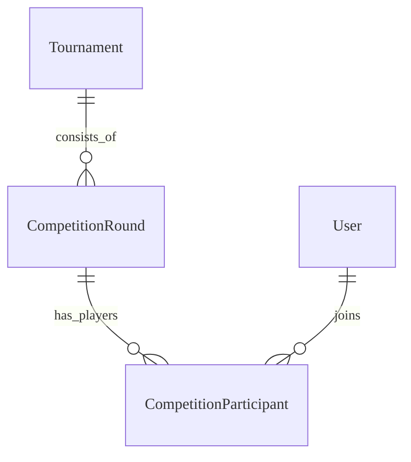

# Tournament & Competition - Data Model

## Overview
Mô hình dữ liệu để quản lý cuộc thi và người tham gia.

## Entities

### Entity: Tournament
**Description**: Cuộc thi lớn (ví dụ: Math Arena).
**Storage**: Database (PostgreSQL)

#### Fields
| Field Name | Type | Required | Default | Validation | Mô tả |
|------------|------|----------|---------|------------|-------------|
| id | UUID | ✅ | auto-gen | unique | Khóa chính |
| name | String | ✅ | - | len > 5 | Tên cuộc thi |
| level | String | ✅ | SCHOOL | enum | Cấp độ (SCHOOL, DISTRICT) |
| subject_id | UUID | ✅ | - | - | Môn học |
| starts_at | Timestamp | ✅ | - | - | Thời gian bắt đầu |
| ends_at | Timestamp | ✅ | - | > starts_at | Thời gian kết thúc |

### Entity: CompetitionRound
**Description**: Vòng thi cụ thể (ví dụ: Vòng 1, Chung kết).
**Storage**: Database (PostgreSQL)

#### Fields
| Field Name | Type | Required | Default | Validation | Mô tả |
|------------|------|----------|---------|------------|-------------|
| id | UUID | ✅ | auto-gen | unique | Khóa chính |
| tournament_id | UUID | ✅ | - | - | FK Tournament |
| name | String | ✅ | - | - | Tên vòng thi |
| requires_invite | Boolean | ✅ | false | - | Yêu cầu invite code? |
| participant_limit | Integer | ✅ | 100 | > 0 | Giới hạn user/room |

### Entity: CompetitionParticipant
**Description**: Người tham gia vòng thi.
**Storage**: Database (PostgreSQL)

#### Fields
| Field Name | Type | Required | Default | Validation | Mô tả |
|------------|------|----------|---------|------------|-------------|
| id | UUID | ✅ | auto-gen | unique | Khóa chính |
| round_id | UUID | ✅ | - | - | FK Round |
| student_id | UUID | ✅ | - | - | FK Student |
| score | Integer | ✅ | 0 | >= 0 | Tổng điểm |
| rank | Integer | ❌ | null | - | Hạng cuối cùng |
| started_at | Timestamp | ❌ | null | - | Thời gian bắt đầu thi |

#### Relationships

## Storage Specifications
### Redis
- **Leaderboard**: ZSET `round:{id}:scores` (Member: `user_id`, Score: `points`).
- **Room State**: Hash `room:{id}` (Trạng thái, QuestionIndex).

## Performance Requirements
- **Leaderboard Write**: < 1ms (Redis).
- **Participant Insert**: Batch insert cho việc join đồng thời cao.

## Data Security
- **Invite Code**: Hash trước khi so sánh hoặc rate limit kiểm tra code.

---

## Validation Checklist
- [ ] Đã xác minh các thao tác Redis ZSET
- [ ] Xử lý join đồng thời
