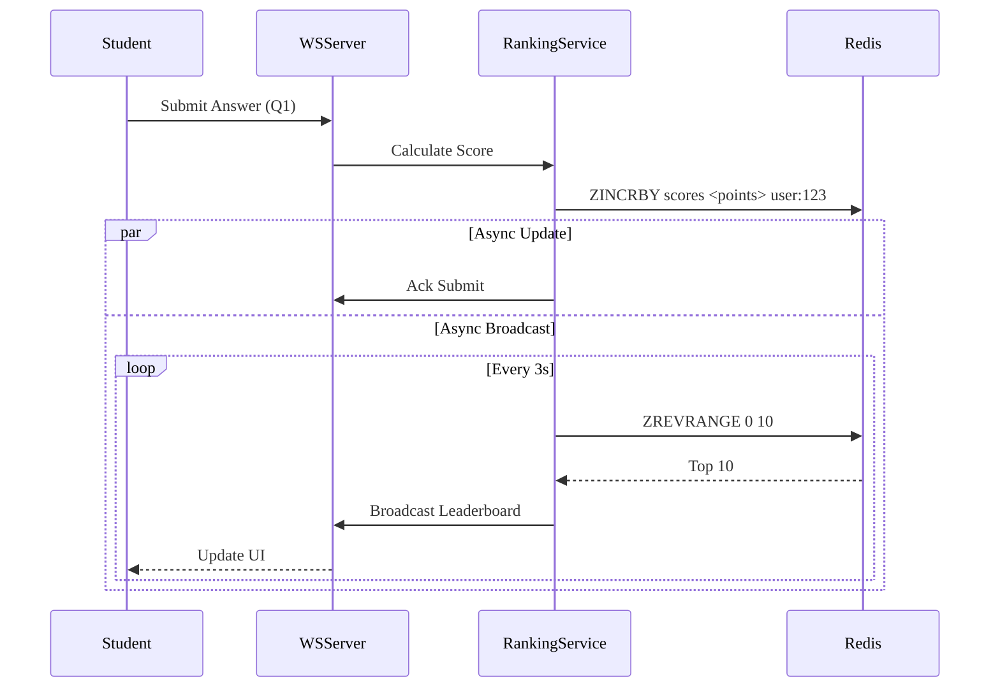

# Tournament & Competition - Business Logic

## Business Context
- **Module**: Tournament & Competition
- **Version**: 1.0
- **Status**: Approved
- **Last Updated**: 2026-01-14

## Overview
Module quản lý thi đấu trực tuyến, hỗ trợ: Tournament, Round, Room, và Real-time Leaderboard.

## Use Cases
| Use Case ID | Name | Description | Priority | Status |
|------------|--------------|-------|----------|--------|
| UC-TOUR-001 | Create Tournament | Tạo cuộc thi mới (Admin) | P1 | Planned |
| UC-TOUR-002 | Join Round | Đăng ký tham gia vòng thi | P0 | Planned |
| UC-TOUR-003 | Compete (Real-time) | Thi real-time qua WebSocket | P0 | Planned |
| UC-TOUR-004 | View Leaderboard | Xem bảng xếp hạng vòng thi | P0 | Planned |
| UC-TOUR-005 | Invite Users | Mời người chơi qua invite code | P2 | Planned |

### UC-TOUR-003: Compete
**Actor**: Student
**Preconditions**: Đã tham gia round và kết nối qua WebSocket.
**Main Flow**:
1. Server gửi câu hỏi.
2. Student trả lời.
3. Server chấm điểm ngay (base score + time bonus).
4. Server cập nhật Real-time leaderboard.
5. Server gửi câu hỏi tiếp theo (nếu có).

## Business Rules
| Rule ID | Name | Description | Condition | Action | Exception |
|---------|----------|-------|------------|---------|------------|
| BR-TOUR-001 | Time Window | Chỉ tham gia được trong time window | Now < start OR Now > end | Block Join | - |
| BR-TOUR-002 | Room Capacity | Giới hạn số user mỗi room | Users >= Max | Create New Round or Reject | - |
| BR-TOUR-003 | Scoring Formula | Công thức tính điểm | Correct Answer | Score = Base + (TimeRemaining * Multiplier) | - |
| BR-TOUR-004 | Anti-Cheat | Chống gian lận | 1 IP/Account check | Đánh dấu hoạt động đáng ngờ | - |

## Dependencies
### Internal Dependencies
- ✅ Realtime Module - Hạ tầng WebSocket.
- ✅ Content Module - Nguồn câu hỏi.
- ✅ Gamification Module - Phần thưởng sau thi đấu.

### External Dependencies
- ✅ Redis - Leaderboard (ZSET).

## KPIs & Metrics
| Metric | Target | Measurement | Frequency |
|--------|--------|-------------------|-----------|
| Concurrent Users | 50,000 | Load Test | Theo sự kiện |
| Score Update Latency | < 100ms | Đo end-to-end | Real-time |

## Validation Criteria
- [ ] Tính điểm chính xác theo thời gian.
- [ ] Leaderboard cập nhật đúng thứ tự.
- [ ] Load balancing giữa các room thi đấu hoạt động tốt.


## Review & Approval
| Role | Name | Date | Status |
|------|------|------|--------|
| **Product Owner** | | | |
| **Tech Lead** | | | |
| **QA Lead** | | | |


---

# Workflows

## Overview
Các workflow cho quy trình thi đấu.

## Workflow Summary
| Workflow ID | Tên Workflow | Trigger | Actors | Status |
|-------------|--------------|---------|--------|--------|
| WF-TOUR-001 | Join Competition | User nhấn Join | User, System | Active |
| WF-TOUR-002 | Realtime Scoring | User trả lời | User, System | Active |

## Workflow Details

### WF-TOUR-001: Join Competition
**Description**: Quy trình đăng ký và vào room thi đấu.

#### Flow Diagram
```mermaid
---
config:
  themeVariables:
    fontFamily: "EB Garamond"
---
flowchart TD
    A[Student] --> B[Input Invite Code?]
    B --> C{Validate Code}
    C -- Invalid --> D[Error Message]
    C -- Valid --> E[Check Time & Cap]
    
    E -- Fail --> F[Reject Join]
    E -- Pass --> G[Create Participant Record]
    G --> H[Assign Room]
    H --> I[Return Room Info (WS Token)]
    I --> J[Connect WebSocket]
```

### WF-TOUR-002: Realtime Scoring Loop
**Description**: Vòng lặp nhận câu hỏi và trả lời.

#### Flow Diagram


## Events
### System Events
| Event Name | Description | Payload | Emitted By |
|------------|-------------|---------|------------|
| `round.started` | Round bắt đầu | `{round_id}` | Scheduler |
| `round.ended` | Round kết thúc | `{round_id}` | Scheduler |

## Error Handling
| Error Scenario | Detection | Recovery Action | Báo cáo |
|----------------|-----------|-----------------|------------|
| WS Disconnect | Socket Close | Client Auto Reconnect (có giới hạn retry) | - |

## Performance Requirements
- **Broadcast**: < 500ms latency đến 10k users.


## Validation Checklist
- [ ] Logic reconnect giữ được điểm

## References

- [Overview](./overview.md)
