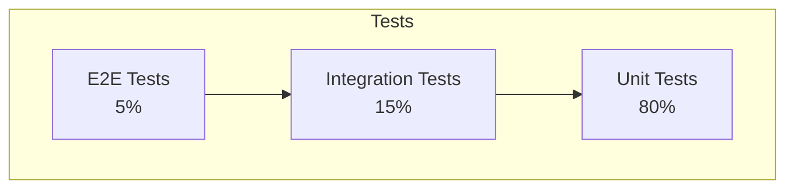

# Strategy

Chiến lược kiểm thử tổng thể và mục tiêu độ bao phủ.

---

## Overview

### Testing Pyramid

### Coverage Goals

| Test Type         | Coverage Target    | Current |
| ----------------- | ------------------ | ------- |
| Unit Tests        | 80%                | [%]     |
| Integration Tests | 70% critical paths | [%]     |
| E2E Tests         | 100% happy paths   | [%]     |

---

## Test Types

### Unit Tests

**Mục đích**: Test các functions/methods riêng lẻ trong isolation

| Aspect       | Guideline             |
| ------------ | --------------------- |
| Scope        | Single function/class |
| Dependencies | Mocked                |
| Speed        | < 100ms mỗi test      |
| Coverage     | 80% minimum           |

**Cần test**:

- Business logic
- Data transformations
- Validation rules
- Edge cases

### Integration Tests

**Mục đích**: Test tương tác giữa các components

| Aspect       | Guideline              |
| ------------ | ---------------------- |
| Scope        | Multiple components    |
| Dependencies | Real (test containers) |
| Speed        | < 5s mỗi test          |
| Coverage     | Critical paths         |

**Cần test**:

- API endpoints
- Database operations
- Service interactions
- External integrations

### E2E Tests

**Mục đích**: Test các luồng người dùng hoàn chỉnh

| Aspect       | Guideline        |
| ------------ | ---------------- |
| Scope        | Full application |
| Dependencies | Real environment |
| Speed        | < 30s mỗi test   |
| Coverage     | Happy paths      |

**Cần test**:

- User journeys
- Critical business flows
- Cross-browser compatibility

---

## Test Categories

### Functional Tests

| Category       | Description         | Coverage       |
| -------------- | ------------------- | -------------- |
| Business Logic | Core business rules | 100%           |
| API            | Tất cả endpoints    | 100%           |
| UI             | User interactions   | Critical paths |

### Non-Functional Tests

| Category      | Description            | Frequency   |
| ------------- | ---------------------- | ----------- |
| Performance   | Load và stress         | Weekly      |
| Security      | Vulnerability scanning | Weekly      |
| Accessibility | WCAG compliance        | Per release |

---

## Test Environments

| Environment | Purpose             | Data            |
| ----------- | ------------------- | --------------- |
| Local       | Development testing | Mock/seed       |
| CI          | Automated testing   | Seed data       |
| Staging     | Pre-production      | Anonymized prod |
| Production  | Smoke tests         | Production      |

---

## Test Data Management

### Data Categories

| Category   | Source          | Refresh            |
| ---------- | --------------- | ------------------ |
| Seed Data  | Scripts         | Mỗi test run       |
| Fixtures   | JSON files      | Version controlled |
| Generated  | Faker           | Dynamic            |
| Anonymized | Production copy | Weekly             |

### Data Isolation

| Strategy             | Use Case          |
| -------------------- | ----------------- |
| Transaction rollback | Unit tests        |
| Test database        | Integration tests |
| Data cleanup         | E2E tests         |

---

## Quality Gates

### PR Checks

| Check      | Requirement | Blocking |
| ---------- | ----------- | -------- |
| Unit Tests | 100% pass   | Yes      |
| Coverage   | > 80%       | Yes      |
| Lint       | No errors   | Yes      |
| Build      | Success     | Yes      |

### Release Checks

| Check         | Requirement    | Blocking |
| ------------- | -------------- | -------- |
| All Tests     | 100% pass      | Yes      |
| E2E Tests     | 100% pass      | Yes      |
| Performance   | Within targets | Yes      |
| Security Scan | No critical    | Yes      |

---

## Defect Management

### Severity Levels

| Severity | Description          | Response  |
| -------- | -------------------- | --------- |
| Critical | System down          | Immediate |
| High     | Major feature broken | 24 hours  |
| Medium   | Feature degraded     | Sprint    |
| Low      | Minor issue          | Backlog   |

### Bug Lifecycle

---

## References

- [Automation](./automation.md)
- [Benchmarks](./benchmarks.md)
- [Monitoring](#)
