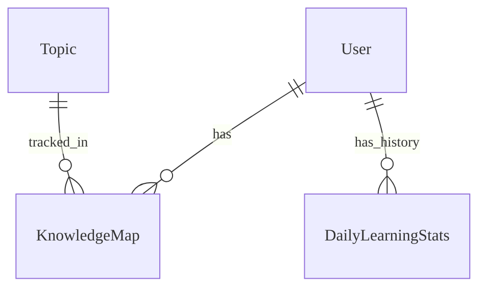

# Analytics & Reporting - Data Model

## Overview
Mô hình dữ liệu để lưu trữ thống kê và bản đồ kiến thức.

## Entities

### Entity: KnowledgeMap
**Mô tả**: Lưu trữ mức độ thành thạo kiến thức của học sinh theo chủ đề.
**Storage**: Database (PostgreSQL)
**Retention**: Vĩnh viễn

#### Fields
| Field Name | Type | Bắt buộc | Mặc định | Validation | Mô tả |
|------------|------|----------|---------|------------|-------------|
| id | UUID | ✅ | auto-gen | unique | Khóa chính |
| student_id | UUID | ✅ | - | valid user | FK Học sinh |
| topic_id | UUID | ✅ | - | valid topic | FK Chủ đề |
| mastery_level | Float | ✅ | 0.0 | 0.0 - 1.0 | Điểm thành thạo |
| questions_attempted | Integer | ✅ | 0 | >= 0 | Số câu hỏi đã làm |
| questions_correct | Integer | ✅ | 0 | >= 0 | Số câu trả lời đúng |
| last_practiced_at | Timestamp | ❌ | null | - | Thời gian luyện tập cuối |

### Entity: DailyLearningStats
**Mô tả**: Bảng tổng hợp hoạt động học tập hàng ngày.
**Storage**: Database (PostgreSQL)

#### Fields
| Field Name | Type | Bắt buộc | Mặc định | Validation | Mô tả |
|------------|------|----------|---------|------------|-------------|
| id | UUID | ✅ | auto-gen | unique | Khóa chính |
| student_id | UUID | ✅ | - | - | FK Học sinh |
| date | Date | ✅ | - | - | Ngày thống kê |
| total_learning_time | Integer | ✅ | 0 | seconds | Tổng thời gian học (giây) |
| lessons_completed | Integer | ✅ | 0 | >= 0 | Số bài học hoàn thành |
| exercises_done | Integer | ✅ | 0 | >= 0 | Số bài tập đã làm |

#### Relationships

## Storage Specifications
### Database
- **Engine**: PostgreSQL extension cho `DailyLearningStats` (hypertables) để tối ưu truy vấn theo khoảng thời gian.
- **Indexes**: Composite index trên `(student_id, date)`.

## Performance Requirements
- **Aggregation**: Job hàng đêm xử lý 1 triệu raw events trong < 1 giờ.
- **Query**: Truy xuất lịch sử 30 ngày cho 1 người dùng < 50ms.

## Data Security
- **PII**: Dữ liệu Analytics có thể chứa thông tin nhạy cảm về hiệu suất học tập -> Yêu cầu bảo vệ nghiêm ngặt.

---

## Validation Checklist
- [ ] Đã cấu hình PostgreSQL partitioning
- [ ] Đã triển khai chính sách lưu trữ dữ liệu
